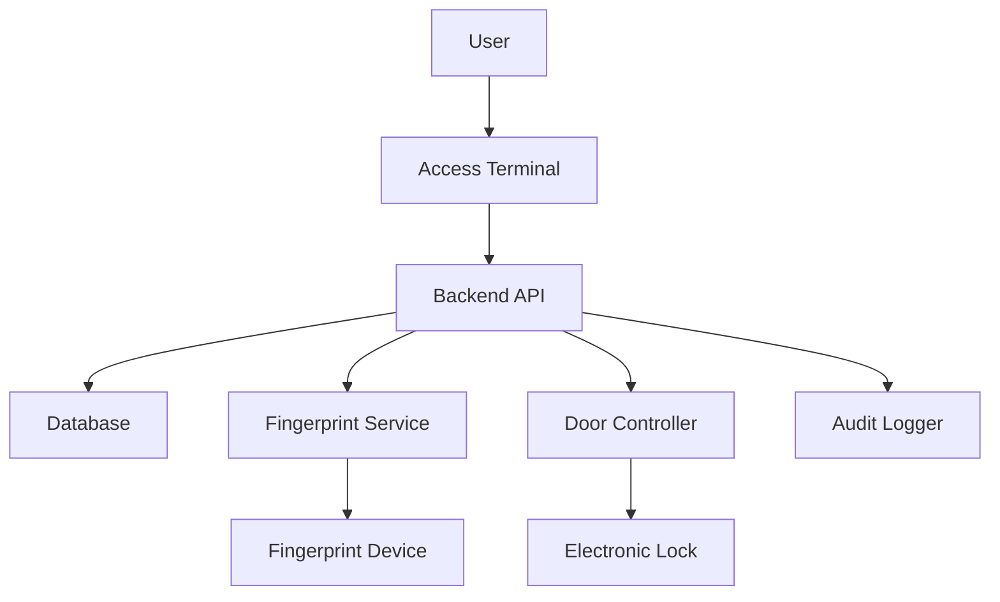

# Fingerprint Access Control System

This example demonstrates a complete fingerprint-based access control system for managing physical access to doors and restricted areas with comprehensive audit logging.

## Overview

This access control system provides:
- User registration with fingerprint enrollment
- Door access verification using fingerprint identification
- Role-based access permissions
- Real-time access monitoring
- Comprehensive audit logging
- Access schedule management
- Emergency override capabilities

## Architecture



## Database Schema

### Users Table

```sql
CREATE TABLE users (
  id INT PRIMARY KEY AUTO_INCREMENT,
  user_code VARCHAR(50) UNIQUE NOT NULL,
  first_name VARCHAR(100) NOT NULL,
  last_name VARCHAR(100) NOT NULL,
  email VARCHAR(255) UNIQUE NOT NULL,
  department VARCHAR(100),
  role ENUM('employee', 'manager', 'admin', 'security') DEFAULT 'employee',
  is_active BOOLEAN DEFAULT TRUE,
  created_at TIMESTAMP DEFAULT CURRENT_TIMESTAMP,
  updated_at TIMESTAMP DEFAULT CURRENT_TIMESTAMP ON UPDATE CURRENT_TIMESTAMP,
  INDEX idx_user_code (user_code),
  INDEX idx_role (role)
);
```

### Fingerprint Templates Table

```sql
CREATE TABLE fingerprint_templates (
  id INT PRIMARY KEY AUTO_INCREMENT,
  user_id INT NOT NULL,
  template_data TEXT NOT NULL,
  finger_position ENUM('left_thumb', 'left_index', 'left_middle', 'left_ring', 'left_pinky',
                       'right_thumb', 'right_index', 'right_middle', 'right_ring', 'right_pinky'),
  quality_score INT,
  enrolled_at TIMESTAMP DEFAULT CURRENT_TIMESTAMP,
  FOREIGN KEY (user_id) REFERENCES users(id) ON DELETE CASCADE,
  INDEX idx_user_id (user_id)
);
```

### Doors Table

```sql
CREATE TABLE doors (
  id INT PRIMARY KEY AUTO_INCREMENT,
  door_code VARCHAR(50) UNIQUE NOT NULL,
  door_name VARCHAR(100) NOT NULL,
  location VARCHAR(255),
  security_level ENUM('low', 'medium', 'high', 'critical') DEFAULT 'medium',
  is_active BOOLEAN DEFAULT TRUE,
  requires_two_factor BOOLEAN DEFAULT FALSE,
  created_at TIMESTAMP DEFAULT CURRENT_TIMESTAMP,
  INDEX idx_door_code (door_code),
  INDEX idx_security_level (security_level)
);
```

### Access Permissions Table

```sql
CREATE TABLE access_permissions (
  id INT PRIMARY KEY AUTO_INCREMENT,
  user_id INT NOT NULL,
  door_id INT NOT NULL,
  access_level ENUM('full', 'scheduled', 'temporary') DEFAULT 'scheduled',
  valid_from TIMESTAMP DEFAULT CURRENT_TIMESTAMP,
  valid_until TIMESTAMP NULL,
  schedule_start_time TIME DEFAULT '00:00:00',
  schedule_end_time TIME DEFAULT '23:59:59',
  allowed_days VARCHAR(20) DEFAULT 'Mon,Tue,Wed,Thu,Fri,Sat,Sun',
  created_at TIMESTAMP DEFAULT CURRENT_TIMESTAMP,
  FOREIGN KEY (user_id) REFERENCES users(id) ON DELETE CASCADE,
  FOREIGN KEY (door_id) REFERENCES doors(id) ON DELETE CASCADE,
  UNIQUE KEY unique_user_door (user_id, door_id),
  INDEX idx_user_id (user_id),
  INDEX idx_door_id (door_id)
);
```

### Access Logs Table

```sql
CREATE TABLE access_logs (
  id INT PRIMARY KEY AUTO_INCREMENT,
  user_id INT NULL,
  door_id INT NOT NULL,
  access_result ENUM('granted', 'denied') NOT NULL,
  denial_reason VARCHAR(255) NULL,
  confidence_score INT NULL,
  timestamp TIMESTAMP DEFAULT CURRENT_TIMESTAMP,
  device_id VARCHAR(50),
  ip_address VARCHAR(45),
  FOREIGN KEY (user_id) REFERENCES users(id) ON DELETE SET NULL,
  FOREIGN KEY (door_id) REFERENCES doors(id) ON DELETE CASCADE,
  INDEX idx_user_id (user_id),
  INDEX idx_door_id (door_id),
  INDEX idx_timestamp (timestamp),
  INDEX idx_access_result (access_result)
);
```

### Emergency Override Table

```sql
CREATE TABLE emergency_overrides (
  id INT PRIMARY KEY AUTO_INCREMENT,
  door_id INT NOT NULL,
  override_type ENUM('lockdown', 'unlock_all') NOT NULL,
  initiated_by INT NOT NULL,
  reason TEXT,
  started_at TIMESTAMP DEFAULT CURRENT_TIMESTAMP,
  ended_at TIMESTAMP NULL,
  is_active BOOLEAN DEFAULT TRUE,
  FOREIGN KEY (door_id) REFERENCES doors(id) ON DELETE CASCADE,
  FOREIGN KEY (initiated_by) REFERENCES users(id),
  INDEX idx_door_id (door_id),
  INDEX idx_is_active (is_active)
);
```

## Backend Implementation (Node.js/Express)

### Setup and Dependencies

```bash
npm init -y
npm install express mysql2 moment dotenv cors ws
```

### Environment Configuration

```env
# .env
DB_HOST=localhost
DB_USER=root
DB_PASSWORD=your_password
DB_NAME=access_control
FINGERPRINT_API_URL=http://localhost:8080
FINGERPRINT_API_KEY=your-api-key
PORT=3000
DOOR_UNLOCK_DURATION_MS=5000
```

### Database Connection

```javascript
// db.js
const mysql = require('mysql2/promise');
require('dotenv').config();

const pool = mysql.createPool({
  host: process.env.DB_HOST,
  user: process.env.DB_USER,
  password: process.env.DB_PASSWORD,
  database: process.env.DB_NAME,
  waitForConnections: true,
  connectionLimit: 10,
  queueLimit: 0
});

module.exports = pool;
```

### Fingerprint API Client

```javascript
// fingerprint-client.js
const axios = require('axios');

class FingerprintClient {
  constructor(baseURL, apiKey) {
    this.client = axios.create({
      baseURL,
      headers: { 'X-API-Key': apiKey }
    });
  }

  async enrollFingerprint(userId, metadata = {}) {
    const response = await this.client.post('/fingerprint/enroll', {
      userId,
      metadata
    });
    return response.data;
  }

  async identifyFingerprint(deviceId = null) {
    const response = await this.client.post('/fingerprint/identify', {
      deviceId
    });
    return response.data;
  }

  async startScan(deviceId = null) {
    const query = deviceId ? `?deviceId=${deviceId}` : '';
    const response = await this.client.get(`/fingerprint/scan/start${query}`);
    return response.data;
  }

  async getScanStatus(scanId) {
    const response = await this.client.get(`/fingerprint/scan/status/${scanId}`);
    return response.data;
  }
}

module.exports = new FingerprintClient(
  process.env.FINGERPRINT_API_URL,
  process.env.FINGERPRINT_API_KEY
);
```

### User Service

```javascript
// services/user-service.js
const db = require('../db');

class UserService {
  async createUser(data) {
    const { userCode, firstName, lastName, email, department, role } = data;
    
    const [result] = await db.execute(
      `INSERT INTO users (user_code, first_name, last_name, email, department, role)
       VALUES (?, ?, ?, ?, ?, ?)`,
      [userCode, firstName, lastName, email, department, role || 'employee']
    );
    
    return result.insertId;
  }

  async getUserById(userId) {
    const [rows] = await db.execute(
      'SELECT * FROM users WHERE id = ? AND is_active = TRUE',
      [userId]
    );
    return rows[0];
  }

  async getUserByCode(userCode) {
    const [rows] = await db.execute(
      'SELECT * FROM users WHERE user_code = ? AND is_active = TRUE',
      [userCode]
    );
    return rows[0];
  }

  async getAllUsers() {
    const [rows] = await db.execute(
      'SELECT id, user_code, first_name, last_name, email, department, role FROM users WHERE is_active = TRUE ORDER BY user_code'
    );
    return rows;
  }

  async saveFingerprint(userId, templateData, fingerPosition, qualityScore) {
    const [result] = await db.execute(
      'INSERT INTO fingerprint_templates (user_id, template_data, finger_position, quality_score) VALUES (?, ?, ?, ?)',
      [userId, templateData, fingerPosition, qualityScore]
    );
    return result.insertId;
  }

  async getFingerprint(userId) {
    const [rows] = await db.execute(
      'SELECT template_data FROM fingerprint_templates WHERE user_id = ? ORDER BY enrolled_at DESC LIMIT 1',
      [userId]
    );
    return rows[0];
  }
}

module.exports = new UserService();
```

### Door Service

```javascript
// services/door-service.js
const db = require('../db');

class DoorService {
  async createDoor(data) {
    const { doorCode, doorName, location, securityLevel, requiresTwoFactor } = data;
    
    const [result] = await db.execute(
      `INSERT INTO doors (door_code, door_name, location, security_level, requires_two_factor)
       VALUES (?, ?, ?, ?, ?)`,
      [doorCode, doorName, location, securityLevel || 'medium', requiresTwoFactor || false]
    );
    
    return result.insertId;
  }

  async getDoorById(doorId) {
    const [rows] = await db.execute(
      'SELECT * FROM doors WHERE id = ? AND is_active = TRUE',
      [doorId]
    );
    return rows[0];
  }

  async getDoorByCode(doorCode) {
    const [rows] = await db.execute(
      'SELECT * FROM doors WHERE door_code = ? AND is_active = TRUE',
      [doorCode]
    );
    return rows[0];
  }

  async getAllDoors() {
    const [rows] = await db.execute(
      'SELECT * FROM doors WHERE is_active = TRUE ORDER BY door_name'
    );
    return rows;
  }

  async updateDoorStatus(doorId, isActive) {
    await db.execute(
      'UPDATE doors SET is_active = ? WHERE id = ?',
      [isActive, doorId]
    );
  }
}

module.exports = new DoorService();
```

### Access Control Service

```javascript
// services/access-control-service.js
const db = require('../db');
const moment = require('moment');

class AccessControlService {
  async grantAccess(userId, doorId, accessLevel, validFrom, validUntil, scheduleStartTime, scheduleEndTime, allowedDays) {
    const [result] = await db.execute(
      `INSERT INTO access_permissions (user_id, door_id, access_level, valid_from, valid_until, schedule_start_time, schedule_end_time, allowed_days)
       VALUES (?, ?, ?, ?, ?, ?, ?, ?)
       ON DUPLICATE KEY UPDATE
       access_level = VALUES(access_level),
       valid_from = VALUES(valid_from),
       valid_until = VALUES(valid_until),
       schedule_start_time = VALUES(schedule_start_time),
       schedule_end_time = VALUES(schedule_end_time),
       allowed_days = VALUES(allowed_days)`,
      [userId, doorId, accessLevel, validFrom, validUntil, scheduleStartTime, scheduleEndTime, allowedDays]
    );
    
    return result.insertId || result.affectedRows;
  }

  async revokeAccess(userId, doorId) {
    await db.execute(
      'DELETE FROM access_permissions WHERE user_id = ? AND door_id = ?',
      [userId, doorId]
    );
  }

  async checkAccess(userId, doorId) {
    // Check for emergency override
    const [overrides] = await db.execute(
      'SELECT override_type FROM emergency_overrides WHERE door_id = ? AND is_active = TRUE',
      [doorId]
    );

    if (overrides.length > 0) {
      const override = overrides[0];
      if (override.override_type === 'lockdown') {
        return { granted: false, reason: 'Door is in lockdown mode' };
      }
      if (override.override_type === 'unlock_all') {
        return { granted: true, reason: 'Emergency unlock active' };
      }
    }

    // Get access permission
    const [permissions] = await db.execute(
      `SELECT * FROM access_permissions 
       WHERE user_id = ? AND door_id = ?
       AND (valid_until IS NULL OR valid_until > NOW())
       AND valid_from <= NOW()`,
      [userId, doorId]
    );

    if (permissions.length === 0) {
      return { granted: false, reason: 'No access permission' };
    }

    const permission = permissions[0];

    // Check access level
    if (permission.access_level === 'full') {
      return { granted: true, reason: 'Full access granted' };
    }

    // Check schedule for scheduled access
    if (permission.access_level === 'scheduled') {
      const now = moment();
      const currentDay = now.format('ddd');
      const currentTime = now.format('HH:mm:ss');

      // Check if current day is allowed
      if (!permission.allowed_days.includes(currentDay)) {
        return { granted: false, reason: 'Access not allowed on this day' };
      }

      // Check if current time is within schedule
      if (currentTime < permission.schedule_start_time || currentTime > permission.schedule_end_time) {
        return { granted: false, reason: 'Access not allowed at this time' };
      }
    }

    return { granted: true, reason: 'Access granted' };
  }

  async logAccess(userId, doorId, accessResult, denialReason, confidenceScore, deviceId, ipAddress) {
    await db.execute(
      `INSERT INTO access_logs (user_id, door_id, access_result, denial_reason, confidence_score, device_id, ip_address)
       VALUES (?, ?, ?, ?, ?, ?, ?)`,
      [userId, doorId, accessResult, denialReason, confidenceScore, deviceId, ipAddress]
    );
  }

  async getAccessLogs(filters = {}) {
    let query = `
      SELECT al.*, u.user_code, u.first_name, u.last_name, d.door_name, d.location
      FROM access_logs al
      LEFT JOIN users u ON al.user_id = u.id
      JOIN doors d ON al.door_id = d.id
      WHERE 1=1
    `;
    const params = [];

    if (filters.userId) {
      query += ' AND al.user_id = ?';
      params.push(filters.userId);
    }

    if (filters.doorId) {
      query += ' AND al.door_id = ?';
      params.push(filters.doorId);
    }

    if (filters.accessResult) {
      query += ' AND al.access_result = ?';
      params.push(filters.accessResult);
    }

    if (filters.startDate) {
      query += ' AND al.timestamp >= ?';
      params.push(filters.startDate);
    }

    if (filters.endDate) {
      query += ' AND al.timestamp <= ?';
      params.push(filters.endDate);
    }

    query += ' ORDER BY al.timestamp DESC LIMIT 1000';

    const [rows] = await db.execute(query, params);
    return rows;
  }

  async getUserPermissions(userId) {
    const [rows] = await db.execute(
      `SELECT ap.*, d.door_name, d.location, d.security_level
       FROM access_permissions ap
       JOIN doors d ON ap.door_id = d.id
       WHERE ap.user_id = ?
       AND (ap.valid_until IS NULL OR ap.valid_until > NOW())`,
      [userId]
    );
    return rows;
  }

  async getDoorPermissions(doorId) {
    const [rows] = await db.execute(
      `SELECT ap.*, u.user_code, u.first_name, u.last_name, u.department
       FROM access_permissions ap
       JOIN users u ON ap.user_id = u.id
       WHERE ap.door_id = ?
       AND (ap.valid_until IS NULL OR ap.valid_until > NOW())`,
      [doorId]
    );
    return rows;
  }

  async createEmergencyOverride(doorId, overrideType, initiatedBy, reason) {
    // End any existing active overrides for this door
    await db.execute(
      'UPDATE emergency_overrides SET is_active = FALSE, ended_at = NOW() WHERE door_id = ? AND is_active = TRUE',
      [doorId]
    );

    // Create new override
    const [result] = await db.execute(
      'INSERT INTO emergency_overrides (door_id, override_type, initiated_by, reason) VALUES (?, ?, ?, ?)',
      [doorId, overrideType, initiatedBy, reason]
    );

    return result.insertId;
  }

  async endEmergencyOverride(overrideId) {
    await db.execute(
      'UPDATE emergency_overrides SET is_active = FALSE, ended_at = NOW() WHERE id = ?',
      [overrideId]
    );
  }

  async getActiveOverrides() {
    const [rows] = await db.execute(
      `SELECT eo.*, d.door_name, u.first_name, u.last_name
       FROM emergency_overrides eo
       JOIN doors d ON eo.door_id = d.id
       JOIN users u ON eo.initiated_by = u.id
       WHERE eo.is_active = TRUE`
    );
    return rows;
  }
}

module.exports = new AccessControlService();
```

### Door Controller

```javascript
// door-controller.js
class DoorController {
  constructor() {
    this.unlockDuration = parseInt(process.env.DOOR_UNLOCK_DURATION_MS || 5000);
    this.doorStates = new Map(); // Track door states
  }

  async unlockDoor(doorId) {
    console.log(`Unlocking door ${doorId}`);
    
    // In a real system, this would send a signal to the physical door lock
    // For this example, we'll simulate it
    this.doorStates.set(doorId, 'unlocked');

    // Auto-lock after duration
    setTimeout(() => {
      this.lockDoor(doorId);
    }, this.unlockDuration);

    return {
      success: true,
      doorId,
      unlockDuration: this.unlockDuration,
      message: `Door unlocked for ${this.unlockDuration}ms`
    };
  }

  async lockDoor(doorId) {
    console.log(`Locking door ${doorId}`);
    this.doorStates.set(doorId, 'locked');

    return {
      success: true,
      doorId,
      message: 'Door locked'
    };
  }

  getDoorState(doorId) {
    return this.doorStates.get(doorId) || 'locked';
  }
}

module.exports = new DoorController();
```

### API Routes

```javascript
// routes/users.js
const express = require('express');
const router = express.Router();
const userService = require('../services/user-service');
const fingerprintClient = require('../fingerprint-client');

// Register new user
router.post('/register', async (req, res) => {
  try {
    const { userCode, firstName, lastName, email, department, role } = req.body;

    if (!userCode || !firstName || !lastName || !email) {
      return res.status(400).json({ error: 'Missing required fields' });
    }

    const userId = await userService.createUser({
      userCode, firstName, lastName, email, department, role
    });

    res.json({
      success: true,
      userId,
      message: 'User registered successfully'
    });
  } catch (error) {
    console.error('Registration error:', error);
    res.status(500).json({ error: error.message });
  }
});

// Enroll fingerprint
router.post('/enroll', async (req, res) => {
  try {
    const { userId, fingerPosition } = req.body;

    if (!userId) {
      return res.status(400).json({ error: 'User ID is required' });
    }

    const enrollResult = await fingerprintClient.enrollFingerprint(userId, {
      fingerPosition: fingerPosition || 'right_index'
    });

    if (!enrollResult.success) {
      return res.status(400).json({ error: 'Enrollment failed', details: enrollResult });
    }

    await userService.saveFingerprint(
      userId,
      enrollResult.template,
      fingerPosition || 'right_index',
      enrollResult.quality || 0
    );

    res.json({
      success: true,
      message: 'Fingerprint enrolled successfully'
    });
  } catch (error) {
    console.error('Enrollment error:', error);
    res.status(500).json({ error: error.message });
  }
});

// Get all users
router.get('/', async (req, res) => {
  try {
    const users = await userService.getAllUsers();
    res.json({ success: true, users });
  } catch (error) {
    console.error('Error fetching users:', error);
    res.status(500).json({ error: error.message });
  }
});

// Get user by ID
router.get('/:id', async (req, res) => {
  try {
    const user = await userService.getUserById(req.params.id);
    if (!user) {
      return res.status(404).json({ error: 'User not found' });
    }
    res.json({ success: true, user });
  } catch (error) {
    console.error('Error fetching user:', error);
    res.status(500).json({ error: error.message });
  }
});

module.exports = router;
```

```javascript
// routes/doors.js
const express = require('express');
const router = express.Router();
const doorService = require('../services/door-service');

// Create new door
router.post('/', async (req, res) => {
  try {
    const { doorCode, doorName, location, securityLevel, requiresTwoFactor } = req.body;

    if (!doorCode || !doorName) {
      return res.status(400).json({ error: 'Door code and name are required' });
    }

    const doorId = await doorService.createDoor({
      doorCode, doorName, location, securityLevel, requiresTwoFactor
    });

    res.json({
      success: true,
      doorId,
      message: 'Door created successfully'
    });
  } catch (error) {
    console.error('Door creation error:', error);
    res.status(500).json({ error: error.message });
  }
});

// Get all doors
router.get('/', async (req, res) => {
  try {
    const doors = await doorService.getAllDoors();
    res.json({ success: true, doors });
  } catch (error) {
    console.error('Error fetching doors:', error);
    res.status(500).json({ error: error.message });
  }
});

// Get door by ID
router.get('/:id', async (req, res) => {
  try {
    const door = await doorService.getDoorById(req.params.id);
    if (!door) {
      return res.status(404).json({ error: 'Door not found' });
    }
    res.json({ success: true, door });
  } catch (error) {
    console.error('Error fetching door:', error);
    res.status(500).json({ error: error.message });
  }
});

module.exports = router;
```

```javascript
// routes/access.js
const express = require('express');
const router = express.Router();
const accessControlService = require('../services/access-control-service');
const fingerprintClient = require('../fingerprint-client');
const doorController = require('../door-controller');

// Request access with fingerprint identification
router.post('/request', async (req, res) => {
  try {
    const { doorCode, deviceId } = req.body;

    if (!doorCode) {
      return res.status(400).json({ error: 'Door code is required' });
    }

    // Get door information
    const doorService = require('../services/door-service');
    const door = await doorService.getDoorByCode(doorCode);
    
    if (!door) {
      return res.status(404).json({ error: 'Door not found' });
    }

    // Identify user via fingerprint
    const identifyResult = await fingerprintClient.identifyFingerprint(deviceId);

    if (!identifyResult.success || !identifyResult.userId) {
      // Log failed attempt with no user identified
      await accessControlService.logAccess(
        null,
        door.id,
        'denied',
        'Fingerprint not recognized',
        identifyResult.confidence || 0,
        deviceId,
        req.ip
      );

      return res.status(401).json({ 
        error: 'Fingerprint not recognized',
        accessGranted: false
      });
    }

    const userId = identifyResult.userId;

    // Check access permission
    const accessCheck = await accessControlService.checkAccess(userId, door.id);

    // Log the access attempt
    await accessControlService.logAccess(
      userId,
      door.id,
      accessCheck.granted ? 'granted' : 'denied',
      accessCheck.reason,
      identifyResult.confidence,
      deviceId,
      req.ip
    );

    if (!accessCheck.granted) {
      return res.status(403).json({
        error: accessCheck.reason,
        accessGranted: false
      });
    }

    // Unlock the door
    const unlockResult = await doorController.unlockDoor(door.id);

    res.json({
      success: true,
      accessGranted: true,
      userId,
      doorId: door.id,
      doorName: door.door_name,
      unlockDuration: unlockResult.unlockDuration,
      message: accessCheck.reason
    });
  } catch (error) {
    console.error('Access request error:', error);
    res.status(500).json({ error: error.message });
  }
});

// Grant access permission
router.post('/grant', async (req, res) => {
  try {
    const { 
      userId, 
      doorId, 
      accessLevel, 
      validFrom, 
      validUntil, 
      scheduleStartTime, 
      scheduleEndTime, 
      allowedDays 
    } = req.body;

    if (!userId || !doorId) {
      return res.status(400).json({ error: 'User ID and Door ID are required' });
    }

    await accessControlService.grantAccess(
      userId,
      doorId,
      accessLevel || 'scheduled',
      validFrom || new Date(),
      validUntil,
      scheduleStartTime || '00:00:00',
      scheduleEndTime || '23:59:59',
      allowedDays || 'Mon,Tue,Wed,Thu,Fri,Sat,Sun'
    );

    res.json({
      success: true,
      message: 'Access permission granted'
    });
  } catch (error) {
    console.error('Grant access error:', error);
    res.status(500).json({ error: error.message });
  }
});

// Revoke access permission
router.post('/revoke', async (req, res) => {
  try {
    const { userId, doorId } = req.body;

    if (!userId || !doorId) {
      return res.status(400).json({ error: 'User ID and Door ID are required' });
    }

    await accessControlService.revokeAccess(userId, doorId);

    res.json({
      success: true,
      message: 'Access permission revoked'
    });
  } catch (error) {
    console.error('Revoke access error:', error);
    res.status(500).json({ error: error.message });
  }
});

// Get access logs
router.get('/logs', async (req, res) => {
  try {
    const filters = {
      userId: req.query.userId,
      doorId: req.query.doorId,
      accessResult: req.query.accessResult,
      startDate: req.query.startDate,
      endDate: req.query.endDate
    };

    const logs = await accessControlService.getAccessLogs(filters);
    res.json({ success: true, logs });
  } catch (error) {
    console.error('Error fetching logs:', error);
    res.status(500).json({ error: error.message });
  }
});

// Get user permissions
router.get('/permissions/user/:userId', async (req, res) => {
  try {
    const permissions = await accessControlService.getUserPermissions(req.params.userId);
    res.json({ success: true, permissions });
  } catch (error) {
    console.error('Error fetching permissions:', error);
    res.status(500).json({ error: error.message });
  }
});

// Get door permissions
router.get('/permissions/door/:doorId', async (req, res) => {
  try {
    const permissions = await accessControlService.getDoorPermissions(req.params.doorId);
    res.json({ success: true, permissions });
  } catch (error) {
    console.error('Error fetching permissions:', error);
    res.status(500).json({ error: error.message });
  }
});

// Create emergency override
router.post('/emergency/override', async (req, res) => {
  try {
    const { doorId, overrideType, initiatedBy, reason } = req.body;

    if (!doorId || !overrideType || !initiatedBy) {
      return res.status(400).json({ error: 'Door ID, override type, and initiator are required' });
    }

    const overrideId = await accessControlService.createEmergencyOverride(
      doorId,
      overrideType,
      initiatedBy,
      reason
    );

    res.json({
      success: true,
      overrideId,
      message: 'Emergency override activated'
    });
  } catch (error) {
    console.error('Emergency override error:', error);
    res.status(500).json({ error: error.message });
  }
});

// End emergency override
router.post('/emergency/end/:overrideId', async (req, res) => {
  try {
    await accessControlService.endEmergencyOverride(req.params.overrideId);

    res.json({
      success: true,
      message: 'Emergency override ended'
    });
  } catch (error) {
    console.error('End override error:', error);
    res.status(500).json({ error: error.message });
  }
});

// Get active overrides
router.get('/emergency/active', async (req, res) => {
  try {
    const overrides = await accessControlService.getActiveOverrides();
    res.json({ success: true, overrides });
  } catch (error) {
    console.error('Error fetching overrides:', error);
    res.status(500).json({ error: error.message });
  }
});

module.exports = router;
```

### Main Application

```javascript
// app.js
const express = require('express');
const cors = require('cors');
const http = require('http');
const WebSocket = require('ws');
require('dotenv').config();

const userRoutes = require('./routes/users');
const doorRoutes = require('./routes/doors');
const accessRoutes = require('./routes/access');

const app = express();
const server = http.createServer(app);
const wss = new WebSocket.Server({ server });

// Middleware
app.use(cors());
app.use(express.json());
app.use(express.static('public'));

// Routes
app.use('/api/users', userRoutes);
app.use('/api/doors', doorRoutes);
app.use('/api/access', accessRoutes);

// WebSocket for real-time access events
wss.on('connection', (ws) => {
  console.log('Client connected to access monitoring');

  ws.on('close', () => {
    console.log('Client disconnected from access monitoring');
  });
});

// Broadcast access event to all connected clients
function broadcastAccessEvent(event) {
  wss.clients.forEach((client) => {
    if (client.readyState === WebSocket.OPEN) {
      client.send(JSON.stringify(event));
    }
  });
}

// Make broadcast function available globally
global.broadcastAccessEvent = broadcastAccessEvent;

const PORT = process.env.PORT || 3000;
server.listen(PORT, () => {
  console.log(`Access control system running on port ${PORT}`);
});
```

## Frontend Implementation

### Access Terminal Interface

```html
<!-- public/terminal.html -->
<!DOCTYPE html>
<html lang="en">
<head>
  <meta charset="UTF-8">
  <meta name="viewport" content="width=device-width, initial-scale=1.0">
  <title>Access Control Terminal</title>
  <style>
    body {
      font-family: Arial, sans-serif;
      margin: 0;
      padding: 0;
      background: linear-gradient(135deg, #1e3c72 0%, #2a5298 100%);
      height: 100vh;
      display: flex;
      justify-content: center;
      align-items: center;
    }
    .terminal {
      background: white;
      border-radius: 20px;
      padding: 40px;
      box-shadow: 0 20px 60px rgba(0,0,0,0.3);
      text-align: center;
      max-width: 500px;
      width: 90%;
    }
    h1 {
      color: #333;
      margin-bottom: 10px;
    }
    .door-info {
      background: #f8f9fa;
      padding: 15px;
      border-radius: 10px;
      margin: 20px 0;
    }
    .door-name {
      font-size: 24px;
      font-weight: bold;
      color: #1e3c72;
    }
    .location {
      color: #666;
      margin-top: 5px;
    }
    .scanner-area {
      background: #f8f9fa;
      border: 3px dashed #1e3c72;
      border-radius: 15px;
      padding: 40px;
      margin: 30px 0;
    }
    .scanner-icon {
      font-size: 80px;
      margin-bottom: 20px;
    }
    .instruction {
      font-size: 24px;
      color: #333;
      font-weight: 500;
    }
    .status {
      padding: 15px;
      border-radius: 10px;
      margin-top: 20px;
      font-size: 18px;
      font-weight: bold;
    }
    .granted {
      background: #d4edda;
      color: #155724;
    }
    .denied {
      background: #f8d7da;
      color: #721c24;
    }
    .info {
      background: #d1ecf1;
      color: #0c5460;
    }
    .user-info {
      margin-top: 20px;
      padding: 20px;
      background: #f8f9fa;
      border-radius: 10px;
    }
    .lock-icon {
      font-size: 60px;
      margin: 20px 0;
    }
    .locked { color: #dc3545; }
    .unlocked { color: #28a745; }
  </style>
</head>
<body>
  <div class="terminal">
    <h1>Access Control</h1>
    
    <div class="door-info">
      <div class="door-name" id="doorName">Main Entrance</div>
      <div class="location" id="location">Building A - Ground Floor</div>
    </div>
    
    <div class="lock-icon locked" id="lockIcon">🔒</div>
    
    <div class="scanner-area">
      <div class="scanner-icon">👆</div>
      <div class="instruction">Place finger on scanner</div>
    </div>
    
    <div id="status"></div>
    <div id="userInfo"></div>
  </div>

  <script>
    const API_URL = 'http://localhost:3000/api';
    const DOOR_CODE = 'MAIN-001'; // Configure for each terminal

    function showStatus(message, type = 'info') {
      const statusDiv = document.getElementById('status');
      statusDiv.className = `status ${type}`;
      statusDiv.textContent = message;
      statusDiv.style.display = 'block';
      
      setTimeout(() => {
        statusDiv.style.display = 'none';
      }, 5000);
    }

    function showUserInfo(user, granted) {
      const infoDiv = document.getElementById('userInfo');
      const lockIcon = document.getElementById('lockIcon');
      
      if (granted) {
        lockIcon.className = 'lock-icon unlocked';
        lockIcon.textContent = '🔓';
        
        infoDiv.innerHTML = `
          <div class="user-info">
            <h3>Access Granted</h3>
            <p><strong>Name:</strong> ${user.first_name} ${user.last_name}</p>
            <p><strong>User Code:</strong> ${user.user_code}</p>
            <p><strong>Department:</strong> ${user.department || 'N/A'}</p>
          </div>
        `;
        
        // Reset after 5 seconds
        setTimeout(() => {
          lockIcon.className = 'lock-icon locked';
          lockIcon.textContent = '🔒';
          infoDiv.innerHTML = '';
        }, 5000);
      } else {
        infoDiv.innerHTML = `
          <div class="user-info">
            <h3>Access Denied</h3>
            <p>${user ? `User: ${user.first_name} ${user.last_name}` : 'Unknown user'}</p>
          </div>
        `;
        
        setTimeout(() => {
          infoDiv.innerHTML = '';
        }, 5000);
      }
    }

    async function pollForAccess() {
      try {
        const response = await fetch(`${API_URL}/access/request`, {
          method: 'POST',
          headers: { 'Content-Type': 'application/json' },
          body: JSON.stringify({ doorCode: DOOR_CODE })
        });

        const data = await response.json();

        if (response.ok && data.accessGranted) {
          // Get user details
          const userResponse = await fetch(`${API_URL}/users/${data.userId}`);
          const userData = await userResponse.json();
          
          if (userData.success) {
            showUserInfo(userData.user, true);
            showStatus('Access Granted - Door Unlocked', 'granted');
          }
        } else {
          showStatus(data.error || 'Access Denied', 'denied');
          if (data.userId) {
            const userResponse = await fetch(`${API_URL}/users/${data.userId}`);
            const userData = await userResponse.json();
            if (userData.success) {
              showUserInfo(userData.user, false);
            }
          }
        }
      } catch (error) {
        // Silently continue polling
      }
      
      // Continue polling
      setTimeout(pollForAccess, 2000);
    }

    // Start polling
    pollForAccess();
  </script>
</body>
</html>
```

### Admin Dashboard

```html
<!-- public/admin.html -->
<!DOCTYPE html>
<html lang="en">
<head>
  <meta charset="UTF-8">
  <meta name="viewport" content="width=device-width, initial-scale=1.0">
  <title>Access Control Admin</title>
  <style>
    body {
      font-family: Arial, sans-serif;
      margin: 0;
      padding: 20px;
      background: #f5f5f5;
    }
    .container {
      max-width: 1400px;
      margin: 0 auto;
      background: white;
      padding: 30px;
      border-radius: 10px;
      box-shadow: 0 2px 10px rgba(0,0,0,0.1);
    }
    h1 {
      color: #333;
      border-bottom: 3px solid #1e3c72;
      padding-bottom: 10px;
    }
    .tabs {
      display: flex;
      gap: 10px;
      margin: 20px 0;
      border-bottom: 2px solid #ddd;
    }
    .tab {
      padding: 10px 20px;
      cursor: pointer;
      border: none;
      background: none;
      font-size: 16px;
      color: #666;
    }
    .tab.active {
      color: #1e3c72;
      border-bottom: 3px solid #1e3c72;
      margin-bottom: -2px;
    }
    .tab-content {
      display: none;
      padding: 20px 0;
    }
    .tab-content.active {
      display: block;
    }
    table {
      width: 100%;
      border-collapse: collapse;
      margin-top: 20px;
    }
    th, td {
      padding: 12px;
      text-align: left;
      border-bottom: 1px solid #ddd;
    }
    th {
      background: #1e3c72;
      color: white;
    }
    tr:hover {
      background: #f8f9fa;
    }
    .badge {
      padding: 5px 10px;
      border-radius: 5px;
      font-size: 12px;
      font-weight: bold;
    }
    .badge-granted {
      background: #d4edda;
      color: #155724;
    }
    .badge-denied {
      background: #f8d7da;
      color: #721c24;
    }
    .badge-high {
      background: #f8d7da;
      color: #721c24;
    }
    .badge-medium {
      background: #fff3cd;
      color: #856404;
    }
    .badge-low {
      background: #d1ecf1;
      color: #0c5460;
    }
    .filters {
      display: flex;
      gap: 15px;
      margin: 20px 0;
      flex-wrap: wrap;
    }
    .filters input, .filters select, .filters button {
      padding: 8px 15px;
      border: 1px solid #ddd;
      border-radius: 5px;
    }
    .filters button {
      background: #1e3c72;
      color: white;
      cursor: pointer;
      border: none;
    }
    .btn {
      padding: 8px 15px;
      border: none;
      border-radius: 5px;
      cursor: pointer;
      font-size: 14px;
    }
    .btn-primary {
      background: #1e3c72;
      color: white;
    }
    .btn-danger {
      background: #dc3545;
      color: white;
    }
    .btn-success {
      background: #28a745;
      color: white;
    }
    .modal {
      display: none;
      position: fixed;
      top: 0;
      left: 0;
      width: 100%;
      height: 100%;
      background: rgba(0,0,0,0.5);
      justify-content: center;
      align-items: center;
    }
    .modal.active {
      display: flex;
    }
    .modal-content {
      background: white;
      padding: 30px;
      border-radius: 10px;
      max-width: 500px;
      width: 90%;
    }
    .form-group {
      margin-bottom: 15px;
    }
    .form-group label {
      display: block;
      margin-bottom: 5px;
      font-weight: bold;
    }
    .form-group input, .form-group select {
      width: 100%;
      padding: 8px;
      border: 1px solid #ddd;
      border-radius: 5px;
    }
  </style>
</head>
<body>
  <div class="container">
    <h1>Access Control Admin Dashboard</h1>
    
    <div class="tabs">
      <button class="tab active" onclick="showTab('logs')">Access Logs</button>
      <button class="tab" onclick="showTab('permissions')">Permissions</button>
      <button class="tab" onclick="showTab('doors')">Doors</button>
      <button class="tab" onclick="showTab('users')">Users</button>
      <button class="tab" onclick="showTab('emergency')">Emergency</button>
    </div>
    
    <div id="logs" class="tab-content active">
      <h2>Access Logs</h2>
      <div class="filters">
        <input type="date" id="logStartDate">
        <input type="date" id="logEndDate">
        <select id="logResult">
          <option value="">All Results</option>
          <option value="granted">Granted</option>
          <option value="denied">Denied</option>
        </select>
        <button onclick="loadLogs()">Filter</button>
      </div>
      <div id="logsData">Loading...</div>
    </div>
    
    <div id="permissions" class="tab-content">
      <h2>Access Permissions</h2>
      <button class="btn btn-primary" onclick="showGrantModal()">Grant Access</button>
      <div id="permissionsData">Loading...</div>
    </div>
    
    <div id="doors" class="tab-content">
      <h2>Doors</h2>
      <button class="btn btn-primary" onclick="showDoorModal()">Add Door</button>
      <div id="doorsData">Loading...</div>
    </div>
    
    <div id="users" class="tab-content">
      <h2>Users</h2>
      <div id="usersData">Loading...</div>
    </div>
    
    <div id="emergency" class="tab-content">
      <h2>Emergency Controls</h2>
      <div style="background: #fff3cd; padding: 20px; border-radius: 10px; margin-bottom: 20px;">
        <strong>⚠️ Warning:</strong> Emergency controls override all access permissions.
      </div>
      <button class="btn btn-danger" onclick="showEmergencyModal('lockdown')">Activate Lockdown</button>
      <button class="btn btn-success" onclick="showEmergencyModal('unlock_all')">Unlock All Doors</button>
      <h3>Active Overrides</h3>
      <div id="overridesData">Loading...</div>
    </div>
  </div>

  <!-- Grant Access Modal -->
  <div id="grantModal" class="modal">
    <div class="modal-content">
      <h2>Grant Access Permission</h2>
      <form id="grantForm">
        <div class="form-group">
          <label>User:</label>
          <select id="grantUserId" required></select>
        </div>
        <div class="form-group">
          <label>Door:</label>
          <select id="grantDoorId" required></select>
        </div>
        <div class="form-group">
          <label>Access Level:</label>
          <select id="grantAccessLevel">
            <option value="full">Full Access</option>
            <option value="scheduled">Scheduled</option>
            <option value="temporary">Temporary</option>
          </select>
        </div>
        <div class="form-group">
          <label>Schedule Start Time:</label>
          <input type="time" id="grantStartTime" value="09:00">
        </div>
        <div class="form-group">
          <label>Schedule End Time:</label>
          <input type="time" id="grantEndTime" value="17:00">
        </div>
        <div class="form-group">
          <label>Valid Until:</label>
          <input type="date" id="grantValidUntil">
        </div>
        <button type="submit" class="btn btn-primary">Grant Access</button>
        <button type="button" class="btn" onclick="closeModal('grantModal')">Cancel</button>
      </form>
    </div>
  </div>

  <script>
    const API_URL = 'http://localhost:3000/api';

    function showTab(tabName) {
      document.querySelectorAll('.tab').forEach(tab => tab.classList.remove('active'));
      document.querySelectorAll('.tab-content').forEach(content => content.classList.remove('active'));
      
      event.target.classList.add('active');
      document.getElementById(tabName).classList.add('active');
      
      if (tabName === 'logs') loadLogs();
      if (tabName === 'permissions') loadPermissions();
      if (tabName === 'doors') loadDoors();
      if (tabName === 'users') loadUsers();
      if (tabName === 'emergency') loadOverrides();
    }

    async function loadLogs() {
      try {
        const startDate = document.getElementById('logStartDate').value;
        const endDate = document.getElementById('logEndDate').value;
        const result = document.getElementById('logResult').value;
        
        let url = `${API_URL}/access/logs?`;
        if (startDate) url += `startDate=${startDate}&`;
        if (endDate) url += `endDate=${endDate}&`;
        if (result) url += `accessResult=${result}`;
        
        const response = await fetch(url);
        const data = await response.json();
        
        if (data.success) {
          const html = `
            <table>
              <thead>
                <tr>
                  <th>Timestamp</th>
                  <th>User</th>
                  <th>Door</th>
                  <th>Location</th>
                  <th>Result</th>
                  <th>Reason</th>
                  <th>Confidence</th>
                </tr>
              </thead>
              <tbody>
                ${data.logs.map(log => `
                  <tr>
                    <td>${new Date(log.timestamp).toLocaleString()}</td>
                    <td>${log.user_code || 'Unknown'} - ${log.first_name || ''} ${log.last_name || ''}</td>
                    <td>${log.door_name}</td>
                    <td>${log.location || 'N/A'}</td>
                    <td><span class="badge badge-${log.access_result}">${log.access_result.toUpperCase()}</span></td>
                    <td>${log.denial_reason || 'Access granted'}</td>
                    <td>${log.confidence_score || 'N/A'}%</td>
                  </tr>
                `).join('')}
              </tbody>
            </table>
          `;
          document.getElementById('logsData').innerHTML = html;
        }
      } catch (error) {
        console.error('Error loading logs:', error);
      }
    }

    async function loadPermissions() {
      // Implementation for loading permissions
      document.getElementById('permissionsData').innerHTML = '<p>Loading permissions...</p>';
    }

    async function loadDoors() {
      try {
        const response = await fetch(`${API_URL}/doors`);
        const data = await response.json();
        
        if (data.success) {
          const html = `
            <table>
              <thead>
                <tr>
                  <th>Door Code</th>
                  <th>Door Name</th>
                  <th>Location</th>
                  <th>Security Level</th>
                  <th>Status</th>
                </tr>
              </thead>
              <tbody>
                ${data.doors.map(door => `
                  <tr>
                    <td>${door.door_code}</td>
                    <td>${door.door_name}</td>
                    <td>${door.location || 'N/A'}</td>
                    <td><span class="badge badge-${door.security_level}">${door.security_level.toUpperCase()}</span></td>
                    <td>${door.is_active ? 'Active' : 'Inactive'}</td>
                  </tr>
                `).join('')}
              </tbody>
            </table>
          `;
          document.getElementById('doorsData').innerHTML = html;
        }
      } catch (error) {
        console.error('Error loading doors:', error);
      }
    }

    async function loadUsers() {
      try {
        const response = await fetch(`${API_URL}/users`);
        const data = await response.json();
        
        if (data.success) {
          const html = `
            <table>
              <thead>
                <tr>
                  <th>User Code</th>
                  <th>Name</th>
                  <th>Email</th>
                  <th>Department</th>
                  <th>Role</th>
                </tr>
              </thead>
              <tbody>
                ${data.users.map(user => `
                  <tr>
                    <td>${user.user_code}</td>
                    <td>${user.first_name} ${user.last_name}</td>
                    <td>${user.email}</td>
                    <td>${user.department || 'N/A'}</td>
                    <td>${user.role}</td>
                  </tr>
                `).join('')}
              </tbody>
            </table>
          `;
          document.getElementById('usersData').innerHTML = html;
        }
      } catch (error) {
        console.error('Error loading users:', error);
      }
    }

    async function loadOverrides() {
      try {
        const response = await fetch(`${API_URL}/access/emergency/active`);
        const data = await response.json();
        
        if (data.success) {
          if (data.overrides.length === 0) {
            document.getElementById('overridesData').innerHTML = '<p>No active emergency overrides</p>';
          } else {
            const html = `
              <table>
                <thead>
                  <tr>
                    <th>Door</th>
                    <th>Type</th>
                    <th>Initiated By</th>
                    <th>Started</th>
                    <th>Reason</th>
                    <th>Action</th>
                  </tr>
                </thead>
                <tbody>
                  ${data.overrides.map(override => `
                    <tr>
                      <td>${override.door_name}</td>
                      <td>${override.override_type}</td>
                      <td>${override.first_name} ${override.last_name}</td>
                      <td>${new Date(override.started_at).toLocaleString()}</td>
                      <td>${override.reason || 'N/A'}</td>
                      <td><button class="btn btn-danger" onclick="endOverride(${override.id})">End</button></td>
                    </tr>
                  `).join('')}
                </tbody>
              </table>
            `;
            document.getElementById('overridesData').innerHTML = html;
          }
        }
      } catch (error) {
        console.error('Error loading overrides:', error);
      }
    }

    function showGrantModal() {
      document.getElementById('grantModal').classList.add('active');
      // Load users and doors for dropdowns
      loadUsersForDropdown();
      loadDoorsForDropdown();
    }

    function closeModal(modalId) {
      document.getElementById(modalId).classList.remove('active');
    }

    async function loadUsersForDropdown() {
      const response = await fetch(`${API_URL}/users`);
      const data = await response.json();
      const select = document.getElementById('grantUserId');
      select.innerHTML = data.users.map(u => 
        `<option value="${u.id}">${u.user_code} - ${u.first_name} ${u.last_name}</option>`
      ).join('');
    }

    async function loadDoorsForDropdown() {
      const response = await fetch(`${API_URL}/doors`);
      const data = await response.json();
      const select = document.getElementById('grantDoorId');
      select.innerHTML = data.doors.map(d => 
        `<option value="${d.id}">${d.door_code} - ${d.door_name}</option>`
      ).join('');
    }

    document.getElementById('grantForm').addEventListener('submit', async (e) => {
      e.preventDefault();
      
      const formData = {
        userId: document.getElementById('grantUserId').value,
        doorId: document.getElementById('grantDoorId').value,
        accessLevel: document.getElementById('grantAccessLevel').value,
        scheduleStartTime: document.getElementById('grantStartTime').value + ':00',
        scheduleEndTime: document.getElementById('grantEndTime').value + ':00',
        validUntil: document.getElementById('grantValidUntil').value || null
      };

      try {
        const response = await fetch(`${API_URL}/access/grant`, {
          method: 'POST',
          headers: { 'Content-Type': 'application/json' },
          body: JSON.stringify(formData)
        });

        if (response.ok) {
          alert('Access granted successfully');
          closeModal('grantModal');
          loadPermissions();
        } else {
          alert('Failed to grant access');
        }
      } catch (error) {
        console.error('Error granting access:', error);
        alert('Error granting access');
      }
    });

    async function endOverride(overrideId) {
      if (!confirm('Are you sure you want to end this emergency override?')) return;
      
      try {
        const response = await fetch(`${API_URL}/access/emergency/end/${overrideId}`, {
          method: 'POST'
        });

        if (response.ok) {
          alert('Override ended successfully');
          loadOverrides();
        }
      } catch (error) {
        console.error('Error ending override:', error);
      }
    }

    // Load initial data
    loadLogs();
  </script>
</body>
</html>
```

## Deployment Instructions

### 1. Database Setup

```bash
# Create database
mysql -u root -p

CREATE DATABASE access_control;
USE access_control;

# Run all schema SQL from above
# (users, fingerprint_templates, doors, access_permissions, access_logs, emergency_overrides tables)
```

### 2. Install Dependencies

```bash
npm install
```

### 3. Configure Environment

Create a `.env` file with your configuration:

```env
DB_HOST=localhost
DB_USER=root
DB_PASSWORD=your_password
DB_NAME=access_control
FINGERPRINT_API_URL=http://localhost:8080
FINGERPRINT_API_KEY=your-api-key
PORT=3000
DOOR_UNLOCK_DURATION_MS=5000
```

### 4. Start the Application

```bash
node app.js
```

### 5. Access the Application

- Access Terminal: http://localhost:3000/terminal.html
- Admin Dashboard: http://localhost:3000/admin.html

### 6. Initial Setup

1. Create doors in the system
2. Register users and enroll fingerprints
3. Grant access permissions to users for specific doors
4. Configure access schedules as needed

## Security Considerations

### 1. HTTPS in Production

Always use HTTPS in production:

```javascript
// Add to app.js for production
if (process.env.NODE_ENV === 'production') {
  app.use((req, res, next) => {
    if (req.header('x-forwarded-proto') !== 'https') {
      res.redirect(`https://${req.header('host')}${req.url}`);
    } else {
      next();
    }
  });
}
```

### 2. Role-Based Access Control

Implement role-based access for admin functions:

```javascript
// middleware/auth.js
function requireRole(role) {
  return async (req, res, next) => {
    const userId = req.headers['x-user-id'];
    
    if (!userId) {
      return res.status(401).json({ error: 'Authentication required' });
    }

    const userService = require('../services/user-service');
    const user = await userService.getUserById(userId);

    if (!user || user.role !== role) {
      return res.status(403).json({ error: 'Insufficient permissions' });
    }

    req.user = user;
    next();
  };
}

// Apply to routes
app.use('/api/access/grant', requireRole('admin'));
app.use('/api/access/emergency', requireRole('security'));
```

### 3. Audit Logging

All access attempts are automatically logged. Ensure logs are:
- Stored securely
- Backed up regularly
- Monitored for suspicious activity
- Retained according to compliance requirements

### 4. Physical Security

- Secure the fingerprint devices physically
- Use tamper-evident seals
- Monitor device health and connectivity
- Implement anti-passback rules if needed

### 5. Data Protection

Encrypt sensitive data:

```javascript
const crypto = require('crypto');

function encryptTemplate(template) {
  const algorithm = 'aes-256-cbc';
  const key = Buffer.from(process.env.ENCRYPTION_KEY, 'hex');
  const iv = crypto.randomBytes(16);
  
  const cipher = crypto.createCipheriv(algorithm, key, iv);
  let encrypted = cipher.update(template, 'utf8', 'hex');
  encrypted += cipher.final('hex');
  
  return iv.toString('hex') + ':' + encrypted;
}

function decryptTemplate(encryptedData) {
  const algorithm = 'aes-256-cbc';
  const key = Buffer.from(process.env.ENCRYPTION_KEY, 'hex');
  
  const parts = encryptedData.split(':');
  const iv = Buffer.from(parts[0], 'hex');
  const encrypted = parts[1];
  
  const decipher = crypto.createDecipheriv(algorithm, key, iv);
  let decrypted = decipher.update(encrypted, 'hex', 'utf8');
  decrypted += decipher.final('utf8');
  
  return decrypted;
}
```

## Testing the System

### 1. Test User Registration and Enrollment

```bash
# Register user
curl -X POST http://localhost:3000/api/users/register \
  -H "Content-Type: application/json" \
  -d '{
    "userCode":"USR001",
    "firstName":"John",
    "lastName":"Doe",
    "email":"john@example.com",
    "department":"Engineering",
    "role":"employee"
  }'

# Enroll fingerprint
curl -X POST http://localhost:3000/api/users/enroll \
  -H "Content-Type: application/json" \
  -d '{"userId":1,"fingerPosition":"right_index"}'
```

### 2. Test Door Creation

```bash
curl -X POST http://localhost:3000/api/doors \
  -H "Content-Type: application/json" \
  -d '{
    "doorCode":"MAIN-001",
    "doorName":"Main Entrance",
    "location":"Building A - Ground Floor",
    "securityLevel":"medium"
  }'
```

### 3. Test Access Permission

```bash
# Grant access
curl -X POST http://localhost:3000/api/access/grant \
  -H "Content-Type: application/json" \
  -d '{
    "userId":1,
    "doorId":1,
    "accessLevel":"scheduled",
    "scheduleStartTime":"09:00:00",
    "scheduleEndTime":"17:00:00",
    "allowedDays":"Mon,Tue,Wed,Thu,Fri"
  }'
```

### 4. Test Access Request

```bash
curl -X POST http://localhost:3000/api/access/request \
  -H "Content-Type: application/json" \
  -d '{"doorCode":"MAIN-001"}'
```

### 5. Test Emergency Override

```bash
# Activate lockdown
curl -X POST http://localhost:3000/api/access/emergency/override \
  -H "Content-Type: application/json" \
  -d '{
    "doorId":1,
    "overrideType":"lockdown",
    "initiatedBy":1,
    "reason":"Security incident"
  }'
```

## Advanced Features

### 1. Anti-Passback

Prevent users from granting access to others by tracking entry/exit:

```javascript
async function checkAntiPassback(userId, doorId, direction) {
  const [lastAccess] = await db.execute(
    `SELECT direction FROM access_logs 
     WHERE user_id = ? AND door_id = ? 
     ORDER BY timestamp DESC LIMIT 1`,
    [userId, doorId]
  );

  if (lastAccess.length > 0 && lastAccess[0].direction === direction) {
    return { allowed: false, reason: 'Anti-passback violation' };
  }

  return { allowed: true };
}
```

### 2. Time-Based Access Zones

Create access zones with different time restrictions:

```javascript
async function checkAccessZone(userId, doorId) {
  const [zones] = await db.execute(
    `SELECT az.* FROM access_zones az
     JOIN door_zones dz ON az.id = dz.zone_id
     JOIN user_zones uz ON az.id = uz.zone_id
     WHERE dz.door_id = ? AND uz.user_id = ?`,
    [doorId, userId]
  );

  // Check zone time restrictions
  // Implementation details...
}
```

### 3. Visitor Management

Track temporary visitors:

```javascript
async function createVisitorPass(visitorData, hostUserId, validUntil) {
  const visitorId = await userService.createUser({
    ...visitorData,
    role: 'visitor'
  });

  // Grant temporary access
  await accessControlService.grantAccess(
    visitorId,
    visitorData.allowedDoors,
    'temporary',
    new Date(),
    validUntil
  );

  return visitorId;
}
```

### 4. Integration with Building Management System

Connect to BMS for HVAC, lighting control:

```javascript
async function notifyBMS(event) {
  // Send event to Building Management System
  await axios.post(process.env.BMS_API_URL, {
    event: event.type,
    location: event.location,
    timestamp: event.timestamp
  });
}
```

## Troubleshooting

### Issue: "Fingerprint not recognized"

**Solution**: 
- Ensure the fingerprint device is connected and working
- Check that the user has enrolled their fingerprint
- Verify the fingerprint service is running
- Check the quality of the fingerprint scan

```sql
SELECT * FROM fingerprint_templates WHERE user_id = 1;
```

### Issue: "Access denied" for authorized user

**Solution**: Check access permissions and schedules

```sql
SELECT * FROM access_permissions 
WHERE user_id = 1 AND door_id = 1
AND (valid_until IS NULL OR valid_until > NOW());
```

### Issue: Door not unlocking

**Solution**:
- Check door controller connection
- Verify door is not in lockdown mode
- Check emergency override status
- Test door lock hardware

```sql
SELECT * FROM emergency_overrides 
WHERE door_id = 1 AND is_active = TRUE;
```

### Issue: Access logs not recording

**Solution**:
- Check database connection
- Verify access log table exists
- Check disk space
- Review application logs for errors

### Issue: Emergency override not working

**Solution**:
- Verify user has security role
- Check override is active in database
- Restart the application if needed

## Monitoring and Maintenance

### 1. Health Checks

Implement health check endpoints:

```javascript
app.get('/health', async (req, res) => {
  const checks = {
    database: false,
    fingerprintService: false,
    doorController: false
  };

  try {
    await db.execute('SELECT 1');
    checks.database = true;
  } catch (error) {
    console.error('Database health check failed:', error);
  }

  try {
    await fingerprintClient.client.get('/health');
    checks.fingerprintService = true;
  } catch (error) {
    console.error('Fingerprint service health check failed:', error);
  }

  checks.doorController = true; // Check actual hardware status

  const healthy = Object.values(checks).every(v => v);
  res.status(healthy ? 200 : 503).json(checks);
});
```

### 2. Automated Backups

Schedule regular database backups:

```bash
#!/bin/bash
# backup.sh
DATE=$(date +%Y%m%d_%H%M%S)
mysqldump -u root -p access_control > backup_$DATE.sql
```

### 3. Log Rotation

Implement log rotation to manage disk space:

```javascript
const winston = require('winston');
require('winston-daily-rotate-file');

const logger = winston.createLogger({
  transports: [
    new winston.transports.DailyRotateFile({
      filename: 'logs/access-%DATE%.log',
      datePattern: 'YYYY-MM-DD',
      maxFiles: '30d'
    })
  ]
});
```

### 4. Performance Monitoring

Monitor system performance:

```javascript
const prometheus = require('prom-client');

const accessCounter = new prometheus.Counter({
  name: 'access_requests_total',
  help: 'Total number of access requests',
  labelNames: ['result']
});

const accessDuration = new prometheus.Histogram({
  name: 'access_request_duration_seconds',
  help: 'Duration of access requests'
});
```

## Compliance Considerations

### GDPR Compliance

- Obtain consent for biometric data collection
- Provide data access and deletion capabilities
- Implement data retention policies
- Document data processing activities

### Physical Security Standards

- Follow ISO 27001 guidelines
- Implement defense in depth
- Regular security audits
- Incident response procedures

## Next Steps

- Implement mobile app for remote access management
- Add facial recognition as secondary authentication
- Integrate with HR systems for automatic provisioning
- Add predictive analytics for security insights
- Implement geofencing for location-based access
- Add support for multi-site deployments
- Create detailed compliance reports
- Implement automated threat detection

## Additional Resources

- [ISO 27001 Physical Security Controls](https://www.iso.org/standard/54534.html)
- [NIST Physical Access Control Guidelines](https://csrc.nist.gov/publications)
- [Biometric Data Protection Best Practices](https://gdpr.eu/biometric-data/)

## Support

For issues or questions:
- Check the troubleshooting section
- Review access logs for detailed error information
- Contact your system administrator
- Refer to the main API documentation
