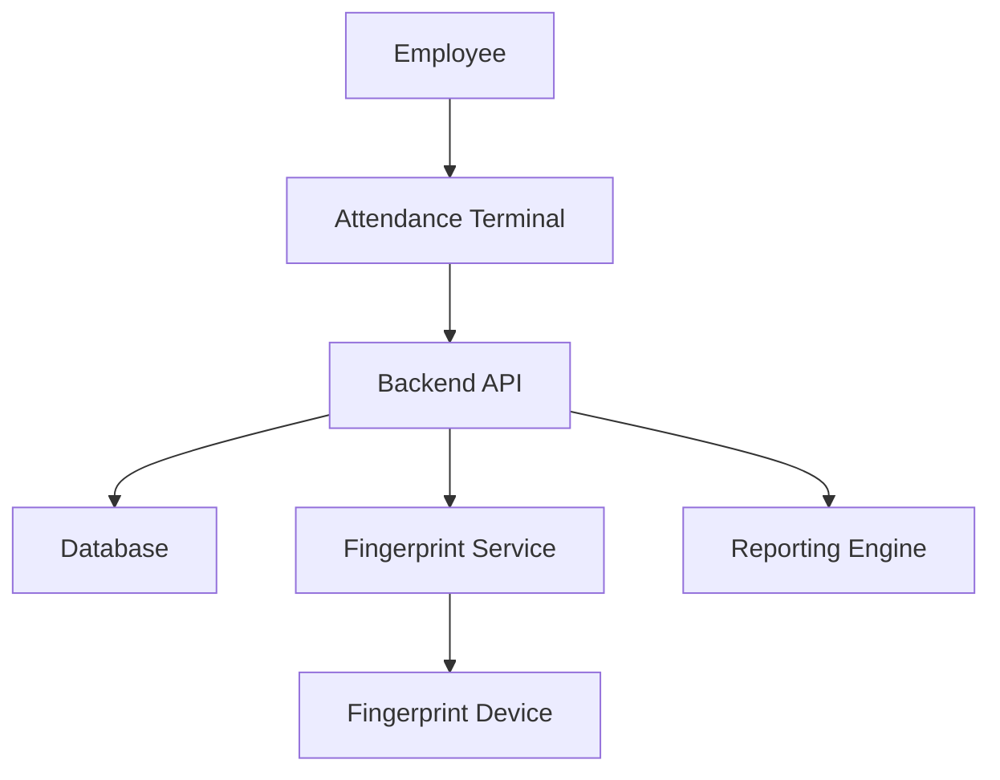

# Fingerprint Attendance System

This example demonstrates a complete fingerprint-based attendance tracking system for employee time and attendance management.

## Overview

This attendance system allows:
- Employee registration with fingerprint enrollment
- Clock-in/clock-out using fingerprint identification
- Real-time attendance tracking
- Attendance reports and analytics
- Late arrival and early departure detection

## Architecture



## Database Schema

### Employees Table

```sql
CREATE TABLE employees (
  id INT PRIMARY KEY AUTO_INCREMENT,
  employee_code VARCHAR(50) UNIQUE NOT NULL,
  first_name VARCHAR(100) NOT NULL,
  last_name VARCHAR(100) NOT NULL,
  email VARCHAR(255) UNIQUE NOT NULL,
  department VARCHAR(100),
  position VARCHAR(100),
  shift_start TIME DEFAULT '09:00:00',
  shift_end TIME DEFAULT '17:00:00',
  is_active BOOLEAN DEFAULT TRUE,
  created_at TIMESTAMP DEFAULT CURRENT_TIMESTAMP,
  INDEX idx_employee_code (employee_code),
  INDEX idx_department (department)
);
```

### Fingerprint Templates Table

```sql
CREATE TABLE employee_fingerprints (
  id INT PRIMARY KEY AUTO_INCREMENT,
  employee_id INT NOT NULL,
  template_data TEXT NOT NULL,
  finger_position ENUM('left_thumb', 'left_index', 'left_middle', 'left_ring', 'left_pinky',
                       'right_thumb', 'right_index', 'right_middle', 'right_ring', 'right_pinky'),
  quality_score INT,
  enrolled_at TIMESTAMP DEFAULT CURRENT_TIMESTAMP,
  FOREIGN KEY (employee_id) REFERENCES employees(id) ON DELETE CASCADE,
  INDEX idx_employee_id (employee_id)
);
```

### Attendance Records Table

```sql
CREATE TABLE attendance_records (
  id INT PRIMARY KEY AUTO_INCREMENT,
  employee_id INT NOT NULL,
  clock_in TIMESTAMP NOT NULL,
  clock_out TIMESTAMP NULL,
  work_date DATE NOT NULL,
  status ENUM('present', 'late', 'early_departure', 'absent') DEFAULT 'present',
  total_hours DECIMAL(5,2) NULL,
  notes TEXT,
  created_at TIMESTAMP DEFAULT CURRENT_TIMESTAMP,
  FOREIGN KEY (employee_id) REFERENCES employees(id) ON DELETE CASCADE,
  INDEX idx_employee_date (employee_id, work_date),
  INDEX idx_work_date (work_date),
  UNIQUE KEY unique_employee_date (employee_id, work_date)
);
```

### Attendance Logs Table

```sql
CREATE TABLE attendance_logs (
  id INT PRIMARY KEY AUTO_INCREMENT,
  employee_id INT NOT NULL,
  action ENUM('clock_in', 'clock_out') NOT NULL,
  timestamp TIMESTAMP DEFAULT CURRENT_TIMESTAMP,
  device_id VARCHAR(50),
  confidence_score INT,
  ip_address VARCHAR(45),
  FOREIGN KEY (employee_id) REFERENCES employees(id) ON DELETE CASCADE,
  INDEX idx_employee_id (employee_id),
  INDEX idx_timestamp (timestamp)
);
```

## Backend Implementation (Node.js/Express)

### Setup and Dependencies

```bash
npm init -y
npm install express mysql2 moment dotenv cors
```

### Environment Configuration

```env
# .env
DB_HOST=localhost
DB_USER=root
DB_PASSWORD=your_password
DB_NAME=attendance_system
FINGERPRINT_API_URL=http://localhost:8080
FINGERPRINT_API_KEY=your-api-key
PORT=3000
LATE_THRESHOLD_MINUTES=15
EARLY_DEPARTURE_THRESHOLD_MINUTES=30
```

### Database Connection

```javascript
// db.js
const mysql = require('mysql2/promise');
require('dotenv').config();

const pool = mysql.createPool({
  host: process.env.DB_HOST,
  user: process.env.DB_USER,
  password: process.env.DB_PASSWORD,
  database: process.env.DB_NAME,
  waitForConnections: true,
  connectionLimit: 10,
  queueLimit: 0
});

module.exports = pool;
```

### Fingerprint API Client

```javascript
// fingerprint-client.js
const axios = require('axios');

class FingerprintClient {
  constructor(baseURL, apiKey) {
    this.client = axios.create({
      baseURL,
      headers: { 'X-API-Key': apiKey }
    });
  }

  async enrollFingerprint(employeeId, metadata = {}) {
    const response = await this.client.post('/fingerprint/enroll', {
      userId: employeeId,
      metadata
    });
    return response.data;
  }

  async identifyFingerprint(deviceId = null) {
    const response = await this.client.post('/fingerprint/identify', {
      deviceId
    });
    return response.data;
  }

  async startScan(deviceId = null) {
    const query = deviceId ? `?deviceId=${deviceId}` : '';
    const response = await this.client.get(`/fingerprint/scan/start${query}`);
    return response.data;
  }

  async getScanStatus(scanId) {
    const response = await this.client.get(`/fingerprint/scan/status/${scanId}`);
    return response.data;
  }
}

module.exports = new FingerprintClient(
  process.env.FINGERPRINT_API_URL,
  process.env.FINGERPRINT_API_KEY
);
```

### Employee Service

```javascript
// services/employee-service.js
const db = require('../db');

class EmployeeService {
  async createEmployee(data) {
    const { employeeCode, firstName, lastName, email, department, position, shiftStart, shiftEnd } = data;
    
    const [result] = await db.execute(
      `INSERT INTO employees (employee_code, first_name, last_name, email, department, position, shift_start, shift_end)
       VALUES (?, ?, ?, ?, ?, ?, ?, ?)`,
      [employeeCode, firstName, lastName, email, department, position, shiftStart || '09:00:00', shiftEnd || '17:00:00']
    );
    
    return result.insertId;
  }

  async getEmployeeById(employeeId) {
    const [rows] = await db.execute(
      'SELECT * FROM employees WHERE id = ? AND is_active = TRUE',
      [employeeId]
    );
    return rows[0];
  }

  async getEmployeeByCode(employeeCode) {
    const [rows] = await db.execute(
      'SELECT * FROM employees WHERE employee_code = ? AND is_active = TRUE',
      [employeeCode]
    );
    return rows[0];
  }

  async getAllEmployees() {
    const [rows] = await db.execute(
      'SELECT id, employee_code, first_name, last_name, email, department, position, shift_start, shift_end FROM employees WHERE is_active = TRUE ORDER BY employee_code'
    );
    return rows;
  }

  async saveFingerprint(employeeId, templateData, fingerPosition, qualityScore) {
    const [result] = await db.execute(
      'INSERT INTO employee_fingerprints (employee_id, template_data, finger_position, quality_score) VALUES (?, ?, ?, ?)',
      [employeeId, templateData, fingerPosition, qualityScore]
    );
    return result.insertId;
  }

  async getFingerprint(employeeId) {
    const [rows] = await db.execute(
      'SELECT template_data FROM employee_fingerprints WHERE employee_id = ? ORDER BY enrolled_at DESC LIMIT 1',
      [employeeId]
    );
    return rows[0];
  }
}

module.exports = new EmployeeService();
```

### Attendance Service

```javascript
// services/attendance-service.js
const db = require('../db');
const moment = require('moment');

class AttendanceService {
  async clockIn(employeeId, deviceId = null, confidenceScore = null, ipAddress = null) {
    const now = moment();
    const workDate = now.format('YYYY-MM-DD');
    const clockInTime = now.format('YYYY-MM-DD HH:mm:ss');

    // Check if already clocked in today
    const [existing] = await db.execute(
      'SELECT id, clock_in, clock_out FROM attendance_records WHERE employee_id = ? AND work_date = ?',
      [employeeId, workDate]
    );

    if (existing.length > 0 && !existing[0].clock_out) {
      throw new Error('Already clocked in. Please clock out first.');
    }

    // Get employee shift information
    const [employee] = await db.execute(
      'SELECT shift_start FROM employees WHERE id = ?',
      [employeeId]
    );

    if (!employee.length) {
      throw new Error('Employee not found');
    }

    // Determine if late
    const shiftStart = moment(employee[0].shift_start, 'HH:mm:ss');
    const lateThreshold = parseInt(process.env.LATE_THRESHOLD_MINUTES || 15);
    const isLate = now.diff(shiftStart, 'minutes') > lateThreshold;
    const status = isLate ? 'late' : 'present';

    // Create attendance record
    const [result] = await db.execute(
      'INSERT INTO attendance_records (employee_id, clock_in, work_date, status) VALUES (?, ?, ?, ?)',
      [employeeId, clockInTime, workDate, status]
    );

    // Log the action
    await db.execute(
      'INSERT INTO attendance_logs (employee_id, action, device_id, confidence_score, ip_address) VALUES (?, ?, ?, ?, ?)',
      [employeeId, 'clock_in', deviceId, confidenceScore, ipAddress]
    );

    return {
      attendanceId: result.insertId,
      clockIn: clockInTime,
      status,
      isLate
    };
  }

  async clockOut(employeeId, deviceId = null, confidenceScore = null, ipAddress = null) {
    const now = moment();
    const workDate = now.format('YYYY-MM-DD');
    const clockOutTime = now.format('YYYY-MM-DD HH:mm:ss');

    // Get today's attendance record
    const [records] = await db.execute(
      'SELECT id, clock_in, status FROM attendance_records WHERE employee_id = ? AND work_date = ? AND clock_out IS NULL',
      [employeeId, workDate]
    );

    if (!records.length) {
      throw new Error('No clock-in record found for today');
    }

    const record = records[0];
    const clockInTime = moment(record.clock_in);
    const totalHours = now.diff(clockInTime, 'hours', true);

    // Get employee shift information
    const [employee] = await db.execute(
      'SELECT shift_end FROM employees WHERE id = ?',
      [employeeId]
    );

    // Check for early departure
    const shiftEnd = moment(employee[0].shift_end, 'HH:mm:ss');
    const earlyThreshold = parseInt(process.env.EARLY_DEPARTURE_THRESHOLD_MINUTES || 30);
    const isEarlyDeparture = shiftEnd.diff(now, 'minutes') > earlyThreshold;
    
    let status = record.status;
    if (isEarlyDeparture && status === 'present') {
      status = 'early_departure';
    }

    // Update attendance record
    await db.execute(
      'UPDATE attendance_records SET clock_out = ?, total_hours = ?, status = ? WHERE id = ?',
      [clockOutTime, totalHours.toFixed(2), status, record.id]
    );

    // Log the action
    await db.execute(
      'INSERT INTO attendance_logs (employee_id, action, device_id, confidence_score, ip_address) VALUES (?, ?, ?, ?, ?)',
      [employeeId, 'clock_out', deviceId, confidenceScore, ipAddress]
    );

    return {
      attendanceId: record.id,
      clockOut: clockOutTime,
      totalHours: totalHours.toFixed(2),
      status
    };
  }

  async getTodayAttendance() {
    const today = moment().format('YYYY-MM-DD');
    
    const [rows] = await db.execute(
      `SELECT ar.*, e.employee_code, e.first_name, e.last_name, e.department
       FROM attendance_records ar
       JOIN employees e ON ar.employee_id = e.id
       WHERE ar.work_date = ?
       ORDER BY ar.clock_in DESC`,
      [today]
    );
    
    return rows;
  }

  async getEmployeeAttendance(employeeId, startDate, endDate) {
    const [rows] = await db.execute(
      `SELECT * FROM attendance_records
       WHERE employee_id = ? AND work_date BETWEEN ? AND ?
       ORDER BY work_date DESC`,
      [employeeId, startDate, endDate]
    );
    
    return rows;
  }

  async getAttendanceReport(startDate, endDate) {
    const [rows] = await db.execute(
      `SELECT 
         e.employee_code,
         e.first_name,
         e.last_name,
         e.department,
         COUNT(ar.id) as total_days,
         SUM(CASE WHEN ar.status = 'present' THEN 1 ELSE 0 END) as present_days,
         SUM(CASE WHEN ar.status = 'late' THEN 1 ELSE 0 END) as late_days,
         SUM(CASE WHEN ar.status = 'early_departure' THEN 1 ELSE 0 END) as early_departure_days,
         SUM(ar.total_hours) as total_hours
       FROM employees e
       LEFT JOIN attendance_records ar ON e.id = ar.employee_id 
         AND ar.work_date BETWEEN ? AND ?
       WHERE e.is_active = TRUE
       GROUP BY e.id
       ORDER BY e.employee_code`,
      [startDate, endDate]
    );
    
    return rows;
  }

  async getAttendanceStatus(employeeId) {
    const today = moment().format('YYYY-MM-DD');
    
    const [rows] = await db.execute(
      'SELECT clock_in, clock_out, status FROM attendance_records WHERE employee_id = ? AND work_date = ?',
      [employeeId, today]
    );
    
    if (!rows.length) {
      return { status: 'not_clocked_in', clockedIn: false };
    }
    
    const record = rows[0];
    return {
      status: record.status,
      clockedIn: !record.clock_out,
      clockIn: record.clock_in,
      clockOut: record.clock_out
    };
  }
}

module.exports = new AttendanceService();
```

### API Routes

```javascript
// routes/employees.js
const express = require('express');
const router = express.Router();
const employeeService = require('../services/employee-service');
const fingerprintClient = require('../fingerprint-client');

// Register new employee
router.post('/register', async (req, res) => {
  try {
    const { employeeCode, firstName, lastName, email, department, position, shiftStart, shiftEnd } = req.body;

    if (!employeeCode || !firstName || !lastName || !email) {
      return res.status(400).json({ error: 'Missing required fields' });
    }

    const employeeId = await employeeService.createEmployee({
      employeeCode, firstName, lastName, email, department, position, shiftStart, shiftEnd
    });

    res.json({
      success: true,
      employeeId,
      message: 'Employee registered successfully'
    });
  } catch (error) {
    console.error('Registration error:', error);
    res.status(500).json({ error: error.message });
  }
});

// Enroll fingerprint
router.post('/enroll', async (req, res) => {
  try {
    const { employeeId, fingerPosition } = req.body;

    if (!employeeId) {
      return res.status(400).json({ error: 'Employee ID is required' });
    }

    const enrollResult = await fingerprintClient.enrollFingerprint(employeeId, {
      fingerPosition: fingerPosition || 'right_index'
    });

    if (!enrollResult.success) {
      return res.status(400).json({ error: 'Enrollment failed', details: enrollResult });
    }

    await employeeService.saveFingerprint(
      employeeId,
      enrollResult.template,
      fingerPosition || 'right_index',
      enrollResult.quality || 0
    );

    res.json({
      success: true,
      message: 'Fingerprint enrolled successfully'
    });
  } catch (error) {
    console.error('Enrollment error:', error);
    res.status(500).json({ error: error.message });
  }
});

// Get all employees
router.get('/', async (req, res) => {
  try {
    const employees = await employeeService.getAllEmployees();
    res.json({ success: true, employees });
  } catch (error) {
    console.error('Error fetching employees:', error);
    res.status(500).json({ error: error.message });
  }
});

// Get employee by ID
router.get('/:id', async (req, res) => {
  try {
    const employee = await employeeService.getEmployeeById(req.params.id);
    if (!employee) {
      return res.status(404).json({ error: 'Employee not found' });
    }
    res.json({ success: true, employee });
  } catch (error) {
    console.error('Error fetching employee:', error);
    res.status(500).json({ error: error.message });
  }
});

module.exports = router;
```

```javascript
// routes/attendance.js
const express = require('express');
const router = express.Router();
const attendanceService = require('../services/attendance-service');
const fingerprintClient = require('../fingerprint-client');

// Clock in/out with fingerprint identification
router.post('/punch', async (req, res) => {
  try {
    const { deviceId } = req.body;

    // Start fingerprint identification
    const identifyResult = await fingerprintClient.identifyFingerprint(deviceId);

    if (!identifyResult.success || !identifyResult.userId) {
      return res.status(400).json({ error: 'Fingerprint not recognized' });
    }

    const employeeId = identifyResult.userId;

    // Check current attendance status
    const status = await attendanceService.getAttendanceStatus(employeeId);

    let result;
    if (!status.clockedIn) {
      // Clock in
      result = await attendanceService.clockIn(
        employeeId,
        deviceId,
        identifyResult.confidence,
        req.ip
      );
      result.action = 'clock_in';
    } else {
      // Clock out
      result = await attendanceService.clockOut(
        employeeId,
        deviceId,
        identifyResult.confidence,
        req.ip
      );
      result.action = 'clock_out';
    }

    res.json({
      success: true,
      employeeId,
      ...result
    });
  } catch (error) {
    console.error('Punch error:', error);
    res.status(500).json({ error: error.message });
  }
});

// Get today's attendance
router.get('/today', async (req, res) => {
  try {
    const attendance = await attendanceService.getTodayAttendance();
    res.json({ success: true, attendance });
  } catch (error) {
    console.error('Error fetching attendance:', error);
    res.status(500).json({ error: error.message });
  }
});

// Get employee attendance history
router.get('/employee/:employeeId', async (req, res) => {
  try {
    const { employeeId } = req.params;
    const { startDate, endDate } = req.query;

    if (!startDate || !endDate) {
      return res.status(400).json({ error: 'Start date and end date are required' });
    }

    const attendance = await attendanceService.getEmployeeAttendance(
      employeeId,
      startDate,
      endDate
    );

    res.json({ success: true, attendance });
  } catch (error) {
    console.error('Error fetching employee attendance:', error);
    res.status(500).json({ error: error.message });
  }
});

// Get attendance report
router.get('/report', async (req, res) => {
  try {
    const { startDate, endDate } = req.query;

    if (!startDate || !endDate) {
      return res.status(400).json({ error: 'Start date and end date are required' });
    }

    const report = await attendanceService.getAttendanceReport(startDate, endDate);
    res.json({ success: true, report });
  } catch (error) {
    console.error('Error generating report:', error);
    res.status(500).json({ error: error.message });
  }
});

// Get employee status
router.get('/status/:employeeId', async (req, res) => {
  try {
    const status = await attendanceService.getAttendanceStatus(req.params.employeeId);
    res.json({ success: true, ...status });
  } catch (error) {
    console.error('Error fetching status:', error);
    res.status(500).json({ error: error.message });
  }
});

module.exports = router;
```

### Main Application

```javascript
// app.js
const express = require('express');
const cors = require('cors');
require('dotenv').config();

const employeeRoutes = require('./routes/employees');
const attendanceRoutes = require('./routes/attendance');

const app = express();

// Middleware
app.use(cors());
app.use(express.json());
app.use(express.static('public'));

// Routes
app.use('/api/employees', employeeRoutes);
app.use('/api/attendance', attendanceRoutes);

const PORT = process.env.PORT || 3000;
app.listen(PORT, () => {
  console.log(`Attendance system running on port ${PORT}`);
});
```

## Frontend Implementation

### Attendance Terminal Interface

```html
<!-- public/terminal.html -->
<!DOCTYPE html>
<html lang="en">
<head>
  <meta charset="UTF-8">
  <meta name="viewport" content="width=device-width, initial-scale=1.0">
  <title>Attendance Terminal</title>
  <style>
    body {
      font-family: Arial, sans-serif;
      margin: 0;
      padding: 0;
      background: linear-gradient(135deg, #667eea 0%, #764ba2 100%);
      height: 100vh;
      display: flex;
      justify-content: center;
      align-items: center;
    }
    .terminal {
      background: white;
      border-radius: 20px;
      padding: 40px;
      box-shadow: 0 20px 60px rgba(0,0,0,0.3);
      text-align: center;
      max-width: 500px;
      width: 90%;
    }
    h1 {
      color: #333;
      margin-bottom: 10px;
    }
    .time {
      font-size: 48px;
      font-weight: bold;
      color: #667eea;
      margin: 20px 0;
    }
    .date {
      font-size: 20px;
      color: #666;
      margin-bottom: 30px;
    }
    .scanner-area {
      background: #f8f9fa;
      border: 3px dashed #667eea;
      border-radius: 15px;
      padding: 40px;
      margin: 30px 0;
    }
    .scanner-icon {
      font-size: 80px;
      margin-bottom: 20px;
    }
    .instruction {
      font-size: 24px;
      color: #333;
      font-weight: 500;
    }
    .status {
      padding: 15px;
      border-radius: 10px;
      margin-top: 20px;
      font-size: 18px;
      font-weight: bold;
    }
    .success {
      background: #d4edda;
      color: #155724;
    }
    .error {
      background: #f8d7da;
      color: #721c24;
    }
    .info {
      background: #d1ecf1;
      color: #0c5460;
    }
    .employee-info {
      margin-top: 20px;
      padding: 20px;
      background: #f8f9fa;
      border-radius: 10px;
    }
  </style>
</head>
<body>
  <div class="terminal">
    <h1>Attendance System</h1>
    <div class="time" id="time">00:00:00</div>
    <div class="date" id="date">Monday, January 1, 2024</div>
    
    <div class="scanner-area">
      <div class="scanner-icon">👆</div>
      <div class="instruction">Place finger on scanner</div>
    </div>
    
    <div id="status"></div>
    <div id="employeeInfo"></div>
  </div>

  <script>
    const API_URL = 'http://localhost:3000/api';

    // Update time and date
    function updateTime() {
      const now = new Date();
      document.getElementById('time').textContent = now.toLocaleTimeString();
      document.getElementById('date').textContent = now.toLocaleDateString('en-US', {
        weekday: 'long',
        year: 'numeric',
        month: 'long',
        day: 'numeric'
      });
    }
    setInterval(updateTime, 1000);
    updateTime();

    // Show status message
    function showStatus(message, type = 'info') {
      const statusDiv = document.getElementById('status');
      statusDiv.className = `status ${type}`;
      statusDiv.textContent = message;
      statusDiv.style.display = 'block';
      
      setTimeout(() => {
        statusDiv.style.display = 'none';
      }, 5000);
    }

    // Show employee info
    function showEmployeeInfo(employee, action, details) {
      const infoDiv = document.getElementById('employeeInfo');
      const actionText = action === 'clock_in' ? 'Clocked In' : 'Clocked Out';
      const statusText = details.isLate ? ' (Late)' : '';
      
      infoDiv.innerHTML = `
        <div class="employee-info">
          <h3>${employee.first_name} ${employee.last_name}</h3>
          <p><strong>Employee Code:</strong> ${employee.employee_code}</p>
          <p><strong>Department:</strong> ${employee.department}</p>
          <p><strong>Action:</strong> ${actionText}${statusText}</p>
          <p><strong>Time:</strong> ${new Date().toLocaleTimeString()}</p>
        </div>
      `;
      
      setTimeout(() => {
        infoDiv.innerHTML = '';
      }, 10000);
    }

    // Poll for fingerprint scan
    async function pollForScan() {
      try {
        const response = await fetch(`${API_URL}/attendance/punch`, {
          method: 'POST',
          headers: { 'Content-Type': 'application/json' },
          body: JSON.stringify({})
        });

        const data = await response.json();

        if (response.ok) {
          // Get employee details
          const empResponse = await fetch(`${API_URL}/employees/${data.employeeId}`);
          const empData = await empResponse.json();
          
          if (empData.success) {
            showEmployeeInfo(empData.employee, data.action, data);
            showStatus(`${data.action === 'clock_in' ? 'Clock In' : 'Clock Out'} Successful!`, 'success');
          }
        }
      } catch (error) {
        // Silently continue polling
      }
      
      // Continue polling
      setTimeout(pollForScan, 2000);
    }

    // Start polling
    pollForScan();
  </script>
</body>
</html>
```

### Admin Dashboard

```html
<!-- public/admin.html -->
<!DOCTYPE html>
<html lang="en">
<head>
  <meta charset="UTF-8">
  <meta name="viewport" content="width=device-width, initial-scale=1.0">
  <title>Attendance Admin Dashboard</title>
  <style>
    body {
      font-family: Arial, sans-serif;
      margin: 0;
      padding: 20px;
      background: #f5f5f5;
    }
    .container {
      max-width: 1200px;
      margin: 0 auto;
      background: white;
      padding: 30px;
      border-radius: 10px;
      box-shadow: 0 2px 10px rgba(0,0,0,0.1);
    }
    h1 {
      color: #333;
      border-bottom: 3px solid #667eea;
      padding-bottom: 10px;
    }
    .tabs {
      display: flex;
      gap: 10px;
      margin: 20px 0;
      border-bottom: 2px solid #ddd;
    }
    .tab {
      padding: 10px 20px;
      cursor: pointer;
      border: none;
      background: none;
      font-size: 16px;
      color: #666;
    }
    .tab.active {
      color: #667eea;
      border-bottom: 3px solid #667eea;
      margin-bottom: -2px;
    }
    .tab-content {
      display: none;
      padding: 20px 0;
    }
    .tab-content.active {
      display: block;
    }
    table {
      width: 100%;
      border-collapse: collapse;
      margin-top: 20px;
    }
    th, td {
      padding: 12px;
      text-align: left;
      border-bottom: 1px solid #ddd;
    }
    th {
      background: #667eea;
      color: white;
    }
    tr:hover {
      background: #f8f9fa;
    }
    .status-badge {
      padding: 5px 10px;
      border-radius: 5px;
      font-size: 12px;
      font-weight: bold;
    }
    .status-present {
      background: #d4edda;
      color: #155724;
    }
    .status-late {
      background: #fff3cd;
      color: #856404;
    }
    .status-early {
      background: #f8d7da;
      color: #721c24;
    }
    .filters {
      display: flex;
      gap: 15px;
      margin: 20px 0;
      flex-wrap: wrap;
    }
    .filters input, .filters button {
      padding: 8px 15px;
      border: 1px solid #ddd;
      border-radius: 5px;
    }
    .filters button {
      background: #667eea;
      color: white;
      cursor: pointer;
      border: none;
    }
  </style>
</head>
<body>
  <div class="container">
    <h1>Attendance Admin Dashboard</h1>
    
    <div class="tabs">
      <button class="tab active" onclick="showTab('today')">Today's Attendance</button>
      <button class="tab" onclick="showTab('report')">Attendance Report</button>
      <button class="tab" onclick="showTab('employees')">Employees</button>
    </div>
    
    <div id="today" class="tab-content active">
      <h2>Today's Attendance</h2>
      <div id="todayAttendance">Loading...</div>
    </div>
    
    <div id="report" class="tab-content">
      <h2>Attendance Report</h2>
      <div class="filters">
        <input type="date" id="reportStartDate">
        <input type="date" id="reportEndDate">
        <button onclick="loadReport()">Generate Report</button>
      </div>
      <div id="reportData"></div>
    </div>
    
    <div id="employees" class="tab-content">
      <h2>Employee List</h2>
      <div id="employeeList">Loading...</div>
    </div>
  </div>

  <script>
    const API_URL = 'http://localhost:3000/api';

    function showTab(tabName) {
      document.querySelectorAll('.tab').forEach(tab => tab.classList.remove('active'));
      document.querySelectorAll('.tab-content').forEach(content => content.classList.remove('active'));
      
      event.target.classList.add('active');
      document.getElementById(tabName).classList.add('active');
      
      if (tabName === 'today') loadTodayAttendance();
      if (tabName === 'employees') loadEmployees();
    }

    async function loadTodayAttendance() {
      try {
        const response = await fetch(`${API_URL}/attendance/today`);
        const data = await response.json();
        
        if (data.success) {
          const html = `
            <table>
              <thead>
                <tr>
                  <th>Employee Code</th>
                  <th>Name</th>
                  <th>Department</th>
                  <th>Clock In</th>
                  <th>Clock Out</th>
                  <th>Hours</th>
                  <th>Status</th>
                </tr>
              </thead>
              <tbody>
                ${data.attendance.map(record => `
                  <tr>
                    <td>${record.employee_code}</td>
                    <td>${record.first_name} ${record.last_name}</td>
                    <td>${record.department || 'N/A'}</td>
                    <td>${new Date(record.clock_in).toLocaleTimeString()}</td>
                    <td>${record.clock_out ? new Date(record.clock_out).toLocaleTimeString() : 'Not clocked out'}</td>
                    <td>${record.total_hours || '-'}</td>
                    <td><span class="status-badge status-${record.status}">${record.status}</span></td>
                  </tr>
                `).join('')}
              </tbody>
            </table>
          `;
          document.getElementById('todayAttendance').innerHTML = html;
        }
      } catch (error) {
        document.getElementById('todayAttendance').innerHTML = 'Error loading attendance data';
      }
    }

    async function loadReport() {
      const startDate = document.getElementById('reportStartDate').value;
      const endDate = document.getElementById('reportEndDate').value;
      
      if (!startDate || !endDate) {
        alert('Please select both start and end dates');
        return;
      }
      
      try {
        const response = await fetch(`${API_URL}/attendance/report?startDate=${startDate}&endDate=${endDate}`);
        const data = await response.json();
        
        if (data.success) {
          const html = `
            <table>
              <thead>
                <tr>
                  <th>Employee Code</th>
                  <th>Name</th>
                  <th>Department</th>
                  <th>Total Days</th>
                  <th>Present</th>
                  <th>Late</th>
                  <th>Early Departure</th>
                  <th>Total Hours</th>
                </tr>
              </thead>
              <tbody>
                ${data.report.map(record => `
                  <tr>
                    <td>${record.employee_code}</td>
                    <td>${record.first_name} ${record.last_name}</td>
                    <td>${record.department || 'N/A'}</td>
                    <td>${record.total_days || 0}</td>
                    <td>${record.present_days || 0}</td>
                    <td>${record.late_days || 0}</td>
                    <td>${record.early_departure_days || 0}</td>
                    <td>${record.total_hours ? parseFloat(record.total_hours).toFixed(2) : '0.00'}</td>
                  </tr>
                `).join('')}
              </tbody>
            </table>
          `;
          document.getElementById('reportData').innerHTML = html;
        }
      } catch (error) {
        document.getElementById('reportData').innerHTML = 'Error loading report';
      }
    }

    async function loadEmployees() {
      try {
        const response = await fetch(`${API_URL}/employees`);
        const data = await response.json();
        
        if (data.success) {
          const html = `
            <table>
              <thead>
                <tr>
                  <th>Employee Code</th>
                  <th>Name</th>
                  <th>Email</th>
                  <th>Department</th>
                  <th>Position</th>
                  <th>Shift</th>
                </tr>
              </thead>
              <tbody>
                ${data.employees.map(emp => `
                  <tr>
                    <td>${emp.employee_code}</td>
                    <td>${emp.first_name} ${emp.last_name}</td>
                    <td>${emp.email}</td>
                    <td>${emp.department || 'N/A'}</td>
                    <td>${emp.position || 'N/A'}</td>
                    <td>${emp.shift_start} - ${emp.shift_end}</td>
                  </tr>
                `).join('')}
              </tbody>
            </table>
          `;
          document.getElementById('employeeList').innerHTML = html;
        }
      } catch (error) {
        document.getElementById('employeeList').innerHTML = 'Error loading employees';
      }
    }

    // Set default dates for report
    const today = new Date();
    const firstDay = new Date(today.getFullYear(), today.getMonth(), 1);
    document.getElementById('reportStartDate').valueAsDate = firstDay;
    document.getElementById('reportEndDate').valueAsDate = today;

    // Load initial data
    loadTodayAttendance();
    
    // Auto-refresh today's attendance every 30 seconds
    setInterval(() => {
      if (document.getElementById('today').classList.contains('active')) {
        loadTodayAttendance();
      }
    }, 30000);
  </script>
</body>
</html>
```

## Deployment Instructions

### 1. Database Setup

```bash
# Create database
mysql -u root -p

CREATE DATABASE attendance_system;
USE attendance_system;

# Run all schema SQL from above
# (employees, employee_fingerprints, attendance_records, attendance_logs tables)
```

### 2. Install Dependencies

```bash
npm install
```

### 3. Configure Environment

Create a `.env` file:

```env
DB_HOST=localhost
DB_USER=root
DB_PASSWORD=your_password
DB_NAME=attendance_system
FINGERPRINT_API_URL=http://localhost:8080
FINGERPRINT_API_KEY=your-api-key
PORT=3000
LATE_THRESHOLD_MINUTES=15
EARLY_DEPARTURE_THRESHOLD_MINUTES=30
```

### 4. Start the Application

```bash
node app.js
```

### 5. Access the Application

- Attendance Terminal: http://localhost:3000/terminal.html
- Admin Dashboard: http://localhost:3000/admin.html

## Advanced Features

### Email Notifications

Add email notifications for late arrivals:

```bash
npm install nodemailer
```

```javascript
// services/notification-service.js
const nodemailer = require('nodemailer');

const transporter = nodemailer.createTransport({
  host: process.env.SMTP_HOST,
  port: process.env.SMTP_PORT,
  auth: {
    user: process.env.SMTP_USER,
    pass: process.env.SMTP_PASS
  }
});

async function notifyLateArrival(employee, clockInTime) {
  await transporter.sendMail({
    from: process.env.SMTP_FROM,
    to: employee.email,
    subject: 'Late Arrival Notification',
    html: `
      <h2>Late Arrival Notice</h2>
      <p>Dear ${employee.first_name},</p>
      <p>You clocked in at ${clockInTime}, which is after your scheduled shift start time.</p>
      <p>Please ensure to arrive on time for future shifts.</p>
    `
  });
}
```

### Export Reports to CSV

```javascript
// Add to attendance service
async exportToCSV(startDate, endDate) {
  const report = await this.getAttendanceReport(startDate, endDate);
  
  const csv = [
    ['Employee Code', 'Name', 'Department', 'Total Days', 'Present', 'Late', 'Early Departure', 'Total Hours'],
    ...report.map(r => [
      r.employee_code,
      `${r.first_name} ${r.last_name}`,
      r.department || 'N/A',
      r.total_days || 0,
      r.present_days || 0,
      r.late_days || 0,
      r.early_departure_days || 0,
      r.total_hours ? parseFloat(r.total_hours).toFixed(2) : '0.00'
    ])
  ].map(row => row.join(',')).join('\n');
  
  return csv;
}
```

### Overtime Calculation

```javascript
// Add to attendance service
async calculateOvertime(employeeId, workDate) {
  const [records] = await db.execute(
    `SELECT ar.*, e.shift_end 
     FROM attendance_records ar
     JOIN employees e ON ar.employee_id = e.id
     WHERE ar.employee_id = ? AND ar.work_date = ?`,
    [employeeId, workDate]
  );
  
  if (!records.length || !records[0].clock_out) {
    return 0;
  }
  
  const record = records[0];
  const clockOut = moment(record.clock_out);
  const shiftEnd = moment(record.shift_end, 'HH:mm:ss');
  
  const overtimeMinutes = clockOut.diff(shiftEnd, 'minutes');
  return overtimeMinutes > 0 ? overtimeMinutes / 60 : 0;
}
```

## Testing the System

### 1. Register an Employee

```bash
curl -X POST http://localhost:3000/api/employees/register \
  -H "Content-Type: application/json" \
  -d '{
    "employeeCode": "EMP001",
    "firstName": "John",
    "lastName": "Doe",
    "email": "john.doe@company.com",
    "department": "Engineering",
    "position": "Software Developer",
    "shiftStart": "09:00:00",
    "shiftEnd": "17:00:00"
  }'
```

### 2. Enroll Fingerprint

```bash
curl -X POST http://localhost:3000/api/employees/enroll \
  -H "Content-Type: application/json" \
  -d '{
    "employeeId": 1,
    "fingerPosition": "right_index"
  }'
```

### 3. Test Clock In/Out

Use the terminal interface or API:

```bash
curl -X POST http://localhost:3000/api/attendance/punch \
  -H "Content-Type: application/json" \
  -d '{}'
```

## Troubleshooting

### Issue: Employee not recognized

**Solution**: 
- Verify fingerprint was enrolled successfully
- Check fingerprint quality score
- Ensure fingerprint service is running
- Try re-enrolling the fingerprint

### Issue: Incorrect attendance status

**Solution**: 
- Check shift times in employee record
- Verify LATE_THRESHOLD_MINUTES and EARLY_DEPARTURE_THRESHOLD_MINUTES settings
- Check system time synchronization

### Issue: Duplicate clock-in attempts

**Solution**: The system prevents duplicate clock-ins. If an employee is already clocked in, they must clock out first.

## Next Steps

- Add break time tracking
- Implement shift scheduling
- Add leave management integration
- Create mobile app for attendance
- Add geofencing for remote attendance
- Implement facial recognition as backup
- Add payroll integration
- Create manager approval workflows

## Related Documentation

- [Identification Flow Guide](../guides/identification-flow.md)
- [REST API Reference](../api-reference/rest-api.md)
- [Best Practices](../guides/best-practices.md)
- [WebSocket Events](../api-reference/websocket.md)
