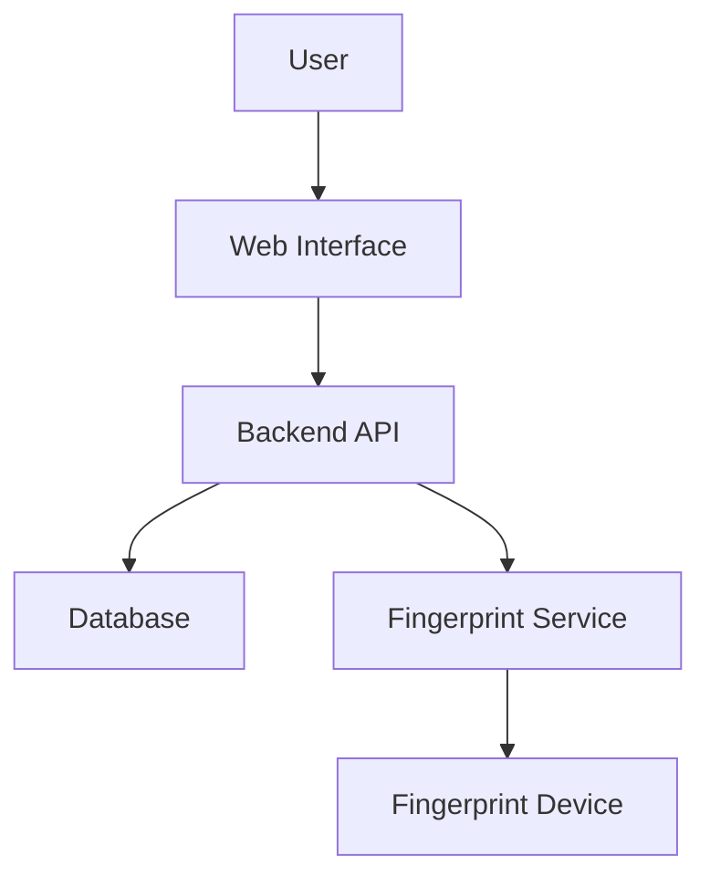

# Fingerprint Login System

This example demonstrates a complete fingerprint-based authentication system with user registration, login, and session management.

## Overview

This login system allows users to:
- Register with username and fingerprint
- Login using fingerprint verification
- Maintain secure sessions
- Logout and session cleanup

## Architecture



## Database Schema

### Users Table

```sql
CREATE TABLE users (
  id INT PRIMARY KEY AUTO_INCREMENT,
  username VARCHAR(255) UNIQUE NOT NULL,
  email VARCHAR(255) UNIQUE NOT NULL,
  created_at TIMESTAMP DEFAULT CURRENT_TIMESTAMP,
  last_login TIMESTAMP NULL,
  is_active BOOLEAN DEFAULT TRUE
);
```

### Fingerprint Templates Table

```sql
CREATE TABLE fingerprint_templates (
  id INT PRIMARY KEY AUTO_INCREMENT,
  user_id INT NOT NULL,
  template_data TEXT NOT NULL,
  finger_position ENUM('left_thumb', 'left_index', 'left_middle', 'left_ring', 'left_pinky',
                       'right_thumb', 'right_index', 'right_middle', 'right_ring', 'right_pinky'),
  quality_score INT,
  enrolled_at TIMESTAMP DEFAULT CURRENT_TIMESTAMP,
  FOREIGN KEY (user_id) REFERENCES users(id) ON DELETE CASCADE,
  INDEX idx_user_id (user_id)
);
```

### Sessions Table

```sql
CREATE TABLE sessions (
  id VARCHAR(255) PRIMARY KEY,
  user_id INT NOT NULL,
  created_at TIMESTAMP DEFAULT CURRENT_TIMESTAMP,
  expires_at TIMESTAMP NOT NULL,
  ip_address VARCHAR(45),
  user_agent TEXT,
  FOREIGN KEY (user_id) REFERENCES users(id) ON DELETE CASCADE,
  INDEX idx_user_id (user_id),
  INDEX idx_expires_at (expires_at)
);
```

## Backend Implementation (Node.js/Express)

### Setup and Dependencies

```bash
npm init -y
npm install express mysql2 express-session uuid bcrypt dotenv
```

### Environment Configuration

```env
# .env
DB_HOST=localhost
DB_USER=root
DB_PASSWORD=your_password
DB_NAME=fingerprint_login
SESSION_SECRET=your-secret-key-change-this
FINGERPRINT_API_URL=http://localhost:8080
FINGERPRINT_API_KEY=your-api-key
PORT=3000
```

### Database Connection

```javascript
// db.js
const mysql = require('mysql2/promise');
require('dotenv').config();

const pool = mysql.createPool({
  host: process.env.DB_HOST,
  user: process.env.DB_USER,
  password: process.env.DB_PASSWORD,
  database: process.env.DB_NAME,
  waitForConnections: true,
  connectionLimit: 10,
  queueLimit: 0
});

module.exports = pool;
```

### Fingerprint API Client

```javascript
// fingerprint-client.js
const axios = require('axios');

class FingerprintClient {
  constructor(baseURL, apiKey) {
    this.client = axios.create({
      baseURL,
      headers: { 'X-API-Key': apiKey }
    });
  }

  async enrollFingerprint(userId, metadata = {}) {
    const response = await this.client.post('/fingerprint/enroll', {
      userId,
      metadata
    });
    return response.data;
  }

  async verifyFingerprint(template, userId) {
    const response = await this.client.post('/fingerprint/verify', {
      template,
      userId
    });
    return response.data;
  }

  async startScan() {
    const response = await this.client.get('/fingerprint/scan/start');
    return response.data;
  }

  async getScanStatus(scanId) {
    const response = await this.client.get(`/fingerprint/scan/status/${scanId}`);
    return response.data;
  }
}

module.exports = new FingerprintClient(
  process.env.FINGERPRINT_API_URL,
  process.env.FINGERPRINT_API_KEY
);
```

### User Service

```javascript
// services/user-service.js
const db = require('../db');
const { v4: uuidv4 } = require('uuid');

class UserService {
  async createUser(username, email) {
    const [result] = await db.execute(
      'INSERT INTO users (username, email) VALUES (?, ?)',
      [username, email]
    );
    return result.insertId;
  }

  async getUserById(userId) {
    const [rows] = await db.execute(
      'SELECT id, username, email, created_at, last_login, is_active FROM users WHERE id = ?',
      [userId]
    );
    return rows[0];
  }

  async getUserByUsername(username) {
    const [rows] = await db.execute(
      'SELECT id, username, email, created_at, last_login, is_active FROM users WHERE username = ?',
      [username]
    );
    return rows[0];
  }

  async saveFingerprint(userId, templateData, fingerPosition, qualityScore) {
    const [result] = await db.execute(
      'INSERT INTO fingerprint_templates (user_id, template_data, finger_position, quality_score) VALUES (?, ?, ?, ?)',
      [userId, templateData, fingerPosition, qualityScore]
    );
    return result.insertId;
  }

  async getFingerprint(userId) {
    const [rows] = await db.execute(
      'SELECT template_data, finger_position, quality_score FROM fingerprint_templates WHERE user_id = ? ORDER BY enrolled_at DESC LIMIT 1',
      [userId]
    );
    return rows[0];
  }

  async updateLastLogin(userId) {
    await db.execute(
      'UPDATE users SET last_login = CURRENT_TIMESTAMP WHERE id = ?',
      [userId]
    );
  }

  async createSession(userId, ipAddress, userAgent) {
    const sessionId = uuidv4();
    const expiresAt = new Date(Date.now() + 24 * 60 * 60 * 1000); // 24 hours

    await db.execute(
      'INSERT INTO sessions (id, user_id, expires_at, ip_address, user_agent) VALUES (?, ?, ?, ?, ?)',
      [sessionId, userId, expiresAt, ipAddress, userAgent]
    );

    return { sessionId, expiresAt };
  }

  async getSession(sessionId) {
    const [rows] = await db.execute(
      'SELECT s.id, s.user_id, s.expires_at, u.username, u.email FROM sessions s JOIN users u ON s.user_id = u.id WHERE s.id = ? AND s.expires_at > NOW()',
      [sessionId]
    );
    return rows[0];
  }

  async deleteSession(sessionId) {
    await db.execute('DELETE FROM sessions WHERE id = ?', [sessionId]);
  }

  async cleanupExpiredSessions() {
    await db.execute('DELETE FROM sessions WHERE expires_at < NOW()');
  }
}

module.exports = new UserService();
```

### API Routes

```javascript
// routes/auth.js
const express = require('express');
const router = express.Router();
const userService = require('../services/user-service');
const fingerprintClient = require('../fingerprint-client');

// Registration endpoint
router.post('/register', async (req, res) => {
  try {
    const { username, email } = req.body;

    // Validate input
    if (!username || !email) {
      return res.status(400).json({ error: 'Username and email are required' });
    }

    // Check if user exists
    const existingUser = await userService.getUserByUsername(username);
    if (existingUser) {
      return res.status(409).json({ error: 'Username already exists' });
    }

    // Create user
    const userId = await userService.createUser(username, email);

    res.json({
      success: true,
      userId,
      message: 'User created. Please enroll fingerprint.'
    });
  } catch (error) {
    console.error('Registration error:', error);
    res.status(500).json({ error: 'Registration failed' });
  }
});

// Fingerprint enrollment endpoint
router.post('/enroll', async (req, res) => {
  try {
    const { userId, fingerPosition } = req.body;

    if (!userId) {
      return res.status(400).json({ error: 'User ID is required' });
    }

    // Start enrollment with fingerprint service
    const enrollResult = await fingerprintClient.enrollFingerprint(userId, {
      fingerPosition: fingerPosition || 'right_index'
    });

    if (!enrollResult.success) {
      return res.status(400).json({ error: 'Enrollment failed', details: enrollResult });
    }

    // Save template to database
    await userService.saveFingerprint(
      userId,
      enrollResult.template,
      fingerPosition || 'right_index',
      enrollResult.quality || 0
    );

    res.json({
      success: true,
      message: 'Fingerprint enrolled successfully'
    });
  } catch (error) {
    console.error('Enrollment error:', error);
    res.status(500).json({ error: 'Enrollment failed' });
  }
});

// Login endpoint
router.post('/login', async (req, res) => {
  try {
    const { username } = req.body;

    if (!username) {
      return res.status(400).json({ error: 'Username is required' });
    }

    // Get user
    const user = await userService.getUserByUsername(username);
    if (!user) {
      return res.status(404).json({ error: 'User not found' });
    }

    // Get stored fingerprint template
    const fingerprint = await userService.getFingerprint(user.id);
    if (!fingerprint) {
      return res.status(400).json({ error: 'No fingerprint enrolled for this user' });
    }

    // Start fingerprint scan
    const scanResult = await fingerprintClient.startScan();
    if (!scanResult.success) {
      return res.status(500).json({ error: 'Failed to start fingerprint scan' });
    }

    // Return scan ID for client to poll
    res.json({
      success: true,
      scanId: scanResult.scanId,
      userId: user.id,
      message: 'Place finger on scanner'
    });
  } catch (error) {
    console.error('Login error:', error);
    res.status(500).json({ error: 'Login failed' });
  }
});

// Verify fingerprint and create session
router.post('/verify', async (req, res) => {
  try {
    const { userId, scanId } = req.body;

    if (!userId || !scanId) {
      return res.status(400).json({ error: 'User ID and scan ID are required' });
    }

    // Get scan status
    const scanStatus = await fingerprintClient.getScanStatus(scanId);
    if (!scanStatus.success || !scanStatus.template) {
      return res.status(400).json({ error: 'Fingerprint scan not complete' });
    }

    // Verify fingerprint
    const verifyResult = await fingerprintClient.verifyFingerprint(
      scanStatus.template,
      userId
    );

    if (!verifyResult.success || !verifyResult.matched) {
      return res.status(401).json({ error: 'Fingerprint verification failed' });
    }

    // Create session
    const { sessionId, expiresAt } = await userService.createSession(
      userId,
      req.ip,
      req.headers['user-agent']
    );

    // Update last login
    await userService.updateLastLogin(userId);

    res.json({
      success: true,
      sessionId,
      expiresAt,
      message: 'Login successful'
    });
  } catch (error) {
    console.error('Verification error:', error);
    res.status(500).json({ error: 'Verification failed' });
  }
});

// Logout endpoint
router.post('/logout', async (req, res) => {
  try {
    const { sessionId } = req.body;

    if (!sessionId) {
      return res.status(400).json({ error: 'Session ID is required' });
    }

    await userService.deleteSession(sessionId);

    res.json({
      success: true,
      message: 'Logged out successfully'
    });
  } catch (error) {
    console.error('Logout error:', error);
    res.status(500).json({ error: 'Logout failed' });
  }
});

// Session validation endpoint
router.get('/session/:sessionId', async (req, res) => {
  try {
    const { sessionId } = req.params;

    const session = await userService.getSession(sessionId);
    if (!session) {
      return res.status(401).json({ error: 'Invalid or expired session' });
    }

    res.json({
      success: true,
      user: {
        id: session.user_id,
        username: session.username,
        email: session.email
      },
      expiresAt: session.expires_at
    });
  } catch (error) {
    console.error('Session validation error:', error);
    res.status(500).json({ error: 'Session validation failed' });
  }
});

module.exports = router;
```

### Main Application

```javascript
// app.js
const express = require('express');
const cors = require('cors');
require('dotenv').config();

const authRoutes = require('./routes/auth');
const userService = require('./services/user-service');

const app = express();

// Middleware
app.use(cors());
app.use(express.json());
app.use(express.static('public'));

// Routes
app.use('/api/auth', authRoutes);

// Cleanup expired sessions every hour
setInterval(() => {
  userService.cleanupExpiredSessions();
}, 60 * 60 * 1000);

const PORT = process.env.PORT || 3000;
app.listen(PORT, () => {
  console.log(`Server running on port ${PORT}`);
});
```

## Frontend Implementation (HTML/JavaScript)

### Registration Page

```html
<!-- public/register.html -->
<!DOCTYPE html>
<html lang="en">
<head>
  <meta charset="UTF-8">
  <meta name="viewport" content="width=device-width, initial-scale=1.0">
  <title>Register - Fingerprint Login</title>
  <style>
    body {
      font-family: Arial, sans-serif;
      max-width: 500px;
      margin: 50px auto;
      padding: 20px;
    }
    .form-group {
      margin-bottom: 15px;
    }
    label {
      display: block;
      margin-bottom: 5px;
      font-weight: bold;
    }
    input, select {
      width: 100%;
      padding: 8px;
      border: 1px solid #ddd;
      border-radius: 4px;
    }
    button {
      background-color: #007bff;
      color: white;
      padding: 10px 20px;
      border: none;
      border-radius: 4px;
      cursor: pointer;
    }
    button:disabled {
      background-color: #ccc;
    }
    .message {
      padding: 10px;
      margin: 10px 0;
      border-radius: 4px;
    }
    .success {
      background-color: #d4edda;
      color: #155724;
    }
    .error {
      background-color: #f8d7da;
      color: #721c24;
    }
    .info {
      background-color: #d1ecf1;
      color: #0c5460;
    }
  </style>
</head>
<body>
  <h1>Register New User</h1>
  
  <div id="step1">
    <h2>Step 1: User Information</h2>
    <form id="registerForm">
      <div class="form-group">
        <label for="username">Username:</label>
        <input type="text" id="username" required>
      </div>
      <div class="form-group">
        <label for="email">Email:</label>
        <input type="email" id="email" required>
      </div>
      <button type="submit">Next</button>
    </form>
  </div>

  <div id="step2" style="display: none;">
    <h2>Step 2: Enroll Fingerprint</h2>
    <div class="form-group">
      <label for="fingerPosition">Finger Position:</label>
      <select id="fingerPosition">
        <option value="right_index">Right Index</option>
        <option value="right_thumb">Right Thumb</option>
        <option value="left_index">Left Index</option>
        <option value="left_thumb">Left Thumb</option>
      </select>
    </div>
    <button id="enrollBtn">Enroll Fingerprint</button>
  </div>

  <div id="messages"></div>

  <script>
    const API_URL = 'http://localhost:3000/api/auth';
    let userId = null;

    function showMessage(message, type = 'info') {
      const messagesDiv = document.getElementById('messages');
      const messageDiv = document.createElement('div');
      messageDiv.className = `message ${type}`;
      messageDiv.textContent = message;
      messagesDiv.appendChild(messageDiv);
      setTimeout(() => messageDiv.remove(), 5000);
    }

    document.getElementById('registerForm').addEventListener('submit', async (e) => {
      e.preventDefault();
      
      const username = document.getElementById('username').value;
      const email = document.getElementById('email').value;

      try {
        const response = await fetch(`${API_URL}/register`, {
          method: 'POST',
          headers: { 'Content-Type': 'application/json' },
          body: JSON.stringify({ username, email })
        });

        const data = await response.json();

        if (response.ok) {
          userId = data.userId;
          document.getElementById('step1').style.display = 'none';
          document.getElementById('step2').style.display = 'block';
          showMessage('User created! Now enroll your fingerprint.', 'success');
        } else {
          showMessage(data.error || 'Registration failed', 'error');
        }
      } catch (error) {
        showMessage('Network error: ' + error.message, 'error');
      }
    });

    document.getElementById('enrollBtn').addEventListener('click', async () => {
      const fingerPosition = document.getElementById('fingerPosition').value;
      const enrollBtn = document.getElementById('enrollBtn');
      
      enrollBtn.disabled = true;
      showMessage('Place your finger on the scanner...', 'info');

      try {
        const response = await fetch(`${API_URL}/enroll`, {
          method: 'POST',
          headers: { 'Content-Type': 'application/json' },
          body: JSON.stringify({ userId, fingerPosition })
        });

        const data = await response.json();

        if (response.ok) {
          showMessage('Fingerprint enrolled successfully!', 'success');
          setTimeout(() => {
            window.location.href = 'login.html';
          }, 2000);
        } else {
          showMessage(data.error || 'Enrollment failed', 'error');
          enrollBtn.disabled = false;
        }
      } catch (error) {
        showMessage('Network error: ' + error.message, 'error');
        enrollBtn.disabled = false;
      }
    });
  </script>
</body>
</html>
```

### Login Page

```html
<!-- public/login.html -->
<!DOCTYPE html>
<html lang="en">
<head>
  <meta charset="UTF-8">
  <meta name="viewport" content="width=device-width, initial-scale=1.0">
  <title>Login - Fingerprint Login</title>
  <style>
    body {
      font-family: Arial, sans-serif;
      max-width: 500px;
      margin: 50px auto;
      padding: 20px;
    }
    .form-group {
      margin-bottom: 15px;
    }
    label {
      display: block;
      margin-bottom: 5px;
      font-weight: bold;
    }
    input {
      width: 100%;
      padding: 8px;
      border: 1px solid #ddd;
      border-radius: 4px;
    }
    button {
      background-color: #007bff;
      color: white;
      padding: 10px 20px;
      border: none;
      border-radius: 4px;
      cursor: pointer;
    }
    button:disabled {
      background-color: #ccc;
    }
    .message {
      padding: 10px;
      margin: 10px 0;
      border-radius: 4px;
    }
    .success {
      background-color: #d4edda;
      color: #155724;
    }
    .error {
      background-color: #f8d7da;
      color: #721c24;
    }
    .info {
      background-color: #d1ecf1;
      color: #0c5460;
    }
    .scanner-status {
      text-align: center;
      padding: 20px;
      margin: 20px 0;
      border: 2px dashed #007bff;
      border-radius: 8px;
    }
  </style>
</head>
<body>
  <h1>Login with Fingerprint</h1>
  
  <form id="loginForm">
    <div class="form-group">
      <label for="username">Username:</label>
      <input type="text" id="username" required>
    </div>
    <button type="submit">Login</button>
  </form>

  <div id="scannerStatus" class="scanner-status" style="display: none;">
    <h3>Place your finger on the scanner</h3>
    <p id="statusText">Waiting for fingerprint...</p>
  </div>

  <div id="messages"></div>

  <p>Don't have an account? <a href="register.html">Register here</a></p>

  <script>
    const API_URL = 'http://localhost:3000/api/auth';
    let scanId = null;
    let userId = null;
    let pollInterval = null;

    function showMessage(message, type = 'info') {
      const messagesDiv = document.getElementById('messages');
      const messageDiv = document.createElement('div');
      messageDiv.className = `message ${type}`;
      messageDiv.textContent = message;
      messagesDiv.appendChild(messageDiv);
      setTimeout(() => messageDiv.remove(), 5000);
    }

    document.getElementById('loginForm').addEventListener('submit', async (e) => {
      e.preventDefault();
      
      const username = document.getElementById('username').value;
      const loginBtn = e.target.querySelector('button');
      
      loginBtn.disabled = true;

      try {
        const response = await fetch(`${API_URL}/login`, {
          method: 'POST',
          headers: { 'Content-Type': 'application/json' },
          body: JSON.stringify({ username })
        });

        const data = await response.json();

        if (response.ok) {
          scanId = data.scanId;
          userId = data.userId;
          document.getElementById('scannerStatus').style.display = 'block';
          showMessage(data.message, 'info');
          
          // Start polling for scan completion
          pollInterval = setInterval(checkScanStatus, 1000);
        } else {
          showMessage(data.error || 'Login failed', 'error');
          loginBtn.disabled = false;
        }
      } catch (error) {
        showMessage('Network error: ' + error.message, 'error');
        loginBtn.disabled = false;
      }
    });

    async function checkScanStatus() {
      try {
        const response = await fetch(`${API_URL}/verify`, {
          method: 'POST',
          headers: { 'Content-Type': 'application/json' },
          body: JSON.stringify({ userId, scanId })
        });

        const data = await response.json();

        if (response.ok) {
          clearInterval(pollInterval);
          
          // Store session
          localStorage.setItem('sessionId', data.sessionId);
          localStorage.setItem('expiresAt', data.expiresAt);
          
          showMessage('Login successful!', 'success');
          
          setTimeout(() => {
            window.location.href = 'dashboard.html';
          }, 1000);
        } else if (response.status === 401) {
          clearInterval(pollInterval);
          showMessage('Fingerprint verification failed', 'error');
          document.getElementById('scannerStatus').style.display = 'none';
          document.querySelector('#loginForm button').disabled = false;
        }
      } catch (error) {
        console.error('Polling error:', error);
      }
    }
  </script>
</body>
</html>
```

### Dashboard Page

```html
<!-- public/dashboard.html -->
<!DOCTYPE html>
<html lang="en">
<head>
  <meta charset="UTF-8">
  <meta name="viewport" content="width=device-width, initial-scale=1.0">
  <title>Dashboard - Fingerprint Login</title>
  <style>
    body {
      font-family: Arial, sans-serif;
      max-width: 800px;
      margin: 50px auto;
      padding: 20px;
    }
    .header {
      display: flex;
      justify-content: space-between;
      align-items: center;
      margin-bottom: 30px;
    }
    .user-info {
      background-color: #f8f9fa;
      padding: 20px;
      border-radius: 8px;
      margin-bottom: 20px;
    }
    button {
      background-color: #dc3545;
      color: white;
      padding: 10px 20px;
      border: none;
      border-radius: 4px;
      cursor: pointer;
    }
  </style>
</head>
<body>
  <div class="header">
    <h1>Dashboard</h1>
    <button id="logoutBtn">Logout</button>
  </div>

  <div class="user-info">
    <h2>Welcome, <span id="username">Loading...</span></h2>
    <p><strong>Email:</strong> <span id="email">Loading...</span></p>
    <p><strong>User ID:</strong> <span id="userId">Loading...</span></p>
    <p><strong>Session Expires:</strong> <span id="expiresAt">Loading...</span></p>
  </div>

  <div id="content">
    <h3>Protected Content</h3>
    <p>This page is only accessible to authenticated users.</p>
  </div>

  <script>
    const API_URL = 'http://localhost:3000/api/auth';

    async function loadUserInfo() {
      const sessionId = localStorage.getItem('sessionId');
      
      if (!sessionId) {
        window.location.href = 'login.html';
        return;
      }

      try {
        const response = await fetch(`${API_URL}/session/${sessionId}`);
        const data = await response.json();

        if (response.ok) {
          document.getElementById('username').textContent = data.user.username;
          document.getElementById('email').textContent = data.user.email;
          document.getElementById('userId').textContent = data.user.id;
          document.getElementById('expiresAt').textContent = new Date(data.expiresAt).toLocaleString();
        } else {
          localStorage.removeItem('sessionId');
          localStorage.removeItem('expiresAt');
          window.location.href = 'login.html';
        }
      } catch (error) {
        console.error('Error loading user info:', error);
        window.location.href = 'login.html';
      }
    }

    document.getElementById('logoutBtn').addEventListener('click', async () => {
      const sessionId = localStorage.getItem('sessionId');
      
      try {
        await fetch(`${API_URL}/logout`, {
          method: 'POST',
          headers: { 'Content-Type': 'application/json' },
          body: JSON.stringify({ sessionId })
        });
      } catch (error) {
        console.error('Logout error:', error);
      }

      localStorage.removeItem('sessionId');
      localStorage.removeItem('expiresAt');
      window.location.href = 'login.html';
    });

    loadUserInfo();
  </script>
</body>
</html>
```

## Deployment Instructions

### 1. Database Setup

```bash
# Create database
mysql -u root -p

CREATE DATABASE fingerprint_login;
USE fingerprint_login;

# Run the schema SQL from above
# (users, fingerprint_templates, sessions tables)
```

### 2. Install Dependencies

```bash
npm install
```

### 3. Configure Environment

Create a `.env` file with your configuration:

```env
DB_HOST=localhost
DB_USER=root
DB_PASSWORD=your_password
DB_NAME=fingerprint_login
SESSION_SECRET=generate-a-random-secret-key
FINGERPRINT_API_URL=http://localhost:8080
FINGERPRINT_API_KEY=your-api-key
PORT=3000
```

### 4. Start the Application

```bash
node app.js
```

### 5. Access the Application

- Registration: http://localhost:3000/register.html
- Login: http://localhost:3000/login.html
- Dashboard: http://localhost:3000/dashboard.html

## Security Considerations

### 1. HTTPS in Production

Always use HTTPS in production to protect session tokens and API keys:

```javascript
// Add to app.js for production
if (process.env.NODE_ENV === 'production') {
  app.use((req, res, next) => {
    if (req.header('x-forwarded-proto') !== 'https') {
      res.redirect(`https://${req.header('host')}${req.url}`);
    } else {
      next();
    }
  });
}
```

### 2. Rate Limiting

Implement rate limiting to prevent brute force attacks:

```bash
npm install express-rate-limit
```

```javascript
const rateLimit = require('express-rate-limit');

const loginLimiter = rateLimit({
  windowMs: 15 * 60 * 1000, // 15 minutes
  max: 5, // 5 attempts
  message: 'Too many login attempts, please try again later'
});

app.use('/api/auth/login', loginLimiter);
```

### 3. Input Validation

Add input validation using a library like Joi:

```bash
npm install joi
```

```javascript
const Joi = require('joi');

const registerSchema = Joi.object({
  username: Joi.string().alphanum().min(3).max(30).required(),
  email: Joi.string().email().required()
});
```

### 4. Session Security

Use secure session configuration:

```javascript
const session = require('express-session');

app.use(session({
  secret: process.env.SESSION_SECRET,
  resave: false,
  saveUninitialized: false,
  cookie: {
    secure: process.env.NODE_ENV === 'production', // HTTPS only in production
    httpOnly: true, // Prevent XSS
    maxAge: 24 * 60 * 60 * 1000, // 24 hours
    sameSite: 'strict' // CSRF protection
  }
}));
```

## Testing the System

### 1. Test Registration Flow

```bash
curl -X POST http://localhost:3000/api/auth/register \
  -H "Content-Type: application/json" \
  -d '{"username":"testuser","email":"test@example.com"}'
```

### 2. Test Enrollment

```bash
curl -X POST http://localhost:3000/api/auth/enroll \
  -H "Content-Type: application/json" \
  -d '{"userId":1,"fingerPosition":"right_index"}'
```

### 3. Test Login

```bash
curl -X POST http://localhost:3000/api/auth/login \
  -H "Content-Type: application/json" \
  -d '{"username":"testuser"}'
```

## Troubleshooting

### Issue: "User not found" during login

**Solution**: Ensure the user was successfully registered and exists in the database.

```sql
SELECT * FROM users WHERE username = 'testuser';
```

### Issue: "No fingerprint enrolled"

**Solution**: Complete the enrollment process before attempting to login.

```sql
SELECT * FROM fingerprint_templates WHERE user_id = 1;
```

### Issue: Session expires immediately

**Solution**: Check that your system clock is synchronized and the `expires_at` calculation is correct.

### Issue: Fingerprint scan fails

**Solution**: 
- Ensure the fingerprint service is running
- Check that the device is connected
- Verify the API key is correct
- Check the service logs for errors

## Next Steps

- Add password fallback for when fingerprint fails
- Implement multi-factor authentication
- Add user profile management
- Implement password reset functionality
- Add email verification
- Create admin panel for user management
- Add audit logging for security events
- Implement role-based access control

## Related Documentation

- [Enrollment Flow Guide](../guides/enrollment-flow.md)
- [Verification Flow Guide](../guides/verification-flow.md)
- [REST API Reference](../api-reference/rest-api.md)
- [Best Practices](../guides/best-practices.md)
