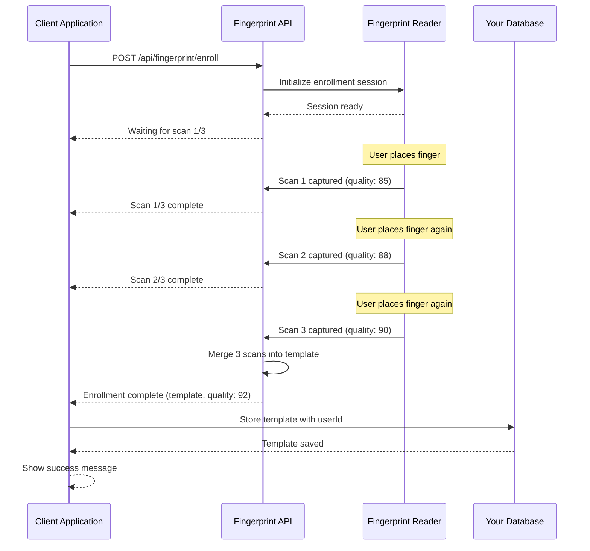

# Fingerprint Enrollment Flow

## Overview

Fingerprint enrollment is the process of capturing and storing a user's fingerprint template for future verification or identification. The enrollment process requires **3 high-quality scans** of the same finger to create a merged template that provides reliable matching.

## Enrollment Workflow



## Step-by-Step Implementation

### Step 1: Check Device Availability

Before starting enrollment, verify that a fingerprint reader is connected and available.

```javascript
async function checkDeviceAvailability() {
  try {
    const devices = await api.getDevices();
    
    if (devices.length === 0) {
      throw new Error('No fingerprint reader connected');
    }
    
    const device = devices[0];
    
    if (device.status !== 'connected') {
      throw new Error(`Device is ${device.status}`);
    }
    
    return device;
  } catch (error) {
    console.error('Device check failed:', error);
    throw error;
  }
}
```

### Step 2: Start Enrollment Process

Initiate the enrollment process with the user's ID and optional device selection.

```javascript
async function startEnrollment(userId, deviceId = null) {
  try {
    const response = await fetch('http://localhost:8080/api/fingerprint/enroll', {
      method: 'POST',
      headers: {
        'X-API-Key': 'your-api-key',
        'Content-Type': 'application/json'
      },
      body: JSON.stringify({
        userId: userId,
        deviceId: deviceId,
        metadata: {
          name: 'John Doe',
          department: 'Engineering'
        }
      })
    });
    
    if (!response.ok) {
      const error = await response.json();
      throw new Error(error.error?.message || 'Enrollment failed');
    }
    
    return await response.json();
  } catch (error) {
    console.error('Enrollment error:', error);
    throw error;
  }
}
```

### Step 3: Monitor Enrollment Progress

The enrollment process requires 3 scans. Use WebSocket events to provide real-time feedback to users.

```javascript
function monitorEnrollmentProgress(ws, onProgress, onComplete, onError) {
  ws.onmessage = (event) => {
    const data = JSON.parse(event.data);
    
    switch (data.type) {
      case 'fingerprint:detected':
        onProgress({
          status: 'scanning',
          quality: data.quality,
          message: 'Fingerprint detected, processing...'
        });
        break;
        
      case 'scan:complete':
        if (data.scansCompleted < 3) {
          onProgress({
            status: 'waiting',
            scansCompleted: data.scansCompleted,
            scansRequired: 3,
            message: `Scan ${data.scansCompleted}/3 complete. Please scan again.`
          });
        } else {
          onComplete({
            template: data.template,
            quality: data.quality,
            enrollmentId: data.enrollmentId
          });
        }
        break;
        
      case 'scan:error':
        onError({
          code: data.code,
          message: data.error
        });
        break;
    }
  };
}
```

### Step 4: Handle Quality Validation

Always validate the quality of captured fingerprints. Reject low-quality scans and prompt users to try again.

```javascript
function validateEnrollmentQuality(quality, minQuality = 60) {
  if (quality < minQuality) {
    return {
      valid: false,
      message: `Quality too low (${quality}). Please clean your finger and try again.`,
      recommendation: 'Ensure finger is clean, dry, and properly placed on sensor'
    };
  }
  
  if (quality < 70) {
    return {
      valid: true,
      message: `Quality acceptable (${quality}), but could be better.`,
      recommendation: 'Consider re-enrolling for better accuracy'
    };
  }
  
  return {
    valid: true,
    message: `Excellent quality (${quality})`,
    recommendation: null
  };
}
```

### Step 5: Store Template Securely

After successful enrollment, store the template in your database with proper security measures.

```javascript
async function storeEnrollmentTemplate(userId, enrollmentData) {
  try {
    // Store in your database
    await database.users.update(userId, {
      fingerprintTemplate: enrollmentData.template,
      fingerprintQuality: enrollmentData.quality,
      enrollmentDate: new Date().toISOString(),
      enrollmentId: enrollmentData.enrollmentId
    });
    
    // Log the enrollment event
    await database.auditLog.create({
      userId: userId,
      action: 'fingerprint_enrolled',
      quality: enrollmentData.quality,
      timestamp: new Date().toISOString()
    });
    
    return { success: true };
  } catch (error) {
    console.error('Failed to store template:', error);
    throw error;
  }
}
```

## Complete Enrollment Example

Here's a complete implementation with retry logic and error handling:

```javascript
async function enrollUserFingerprint(userId, maxAttempts = 3) {
  let attempt = 0;
  
  while (attempt < maxAttempts) {
    attempt++;
    
    try {
      console.log(`Enrollment attempt ${attempt}/${maxAttempts}`);
      
      // Check device availability
      const device = await checkDeviceAvailability();
      console.log(`Using device: ${device.model}`);
      
      // Start enrollment
      const result = await startEnrollment(userId, device.id);
      
      // Validate quality
      const validation = validateEnrollmentQuality(result.quality);
      
      if (!validation.valid) {
        console.warn(validation.message);
        console.log(validation.recommendation);
        
        if (attempt < maxAttempts) {
          console.log('Please try again...');
          await sleep(2000); // Wait 2 seconds before retry
          continue;
        } else {
          throw new Error('Failed to capture quality fingerprint after maximum attempts');
        }
      }
      
      // Store template
      await storeEnrollmentTemplate(userId, result);
      
      console.log('✓ Enrollment successful!');
      console.log(`  Quality: ${result.quality}`);
      console.log(`  Enrollment ID: ${result.enrollmentId}`);
      
      return {
        success: true,
        quality: result.quality,
        enrollmentId: result.enrollmentId
      };
      
    } catch (error) {
      console.error(`Attempt ${attempt} failed:`, error.message);
      
      // Handle specific error codes
      if (error.code === 1001) {
        throw new Error('Fingerprint reader not found. Please connect the device.');
      } else if (error.code === 1002) {
        console.log('Device is busy, waiting...');
        await sleep(3000);
        continue;
      } else if (error.code === 2001 && attempt < maxAttempts) {
        console.log('Low quality scan, please try again');
        await sleep(2000);
        continue;
      }
      
      if (attempt >= maxAttempts) {
        throw new Error(`Enrollment failed after ${maxAttempts} attempts: ${error.message}`);
      }
    }
  }
}

// Helper function
function sleep(ms) {
  return new Promise(resolve => setTimeout(resolve, ms));
}

// Usage
try {
  const result = await enrollUserFingerprint('user-12345');
  console.log('User enrolled successfully:', result);
} catch (error) {
  console.error('Enrollment failed:', error.message);
  // Show error to user
}
```

## Quality Validation Guidelines

### Minimum Quality Thresholds

| Operation | Minimum Quality | Recommended Quality |
|-----------|----------------|---------------------|
| Enrollment | 60 | 70+ |
| Verification | 50 | 60+ |
| Identification | 50 | 60+ |

### Factors Affecting Quality

1. **Finger Condition**
   - Dry or wet fingers reduce quality
   - Dirty or oily fingers reduce quality
   - Cuts or injuries affect scanning

2. **Placement**
   - Finger not centered on sensor
   - Insufficient pressure
   - Too much pressure causing distortion

3. **Environmental**
   - Sensor surface dirty or damaged
   - Extreme temperatures
   - Humidity levels

### Quality Improvement Tips

```javascript
function getQualityImprovementTips(quality) {
  if (quality < 40) {
    return [
      'Clean your finger thoroughly',
      'Ensure finger is dry',
      'Check for cuts or injuries',
      'Clean the sensor surface',
      'Try a different finger'
    ];
  } else if (quality < 60) {
    return [
      'Apply slightly more pressure',
      'Center your finger on the sensor',
      'Keep finger still during scan',
      'Ensure good lighting'
    ];
  } else if (quality < 70) {
    return [
      'Good quality, but can be improved',
      'Try adjusting finger placement slightly'
    ];
  }
  
  return ['Excellent quality!'];
}
```

## Retry Logic Implementation

### Exponential Backoff

```javascript
async function enrollWithExponentialBackoff(userId, maxRetries = 3) {
  let retryDelay = 1000; // Start with 1 second
  
  for (let i = 0; i < maxRetries; i++) {
    try {
      return await startEnrollment(userId);
    } catch (error) {
      if (i === maxRetries - 1) {
        throw error; // Last attempt failed
      }
      
      // Check if error is retryable
      const retryableErrors = [1002, 1005, 2001, 2002]; // Device busy, timeout, low quality, no fingerprint
      
      if (!retryableErrors.includes(error.code)) {
        throw error; // Non-retryable error
      }
      
      console.log(`Retry ${i + 1}/${maxRetries} after ${retryDelay}ms`);
      await sleep(retryDelay);
      
      // Exponential backoff: double the delay each time
      retryDelay *= 2;
    }
  }
}
```

### Smart Retry with User Feedback

```javascript
async function enrollWithSmartRetry(userId, onFeedback) {
  const maxAttempts = 3;
  
  for (let attempt = 1; attempt <= maxAttempts; attempt++) {
    try {
      onFeedback({
        type: 'info',
        message: `Attempt ${attempt}/${maxAttempts}: Please place your finger on the sensor`
      });
      
      const result = await startEnrollment(userId);
      
      if (result.quality >= 60) {
        onFeedback({
          type: 'success',
          message: `Enrollment successful! Quality: ${result.quality}`
        });
        return result;
      } else {
        const tips = getQualityImprovementTips(result.quality);
        onFeedback({
          type: 'warning',
          message: `Quality too low (${result.quality}). ${tips[0]}`
        });
      }
      
    } catch (error) {
      if (error.code === 2002) {
        onFeedback({
          type: 'warning',
          message: 'No fingerprint detected. Please place your finger firmly on the sensor.'
        });
      } else if (error.code === 1002) {
        onFeedback({
          type: 'warning',
          message: 'Device is busy. Please wait...'
        });
        await sleep(3000);
      } else {
        onFeedback({
          type: 'error',
          message: `Error: ${error.message}`
        });
      }
      
      if (attempt === maxAttempts) {
        throw new Error('Maximum enrollment attempts reached');
      }
      
      await sleep(2000);
    }
  }
}
```

## Troubleshooting

### Common Issues and Solutions

#### Issue: "Device not found" (Error 1001)

**Cause:** Fingerprint reader is not connected or not detected by the system.

**Solutions:**
1. Check USB connection
2. Verify device drivers are installed
3. Restart the fingerprint service
4. Check device permissions (Linux/macOS)

```javascript
async function troubleshootDeviceConnection() {
  try {
    const devices = await api.getDevices();
    
    if (devices.length === 0) {
      console.log('Troubleshooting steps:');
      console.log('1. Check if device is physically connected');
      console.log('2. Verify device appears in system devices');
      console.log('3. Restart fingerprint service');
      console.log('4. Check service logs for errors');
      
      return false;
    }
    
    return true;
  } catch (error) {
    console.error('Cannot connect to fingerprint service');
    return false;
  }
}
```

#### Issue: "Low quality scan" (Error 2001)

**Cause:** Fingerprint image quality is below the minimum threshold.

**Solutions:**
1. Clean the finger and sensor
2. Ensure finger is dry
3. Apply proper pressure
4. Center finger on sensor
5. Try a different finger

```javascript
function handleLowQualityError(quality) {
  console.log(`Quality: ${quality} (minimum: 60)`);
  console.log('\nImprovement tips:');
  
  const tips = getQualityImprovementTips(quality);
  tips.forEach((tip, index) => {
    console.log(`${index + 1}. ${tip}`);
  });
}
```

#### Issue: "No fingerprint detected" (Error 2002)

**Cause:** No finger is placed on the sensor or finger is not properly positioned.

**Solutions:**
1. Ensure finger is placed on the sensor
2. Apply sufficient pressure
3. Keep finger still during scan
4. Check if sensor is working

```javascript
async function waitForFingerPlacement(timeout = 30000) {
  const startTime = Date.now();
  
  while (Date.now() - startTime < timeout) {
    try {
      const result = await api.startScan();
      return result;
    } catch (error) {
      if (error.code === 2002) {
        console.log('Waiting for finger placement...');
        await sleep(1000);
        continue;
      }
      throw error;
    }
  }
  
  throw new Error('Timeout waiting for finger placement');
}
```

#### Issue: "Device busy" (Error 1002)

**Cause:** Another operation is currently using the device.

**Solutions:**
1. Wait for current operation to complete
2. Cancel ongoing operations if possible
3. Implement queue system for multiple requests

```javascript
class EnrollmentQueue {
  constructor() {
    this.queue = [];
    this.processing = false;
  }
  
  async enroll(userId) {
    return new Promise((resolve, reject) => {
      this.queue.push({ userId, resolve, reject });
      this.processQueue();
    });
  }
  
  async processQueue() {
    if (this.processing || this.queue.length === 0) return;
    
    this.processing = true;
    const { userId, resolve, reject } = this.queue.shift();
    
    try {
      const result = await startEnrollment(userId);
      resolve(result);
    } catch (error) {
      reject(error);
    } finally {
      this.processing = false;
      this.processQueue(); // Process next in queue
    }
  }
}

// Usage
const enrollmentQueue = new EnrollmentQueue();
const result = await enrollmentQueue.enroll('user-12345');
```

#### Issue: Enrollment succeeds but verification fails

**Cause:** Template quality is borderline or finger placement differs between enrollment and verification.

**Solutions:**
1. Re-enroll with higher quality threshold
2. Enroll multiple fingers
3. Educate users on consistent finger placement

```javascript
async function enrollWithHighQuality(userId, minQuality = 75) {
  let attempts = 0;
  const maxAttempts = 5;
  
  while (attempts < maxAttempts) {
    attempts++;
    const result = await startEnrollment(userId);
    
    if (result.quality >= minQuality) {
      console.log(`High-quality enrollment achieved: ${result.quality}`);
      return result;
    }
    
    console.log(`Quality ${result.quality} below target ${minQuality}, retrying...`);
  }
  
  throw new Error('Could not achieve high-quality enrollment');
}
```

## Best Practices

### 1. User Experience

```javascript
// Provide clear instructions
function showEnrollmentInstructions() {
  return {
    title: 'Fingerprint Enrollment',
    steps: [
      'Clean and dry your finger',
      'Place your finger flat on the sensor',
      'Keep your finger still until the scan completes',
      'You will need to scan 3 times',
      'Use the same finger for all 3 scans'
    ],
    tips: [
      'Use your index or middle finger for best results',
      'Avoid using injured or damaged fingers',
      'Ensure good lighting in the room'
    ]
  };
}
```

### 2. Error Recovery

```javascript
// Graceful error handling
async function enrollWithGracefulRecovery(userId) {
  try {
    return await enrollUserFingerprint(userId);
  } catch (error) {
    // Log error for debugging
    console.error('Enrollment error:', error);
    
    // Provide user-friendly message
    const userMessage = getUserFriendlyErrorMessage(error);
    
    // Offer alternative actions
    return {
      success: false,
      error: userMessage,
      alternatives: [
        'Try again with a different finger',
        'Contact support if problem persists',
        'Use alternative authentication method'
      ]
    };
  }
}

function getUserFriendlyErrorMessage(error) {
  const messages = {
    1001: 'Fingerprint reader not connected. Please check the device.',
    1002: 'Device is busy. Please wait a moment and try again.',
    2001: 'Fingerprint quality too low. Please clean your finger and try again.',
    2002: 'No fingerprint detected. Please place your finger on the sensor.',
    default: 'An error occurred during enrollment. Please try again.'
  };
  
  return messages[error.code] || messages.default;
}
```

### 3. Progress Feedback

```javascript
// Real-time progress updates
class EnrollmentProgress {
  constructor(onUpdate) {
    this.onUpdate = onUpdate;
    this.currentScan = 0;
    this.totalScans = 3;
  }
  
  updateProgress(scan, quality) {
    this.currentScan = scan;
    
    this.onUpdate({
      progress: (scan / this.totalScans) * 100,
      message: `Scan ${scan}/${this.totalScans} complete`,
      quality: quality,
      remaining: this.totalScans - scan
    });
  }
  
  complete(result) {
    this.onUpdate({
      progress: 100,
      message: 'Enrollment complete!',
      quality: result.quality,
      remaining: 0,
      complete: true
    });
  }
}

// Usage
const progress = new EnrollmentProgress((update) => {
  console.log(`Progress: ${update.progress}% - ${update.message}`);
  // Update UI with progress information
});
```

### 4. Security Considerations

```javascript
// Never expose templates in logs or UI
function sanitizeEnrollmentResult(result) {
  return {
    success: true,
    quality: result.quality,
    enrollmentId: result.enrollmentId,
    // Do NOT include: template
  };
}

// Encrypt templates before storage
async function storeTemplateSecurely(userId, template) {
  const encrypted = await encryptTemplate(template);
  
  await database.users.update(userId, {
    fingerprintTemplate: encrypted,
    // Store metadata separately
    enrollmentDate: new Date().toISOString()
  });
}
```

## Next Steps

After successful enrollment, you can:

- [Implement verification flow](./verification-flow.md) for 1:1 matching
- [Implement identification flow](./identification-flow.md) for 1:N matching
- [Review best practices](./best-practices.md) for production deployment

## Related Documentation

- [REST API Reference](../api-reference/rest-api.md)
- [WebSocket Events](../api-reference/websocket.md)
- [Error Codes](../api-reference/error-codes.md)
