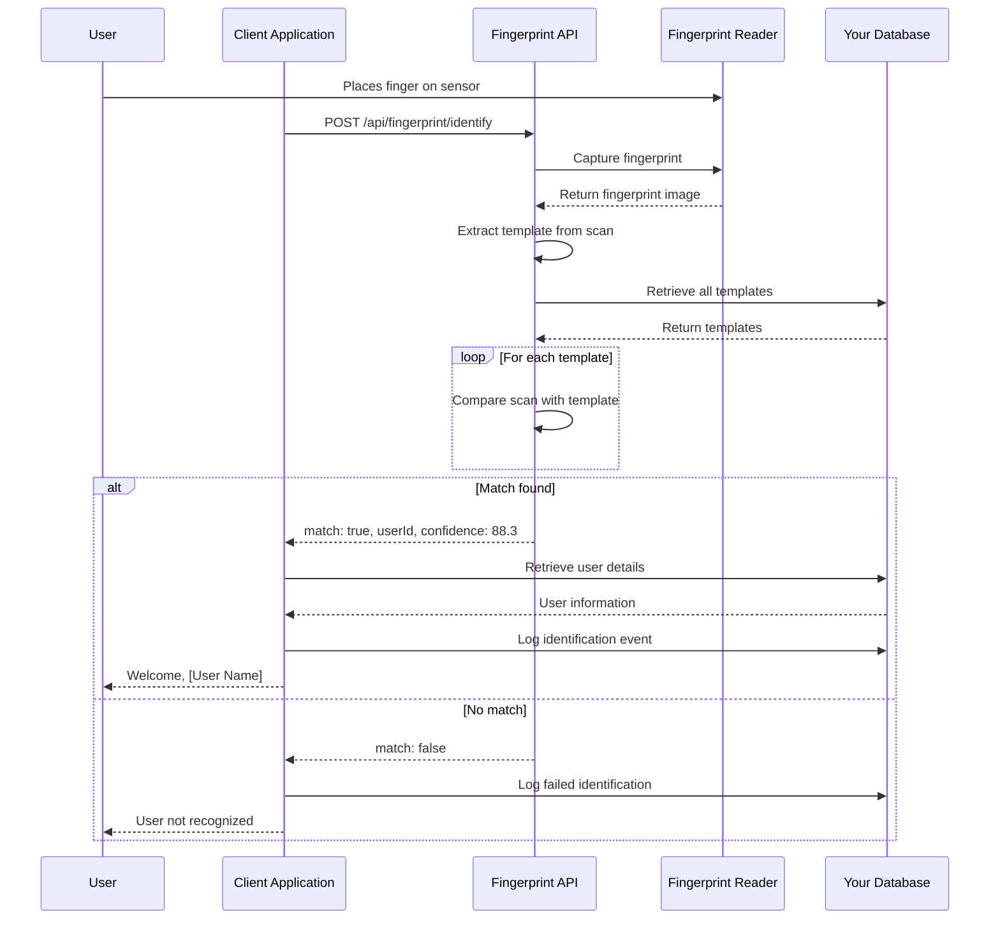

# Fingerprint Identification Flow (1:N)

## Overview

Fingerprint identification is a **1:N matching process** where you identify an unknown user by comparing a captured fingerprint against all stored templates in your database. This is commonly used for scenarios where the user's identity is not known beforehand (e.g., attendance systems, access control without ID cards).

## Identification vs Verification

| Aspect | Verification (1:1) | Identification (1:N) |
|--------|-------------------|---------------------|
| User Identity | Known beforehand | Unknown |
| Comparison | Against 1 template | Against N templates |
| Speed | Fast (~100-200ms) | Slower (depends on N) |
| Use Case | Login with username | Attendance, access control |
| Accuracy | Higher | Slightly lower |

## Identification Workflow



## Step-by-Step Implementation

### Step 1: Capture Fingerprint

Start by capturing a fingerprint without knowing the user's identity.

```javascript
async function captureFingerprint(deviceId = null) {
  try {
    const response = await fetch('http://localhost:8080/api/fingerprint/scan/start', {
      method: 'GET',
      headers: {
        'X-API-Key': 'your-api-key'
      },
      params: deviceId ? { deviceId } : {}
    });
    
    if (!response.ok) {
      const error = await response.json();
      throw new Error(error.error?.message || 'Scan failed');
    }
    
    const scanSession = await response.json();
    
    // Poll for scan completion or use WebSocket
    return await waitForScanCompletion(scanSession.scanId);
  } catch (error) {
    console.error('Capture error:', error);
    throw error;
  }
}

async function waitForScanCompletion(scanId, timeout = 30000) {
  const startTime = Date.now();
  
  while (Date.now() - startTime < timeout) {
    const response = await fetch(
      `http://localhost:8080/api/fingerprint/scan/status/${scanId}`,
      {
        headers: { 'X-API-Key': 'your-api-key' }
      }
    );
    
    const status = await response.json();
    
    if (status.status === 'complete') {
      return {
        template: status.template,
        quality: status.quality,
        scanTime: status.scanTime
      };
    } else if (status.status === 'error') {
      throw new Error(status.error || 'Scan failed');
    }
    
    // Wait before polling again
    await sleep(500);
  }
  
  throw new Error('Scan timeout');
}

function sleep(ms) {
  return new Promise(resolve => setTimeout(resolve, ms));
}
```

### Step 2: Perform Identification

Send the captured template to identify the user from your database.

```javascript
async function identifyFingerprint(template, deviceId = null) {
  try {
    const response = await fetch('http://localhost:8080/api/fingerprint/identify', {
      method: 'POST',
      headers: {
        'X-API-Key': 'your-api-key',
        'Content-Type': 'application/json'
      },
      body: JSON.stringify({
        template: template,
        deviceId: deviceId
      })
    });
    
    if (!response.ok) {
      const error = await response.json();
      throw new Error(error.error?.message || 'Identification failed');
    }
    
    return await response.json();
  } catch (error) {
    console.error('Identification error:', error);
    throw error;
  }
}
```

### Step 3: Evaluate Identification Result

Process the identification result and determine if the match is acceptable.

```javascript
function evaluateIdentificationResult(result, minConfidence = 70) {
  if (!result.match) {
    return {
      identified: false,
      reason: 'No matching fingerprint found in database',
      confidence: 0
    };
  }
  
  if (result.confidence < minConfidence) {
    return {
      identified: false,
      reason: `Confidence too low (${result.confidence} < ${minConfidence})`,
      confidence: result.confidence,
      userId: result.userId,
      suggestion: 'User may need to re-enroll or try again'
    };
  }
  
  // Determine confidence level
  let confidenceLevel;
  if (result.confidence >= 85) {
    confidenceLevel = 'very high';
  } else if (result.confidence >= 75) {
    confidenceLevel = 'high';
  } else if (result.confidence >= 70) {
    confidenceLevel = 'acceptable';
  } else {
    confidenceLevel = 'low';
  }
  
  return {
    identified: true,
    userId: result.userId,
    confidence: result.confidence,
    confidenceLevel: confidenceLevel,
    identificationTime: result.identificationTime
  };
}
```

### Step 4: Retrieve User Information

Once identified, retrieve the user's details from your database.

```javascript
async function getUserInformation(userId) {
  try {
    const user = await database.users.findById(userId);
    
    if (!user) {
      throw new Error('User not found in database');
    }
    
    return {
      id: user.id,
      name: user.name,
      email: user.email,
      department: user.department,
      role: user.role,
      // Don't include sensitive data like fingerprint template
    };
  } catch (error) {
    console.error('Failed to retrieve user:', error);
    throw error;
  }
}
```

### Step 5: Log Identification Event

Always log identification attempts for auditing and analytics.

```javascript
async function logIdentificationEvent(result, success, additionalData = {}) {
  try {
    await database.auditLog.create({
      action: 'fingerprint_identification',
      success: success,
      userId: result.userId || null,
      confidence: result.confidence,
      identificationTime: result.identificationTime,
      timestamp: new Date().toISOString(),
      deviceId: additionalData.deviceId,
      location: additionalData.location,
      ipAddress: getClientIP()
    });
  } catch (error) {
    console.error('Failed to log identification:', error);
    // Don't throw - logging failure shouldn't break identification
  }
}
```

## Complete Identification Example

Here's a complete implementation with error handling:

```javascript
async function identifyAndAuthenticateUser(deviceId = null, minConfidence = 70) {
  try {
    console.log('Starting identification process...');
    console.log('Please place your finger on the sensor');
    
    // Step 1: Capture fingerprint
    const scan = await captureFingerprint(deviceId);
    console.log(`Fingerprint captured (quality: ${scan.quality})`);
    
    // Validate scan quality
    if (scan.quality < 50) {
      throw new Error('Scan quality too low. Please try again.');
    }
    
    // Step 2: Identify user
    console.log('Identifying user...');
    const result = await identifyFingerprint(scan.template, deviceId);
    
    console.log(`Match: ${result.match}`);
    if (result.match) {
      console.log(`User ID: ${result.userId}`);
      console.log(`Confidence: ${result.confidence}%`);
      console.log(`Identification time: ${result.identificationTime}ms`);
    }
    
    // Step 3: Evaluate result
    const evaluation = evaluateIdentificationResult(result, minConfidence);
    
    if (!evaluation.identified) {
      console.warn(`Identification failed: ${evaluation.reason}`);
      await logIdentificationEvent(result, false, { deviceId });
      
      return {
        success: false,
        reason: evaluation.reason,
        confidence: evaluation.confidence
      };
    }
    
    // Step 4: Retrieve user information
    const user = await getUserInformation(evaluation.userId);
    console.log(`User identified: ${user.name}`);
    
    // Step 5: Log successful identification
    await logIdentificationEvent(result, true, { deviceId });
    
    // Step 6: Create session or perform action
    const session = await createUserSession(user.id);
    
    console.log('✓ Identification successful!');
    console.log(`  User: ${user.name}`);
    console.log(`  Confidence: ${evaluation.confidence}% (${evaluation.confidenceLevel})`);
    console.log(`  Session token: ${session.token}`);
    
    return {
      success: true,
      user: user,
      confidence: evaluation.confidence,
      confidenceLevel: evaluation.confidenceLevel,
      identificationTime: evaluation.identificationTime,
      sessionToken: session.token,
      expiresIn: session.expiresIn
    };
    
  } catch (error) {
    console.error('Identification failed:', error.message);
    
    // Log failed attempt
    await logIdentificationEvent({ confidence: 0 }, false, { 
      deviceId,
      error: error.message 
    });
    
    throw error;
  }
}

// Usage
try {
  const result = await identifyAndAuthenticateUser();
  console.log('User authenticated:', result.user.name);
  // Proceed with authenticated session
} catch (error) {
  console.error('Authentication failed:', error.message);
  // Show error to user
}
```

## Performance Considerations

### Database Size Impact

Identification performance degrades as the database grows:

| Database Size | Typical Time | Performance Level |
|--------------|--------------|-------------------|
| < 100 users | 100-300ms | Excellent |
| 100-500 users | 300-800ms | Good |
| 500-1,000 users | 800-1,500ms | Acceptable |
| 1,000-5,000 users | 1.5-5s | Slow |
| > 5,000 users | > 5s | Very Slow |

### Optimization Strategies

#### 1. Database Indexing

Ensure your fingerprint templates are properly indexed:

```javascript
// Example: MongoDB index
await database.users.createIndex({ 
  fingerprintTemplate: 1,
  active: 1 
});

// Only search active users
async function identifyFromActiveUsers(template) {
  const result = await api.identifyFingerprint(template);
  
  if (result.match) {
    // Verify user is still active
    const user = await database.users.findOne({
      id: result.userId,
      active: true
    });
    
    if (!user) {
      return { match: false };
    }
  }
  
  return result;
}
```

#### 2. Subset Identification

Limit the search space based on context:

```javascript
async function identifyWithinDepartment(template, department) {
  // Get users in specific department
  const departmentUsers = await database.users.find({
    department: department,
    active: true
  });
  
  const userIds = departmentUsers.map(u => u.id);
  
  // Perform identification with subset
  const result = await api.identifyFingerprint(template, {
    userIds: userIds // If API supports filtering
  });
  
  return result;
}

async function identifyWithinTimeWindow(template, location) {
  // Get users expected at this location/time
  const expectedUsers = await getExpectedUsers(location, new Date());
  
  // Search only expected users first
  const result = await identifyFromSubset(template, expectedUsers);
  
  if (!result.match) {
    // Fallback to full database search
    return await identifyFingerprint(template);
  }
  
  return result;
}
```

#### 3. Caching Strategy

Cache frequently accessed data:

```javascript
class IdentificationCache {
  constructor() {
    this.recentIdentifications = new Map();
    this.maxSize = 100;
    this.ttl = 3600000; // 1 hour
  }
  
  getCached(templateHash) {
    const cached = this.recentIdentifications.get(templateHash);
    
    if (cached && Date.now() - cached.timestamp < this.ttl) {
      return cached.result;
    }
    
    return null;
  }
  
  setCached(templateHash, result) {
    // Limit cache size
    if (this.recentIdentifications.size >= this.maxSize) {
      const oldestKey = this.recentIdentifications.keys().next().value;
      this.recentIdentifications.delete(oldestKey);
    }
    
    this.recentIdentifications.set(templateHash, {
      result: result,
      timestamp: Date.now()
    });
  }
}

// Usage
const cache = new IdentificationCache();

async function cachedIdentification(template) {
  const templateHash = hashTemplate(template);
  
  // Check cache first
  const cached = cache.getCached(templateHash);
  if (cached) {
    console.log('Cache hit!');
    return cached;
  }
  
  // Perform identification
  const result = await identifyFingerprint(template);
  
  // Cache result
  if (result.match) {
    cache.setCached(templateHash, result);
  }
  
  return result;
}

function hashTemplate(template) {
  // Simple hash function (use crypto.createHash in production)
  return template.substring(0, 32);
}
```

#### 4. Parallel Processing

For very large databases, consider parallel processing:

```javascript
async function parallelIdentification(template, batchSize = 1000) {
  // Get total user count
  const totalUsers = await database.users.count({ active: true });
  const batches = Math.ceil(totalUsers / batchSize);
  
  console.log(`Searching ${totalUsers} users in ${batches} batches`);
  
  // Process batches in parallel
  const promises = [];
  for (let i = 0; i < batches; i++) {
    const skip = i * batchSize;
    promises.push(
      identifyInBatch(template, skip, batchSize)
    );
  }
  
  const results = await Promise.all(promises);
  
  // Find best match across all batches
  const matches = results.filter(r => r.match);
  if (matches.length === 0) {
    return { match: false };
  }
  
  // Return highest confidence match
  return matches.reduce((best, current) => 
    current.confidence > best.confidence ? current : best
  );
}

async function identifyInBatch(template, skip, limit) {
  const users = await database.users.find({ active: true })
    .skip(skip)
    .limit(limit);
  
  // Compare against each user in batch
  for (const user of users) {
    const match = await compareTemplates(template, user.fingerprintTemplate);
    if (match.confidence >= 70) {
      return {
        match: true,
        userId: user.id,
        confidence: match.confidence
      };
    }
  }
  
  return { match: false };
}
```

#### 5. Quality Pre-filtering

Reject low-quality scans early:

```javascript
async function identifyWithQualityCheck(deviceId, minQuality = 60) {
  const scan = await captureFingerprint(deviceId);
  
  if (scan.quality < minQuality) {
    throw new Error(
      `Scan quality too low (${scan.quality}). Please try again.`
    );
  }
  
  return await identifyFingerprint(scan.template, deviceId);
}
```

## Real-Time Identification with WebSocket

For better user experience, use WebSocket for real-time feedback:

```javascript
class RealtimeIdentification {
  constructor(apiKey) {
    this.ws = new WebSocket('ws://localhost:8080');
    this.apiKey = apiKey;
    this.setupListeners();
  }
  
  setupListeners() {
    this.ws.onopen = () => {
      console.log('WebSocket connected');
      this.ws.send(JSON.stringify({
        type: 'auth',
        apiKey: this.apiKey
      }));
    };
    
    this.ws.onmessage = (event) => {
      const data = JSON.parse(event.data);
      this.handleMessage(data);
    };
  }
  
  handleMessage(data) {
    switch (data.type) {
      case 'fingerprint:detected':
        this.onFingerprintDetected(data.quality);
        break;
        
      case 'scan:complete':
        this.onScanComplete(data);
        break;
        
      case 'identification:searching':
        this.onSearching(data.progress);
        break;
        
      case 'identification:result':
        this.onIdentificationResult(data);
        break;
        
      case 'scan:error':
        this.onError(data);
        break;
    }
  }
  
  async identify(deviceId = null) {
    return new Promise((resolve, reject) => {
      this.onIdentificationResult = (data) => {
        if (data.match) {
          resolve({
            success: true,
            userId: data.userId,
            confidence: data.confidence,
            identificationTime: data.identificationTime
          });
        } else {
          resolve({
            success: false,
            confidence: 0
          });
        }
      };
      
      this.onError = (data) => {
        reject(new Error(data.error));
      };
      
      // Send identification request
      this.ws.send(JSON.stringify({
        type: 'identify',
        deviceId: deviceId
      }));
    });
  }
  
  onFingerprintDetected(quality) {
    console.log(`Fingerprint detected (quality: ${quality})`);
    // Update UI: show scanning animation
  }
  
  onScanComplete(data) {
    console.log('Scan complete, identifying...');
    // Update UI: show identification in progress
  }
  
  onSearching(progress) {
    console.log(`Searching database: ${progress}%`);
    // Update UI: show search progress
  }
}

// Usage
const identifier = new RealtimeIdentification('your-api-key');

try {
  const result = await identifier.identify();
  
  if (result.success) {
    const user = await getUserInformation(result.userId);
    console.log(`Identified: ${user.name} (${result.confidence}%)`);
  } else {
    console.log('User not recognized');
  }
} catch (error) {
  console.error('Identification error:', error);
}
```

## Troubleshooting

### Common Issues and Solutions

#### Issue: Identification is too slow

**Cause:** Large database size or inefficient queries.

**Solutions:**

```javascript
// Monitor identification performance
class PerformanceMonitor {
  constructor() {
    this.metrics = [];
  }
  
  async measureIdentification(identifyFn) {
    const startTime = Date.now();
    const startMemory = process.memoryUsage().heapUsed;
    
    try {
      const result = await identifyFn();
      const endTime = Date.now();
      const endMemory = process.memoryUsage().heapUsed;
      
      const metric = {
        duration: endTime - startTime,
        memoryUsed: endMemory - startMemory,
        success: result.match,
        timestamp: new Date().toISOString()
      };
      
      this.metrics.push(metric);
      
      if (metric.duration > 2000) {
        console.warn(`Slow identification: ${metric.duration}ms`);
        this.suggestOptimizations(metric);
      }
      
      return result;
    } catch (error) {
      console.error('Identification failed:', error);
      throw error;
    }
  }
  
  suggestOptimizations(metric) {
    console.log('Performance optimization suggestions:');
    console.log('1. Implement database indexing');
    console.log('2. Use subset identification');
    console.log('3. Consider caching strategy');
    console.log('4. Upgrade hardware if needed');
  }
  
  getAverageTime() {
    if (this.metrics.length === 0) return 0;
    const sum = this.metrics.reduce((acc, m) => acc + m.duration, 0);
    return sum / this.metrics.length;
  }
}

// Usage
const monitor = new PerformanceMonitor();
const result = await monitor.measureIdentification(() => 
  identifyFingerprint(template)
);
```

#### Issue: False positives (wrong user identified)

**Cause:** Confidence threshold too low or similar fingerprints.

**Solutions:**

```javascript
// Implement secondary verification
async function identifyWithSecondaryVerification(template, minConfidence = 75) {
  const result = await identifyFingerprint(template);
  
  if (!result.match) {
    return { success: false };
  }
  
  // If confidence is borderline, request secondary verification
  if (result.confidence < 85) {
    console.log('Confidence borderline, requesting secondary verification');
    
    // Option 1: Request PIN or password
    const pinVerified = await requestPIN(result.userId);
    
    if (!pinVerified) {
      return {
        success: false,
        reason: 'Secondary verification failed'
      };
    }
  }
  
  return {
    success: true,
    userId: result.userId,
    confidence: result.confidence
  };
}

// Implement duplicate detection
async function checkForDuplicates(userId, confidence) {
  if (confidence < 90) {
    // Search for other users with similar confidence
    const recentIdentifications = await database.auditLog.find({
      action: 'fingerprint_identification',
      timestamp: { $gte: new Date(Date.now() - 60000) }, // Last minute
      confidence: { $gte: confidence - 5, $lte: confidence + 5 }
    });
    
    if (recentIdentifications.length > 1) {
      console.warn('Potential duplicate fingerprints detected');
      // Alert administrator
      await alertAdmin('Duplicate fingerprint detection', {
        userId: userId,
        confidence: confidence,
        recentMatches: recentIdentifications
      });
    }
  }
}
```

#### Issue: No match found for enrolled users

**Cause:** Poor scan quality, finger condition changed, or database issues.

**Solutions:**

```javascript
async function troubleshootNoMatch(template, scanQuality) {
  console.log('Troubleshooting no match result...');
  
  // Check scan quality
  if (scanQuality < 60) {
    return {
      issue: 'quality',
      message: 'Scan quality too low',
      suggestions: [
        'Clean your finger and the sensor',
        'Ensure finger is dry',
        'Try adjusting finger placement'
      ]
    };
  }
  
  // Check database connectivity
  try {
    const dbStats = await database.users.count();
    console.log(`Database has ${dbStats} users`);
    
    if (dbStats === 0) {
      return {
        issue: 'database',
        message: 'No users enrolled in database',
        suggestions: ['Enroll users before attempting identification']
      };
    }
  } catch (error) {
    return {
      issue: 'database',
      message: 'Database connection error',
      suggestions: ['Check database connectivity', 'Verify database configuration']
    };
  }
  
  // Suggest re-enrollment
  return {
    issue: 'enrollment',
    message: 'User may need to re-enroll',
    suggestions: [
      'User may not be enrolled',
      'Fingerprint may have changed significantly',
      'Consider enrolling multiple fingers'
    ]
  };
}

// Usage
const scan = await captureFingerprint();
const result = await identifyFingerprint(scan.template);

if (!result.match) {
  const troubleshooting = await troubleshootNoMatch(scan.template, scan.quality);
  console.log(`Issue: ${troubleshooting.issue}`);
  console.log(`Message: ${troubleshooting.message}`);
  console.log('Suggestions:');
  troubleshooting.suggestions.forEach(s => console.log(`  - ${s}`));
}
```

#### Issue: Inconsistent identification results

**Cause:** Environmental factors or device issues.

**Solutions:**

```javascript
// Implement consistency checking
class ConsistencyChecker {
  constructor() {
    this.recentResults = new Map();
  }
  
  async checkConsistency(userId, confidence) {
    const recent = this.recentResults.get(userId) || [];
    recent.push({ confidence, timestamp: Date.now() });
    
    // Keep only last 5 results
    if (recent.length > 5) {
      recent.shift();
    }
    
    this.recentResults.set(userId, recent);
    
    // Calculate variance
    if (recent.length >= 3) {
      const confidences = recent.map(r => r.confidence);
      const avg = confidences.reduce((a, b) => a + b) / confidences.length;
      const variance = confidences.reduce((sum, c) => 
        sum + Math.pow(c - avg, 2), 0
      ) / confidences.length;
      
      if (variance > 100) { // High variance
        console.warn(`High variance in identification results for user ${userId}`);
        return {
          consistent: false,
          variance: variance,
          suggestion: 'User may need to re-enroll for better consistency'
        };
      }
    }
    
    return { consistent: true };
  }
}

// Usage
const checker = new ConsistencyChecker();
const result = await identifyFingerprint(template);

if (result.match) {
  const consistency = await checker.checkConsistency(
    result.userId,
    result.confidence
  );
  
  if (!consistency.consistent) {
    console.warn('Inconsistent results detected');
  }
}
```

## Best Practices

### 1. User Experience

```javascript
// Provide clear feedback during identification
class IdentificationUI {
  showWaiting() {
    console.log('👆 Please place your finger on the sensor');
    // Update UI: show finger placement animation
  }
  
  showScanning(quality) {
    console.log(`📸 Scanning... (quality: ${quality})`);
    // Update UI: show scanning progress
  }
  
  showSearching(progress) {
    console.log(`🔍 Searching database... ${progress}%`);
    // Update UI: show search progress bar
  }
  
  showSuccess(userName, confidence) {
    console.log(`✓ Welcome, ${userName}! (confidence: ${confidence}%)`);
    // Update UI: show success animation with user info
  }
  
  showNotFound() {
    console.log('✗ User not recognized');
    // Update UI: show not found message with options
  }
}

// Usage
const ui = new IdentificationUI();

async function identifyWithUI() {
  ui.showWaiting();
  
  const scan = await captureFingerprint();
  ui.showScanning(scan.quality);
  
  ui.showSearching(0);
  const result = await identifyFingerprint(scan.template);
  ui.showSearching(100);
  
  if (result.match) {
    const user = await getUserInformation(result.userId);
    ui.showSuccess(user.name, result.confidence);
  } else {
    ui.showNotFound();
  }
}
```

### 2. Security Considerations

```javascript
// Implement rate limiting for identification attempts
class IdentificationRateLimiter {
  constructor(maxAttempts = 10, windowMs = 60000) {
    this.attempts = [];
    this.maxAttempts = maxAttempts;
    this.windowMs = windowMs;
  }
  
  async checkLimit(deviceId) {
    const now = Date.now();
    
    // Remove old attempts
    this.attempts = this.attempts.filter(
      a => now - a.timestamp < this.windowMs
    );
    
    // Check if limit exceeded
    const deviceAttempts = this.attempts.filter(
      a => a.deviceId === deviceId
    );
    
    if (deviceAttempts.length >= this.maxAttempts) {
      throw new Error(
        `Too many identification attempts. Please wait ${Math.ceil(this.windowMs / 1000)} seconds.`
      );
    }
    
    // Record this attempt
    this.attempts.push({
      deviceId: deviceId,
      timestamp: now
    });
    
    return true;
  }
}

// Usage
const rateLimiter = new IdentificationRateLimiter();

async function rateLimitedIdentification(deviceId) {
  await rateLimiter.checkLimit(deviceId);
  return await identifyAndAuthenticateUser(deviceId);
}
```

### 3. Monitoring and Analytics

```javascript
// Track identification metrics
class IdentificationAnalytics {
  constructor() {
    this.metrics = {
      totalAttempts: 0,
      successfulIdentifications: 0,
      failedIdentifications: 0,
      averageConfidence: 0,
      averageSearchTime: 0,
      userFrequency: new Map()
    };
  }
  
  recordAttempt(result, searchTime) {
    this.metrics.totalAttempts++;
    
    if (result.match) {
      this.metrics.successfulIdentifications++;
      
      // Track user frequency
      const count = this.metrics.userFrequency.get(result.userId) || 0;
      this.metrics.userFrequency.set(result.userId, count + 1);
      
      // Update averages
      const n = this.metrics.successfulIdentifications;
      this.metrics.averageConfidence = 
        (this.metrics.averageConfidence * (n - 1) + result.confidence) / n;
    } else {
      this.metrics.failedIdentifications++;
    }
    
    // Update search time average
    const total = this.metrics.totalAttempts;
    this.metrics.averageSearchTime = 
      (this.metrics.averageSearchTime * (total - 1) + searchTime) / total;
  }
  
  getSuccessRate() {
    if (this.metrics.totalAttempts === 0) return 0;
    return (this.metrics.successfulIdentifications / this.metrics.totalAttempts) * 100;
  }
  
  getMostFrequentUsers(limit = 10) {
    return Array.from(this.metrics.userFrequency.entries())
      .sort((a, b) => b[1] - a[1])
      .slice(0, limit)
      .map(([userId, count]) => ({ userId, count }));
  }
  
  getReport() {
    return {
      ...this.metrics,
      successRate: this.getSuccessRate().toFixed(2) + '%',
      topUsers: this.getMostFrequentUsers(5),
      userFrequency: undefined // Don't include full map in report
    };
  }
}

// Usage
const analytics = new IdentificationAnalytics();

async function monitoredIdentification() {
  const startTime = Date.now();
  const result = await identifyAndAuthenticateUser();
  const searchTime = Date.now() - startTime;
  
  analytics.recordAttempt(result, searchTime);
  
  // Periodically log analytics
  if (analytics.metrics.totalAttempts % 100 === 0) {
    console.log('Analytics Report:', analytics.getReport());
  }
  
  return result;
}
```

### 4. Fallback Strategies

```javascript
// Implement graceful degradation
async function identifyWithFallback(deviceId) {
  try {
    // Try identification
    return await identifyAndAuthenticateUser(deviceId);
  } catch (error) {
    console.warn('Identification failed, offering alternatives');
    
    return {
      success: false,
      error: error.message,
      alternatives: [
        {
          method: 'manual_entry',
          description: 'Enter your user ID manually',
          action: 'prompt_user_id'
        },
        {
          method: 'qr_code',
          description: 'Scan your QR code',
          action: 'scan_qr'
        },
        {
          method: 'rfid_card',
          description: 'Use your RFID card',
          action: 'scan_rfid'
        }
      ]
    };
  }
}
```

## Use Case Examples

### Attendance System

```javascript
async function recordAttendance(deviceId, location) {
  try {
    console.log(`Recording attendance at ${location}`);
    
    // Identify user
    const result = await identifyAndAuthenticateUser(deviceId, 70);
    
    if (!result.success) {
      console.log('User not recognized');
      return { success: false };
    }
    
    // Record attendance
    const attendance = await database.attendance.create({
      userId: result.user.id,
      userName: result.user.name,
      timestamp: new Date().toISOString(),
      location: location,
      confidence: result.confidence,
      type: 'check-in'
    });
    
    console.log(`✓ Attendance recorded for ${result.user.name}`);
    
    return {
      success: true,
      user: result.user,
      attendance: attendance
    };
  } catch (error) {
    console.error('Attendance recording failed:', error);
    return { success: false, error: error.message };
  }
}

// Usage
const result = await recordAttendance('device-001', 'Main Office');
```

### Access Control

```javascript
async function grantAccess(deviceId, doorId) {
  try {
    console.log(`Access request at door ${doorId}`);
    
    // Identify user
    const result = await identifyAndAuthenticateUser(deviceId, 80);
    
    if (!result.success) {
      console.log('Access denied: User not recognized');
      await logAccessAttempt(null, doorId, false, 'not_recognized');
      return { granted: false, reason: 'not_recognized' };
    }
    
    // Check access permissions
    const hasAccess = await checkDoorPermissions(result.user.id, doorId);
    
    if (!hasAccess) {
      console.log(`Access denied: ${result.user.name} lacks permission`);
      await logAccessAttempt(result.user.id, doorId, false, 'no_permission');
      return { granted: false, reason: 'no_permission' };
    }
    
    // Grant access
    console.log(`✓ Access granted to ${result.user.name}`);
    await logAccessAttempt(result.user.id, doorId, true, 'granted');
    await unlockDoor(doorId, 5000); // Unlock for 5 seconds
    
    return {
      granted: true,
      user: result.user,
      confidence: result.confidence
    };
  } catch (error) {
    console.error('Access control error:', error);
    return { granted: false, reason: 'system_error' };
  }
}

async function checkDoorPermissions(userId, doorId) {
  const permissions = await database.permissions.findOne({
    userId: userId,
    doorId: doorId,
    active: true
  });
  
  return permissions !== null;
}

async function unlockDoor(doorId, duration) {
  // Send unlock command to door controller
  console.log(`Unlocking door ${doorId} for ${duration}ms`);
  // Implementation depends on your door controller system
}

async function logAccessAttempt(userId, doorId, granted, reason) {
  await database.accessLog.create({
    userId: userId,
    doorId: doorId,
    granted: granted,
    reason: reason,
    timestamp: new Date().toISOString()
  });
}

// Usage
const result = await grantAccess('device-001', 'door-main-entrance');
```

## Next Steps

After implementing identification:

- [Review best practices](./best-practices.md) for production deployment
- [Explore enrollment flow](./enrollment-flow.md) for user registration
- [Learn about verification flow](./verification-flow.md) for 1:1 matching

## Related Documentation

- [REST API Reference](../api-reference/rest-api.md)
- [WebSocket Events](../api-reference/websocket.md)
- [Error Codes](../api-reference/error-codes.md)
