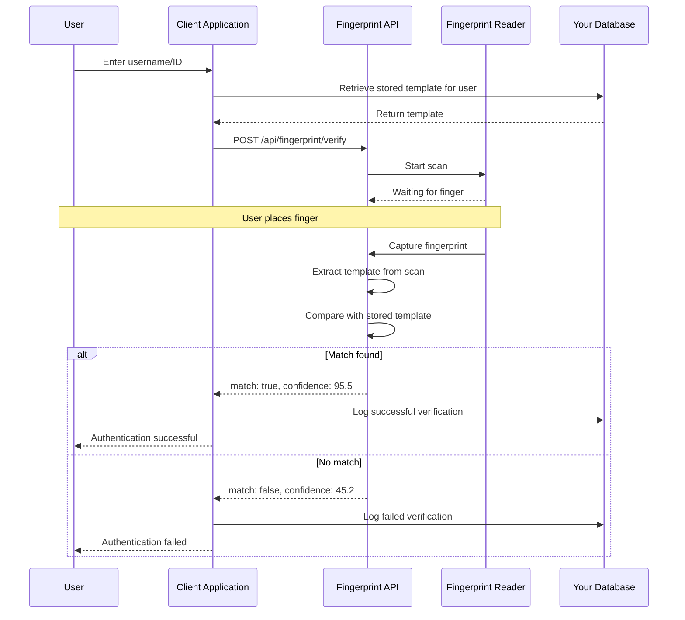

# Fingerprint Verification Flow (1:1)

## Overview

Fingerprint verification is a **1:1 matching process** where you verify that a captured fingerprint matches a specific user's stored template. This is commonly used for authentication scenarios where the user's identity is already known (e.g., login with username + fingerprint).

## Verification Workflow



## Step-by-Step Implementation

### Step 1: Retrieve Stored Template

Before verification, retrieve the user's stored fingerprint template from your database.

```javascript
async function getUserTemplate(userId) {
  try {
    const user = await database.users.findById(userId);
    
    if (!user) {
      throw new Error('User not found');
    }
    
    if (!user.fingerprintTemplate) {
      throw new Error('User has no fingerprint enrolled');
    }
    
    return {
      userId: user.id,
      template: user.fingerprintTemplate,
      enrollmentDate: user.enrollmentDate,
      quality: user.fingerprintQuality
    };
  } catch (error) {
    console.error('Failed to retrieve template:', error);
    throw error;
  }
}
```

### Step 2: Initiate Verification

Send the stored template to the API along with a request to capture and verify a new fingerprint.

```javascript
async function verifyFingerprint(userId, template, deviceId = null) {
  try {
    const response = await fetch('http://localhost:8080/api/fingerprint/verify', {
      method: 'POST',
      headers: {
        'X-API-Key': 'your-api-key',
        'Content-Type': 'application/json'
      },
      body: JSON.stringify({
        template: template,
        userId: userId,
        deviceId: deviceId
      })
    });
    
    if (!response.ok) {
      const error = await response.json();
      throw new Error(error.error?.message || 'Verification failed');
    }
    
    return await response.json();
  } catch (error) {
    console.error('Verification error:', error);
    throw error;
  }
}
```

### Step 3: Evaluate Confidence Score

The verification result includes a confidence score (0-100). Use appropriate thresholds based on your security requirements.

```javascript
function evaluateVerificationResult(result, minConfidence = 70) {
  if (!result.match) {
    return {
      authenticated: false,
      reason: 'Fingerprint does not match',
      confidence: result.confidence
    };
  }
  
  if (result.confidence < minConfidence) {
    return {
      authenticated: false,
      reason: `Confidence too low (${result.confidence} < ${minConfidence})`,
      confidence: result.confidence,
      suggestion: 'Please try again or use alternative authentication'
    };
  }
  
  // Determine confidence level
  let confidenceLevel;
  if (result.confidence >= 90) {
    confidenceLevel = 'very high';
  } else if (result.confidence >= 80) {
    confidenceLevel = 'high';
  } else if (result.confidence >= 70) {
    confidenceLevel = 'acceptable';
  } else {
    confidenceLevel = 'low';
  }
  
  return {
    authenticated: true,
    confidence: result.confidence,
    confidenceLevel: confidenceLevel,
    verificationTime: result.verificationTime
  };
}
```

### Step 4: Log Verification Attempt

Always log verification attempts for security auditing and troubleshooting.

```javascript
async function logVerificationAttempt(userId, result, success) {
  try {
    await database.auditLog.create({
      userId: userId,
      action: 'fingerprint_verification',
      success: success,
      confidence: result.confidence,
      timestamp: new Date().toISOString(),
      ipAddress: getClientIP(),
      userAgent: getUserAgent()
    });
  } catch (error) {
    console.error('Failed to log verification:', error);
    // Don't throw - logging failure shouldn't break authentication
  }
}
```

### Step 5: Handle Authentication Result

Based on the verification result, grant or deny access to the user.

```javascript
async function handleVerificationResult(userId, result) {
  const evaluation = evaluateVerificationResult(result);
  
  // Log the attempt
  await logVerificationAttempt(userId, result, evaluation.authenticated);
  
  if (evaluation.authenticated) {
    // Create session
    const session = await createUserSession(userId);
    
    return {
      success: true,
      message: 'Authentication successful',
      confidence: evaluation.confidence,
      confidenceLevel: evaluation.confidenceLevel,
      sessionToken: session.token,
      expiresIn: session.expiresIn
    };
  } else {
    // Increment failed attempts counter
    await incrementFailedAttempts(userId);
    
    return {
      success: false,
      message: evaluation.reason,
      confidence: evaluation.confidence,
      suggestion: evaluation.suggestion
    };
  }
}
```

## Complete Verification Example

Here's a complete implementation with error handling and retry logic:

```javascript
async function authenticateUserWithFingerprint(userId, maxAttempts = 3) {
  let attempt = 0;
  
  // Retrieve stored template
  const userData = await getUserTemplate(userId);
  console.log(`Verifying user: ${userId}`);
  console.log(`Template enrolled on: ${userData.enrollmentDate}`);
  
  while (attempt < maxAttempts) {
    attempt++;
    
    try {
      console.log(`Verification attempt ${attempt}/${maxAttempts}`);
      console.log('Please place your finger on the sensor...');
      
      // Perform verification
      const result = await verifyFingerprint(
        userId,
        userData.template
      );
      
      console.log(`Match: ${result.match}`);
      console.log(`Confidence: ${result.confidence}%`);
      console.log(`Verification time: ${result.verificationTime}ms`);
      
      // Evaluate result
      const evaluation = evaluateVerificationResult(result);
      
      if (evaluation.authenticated) {
        // Handle successful authentication
        const authResult = await handleVerificationResult(userId, result);
        
        console.log('✓ Authentication successful!');
        console.log(`  Confidence: ${authResult.confidence}% (${authResult.confidenceLevel})`);
        console.log(`  Session token: ${authResult.sessionToken}`);
        
        return authResult;
      } else {
        console.warn(`✗ Authentication failed: ${evaluation.reason}`);
        
        if (attempt < maxAttempts) {
          console.log(`Please try again (${maxAttempts - attempt} attempts remaining)`);
          await sleep(2000);
          continue;
        } else {
          // Max attempts reached
          await handleVerificationResult(userId, result);
          throw new Error('Authentication failed after maximum attempts');
        }
      }
      
    } catch (error) {
      console.error(`Attempt ${attempt} failed:`, error.message);
      
      // Handle specific error codes
      if (error.code === 1001) {
        throw new Error('Fingerprint reader not found');
      } else if (error.code === 1002) {
        console.log('Device is busy, waiting...');
        await sleep(3000);
        continue;
      } else if (error.code === 2001 && attempt < maxAttempts) {
        console.log('Low quality scan, please try again');
        await sleep(2000);
        continue;
      } else if (error.code === 2002 && attempt < maxAttempts) {
        console.log('No fingerprint detected, please place your finger on the sensor');
        await sleep(2000);
        continue;
      }
      
      if (attempt >= maxAttempts) {
        throw new Error(`Verification failed after ${maxAttempts} attempts: ${error.message}`);
      }
    }
  }
}

// Helper function
function sleep(ms) {
  return new Promise(resolve => setTimeout(resolve, ms));
}

// Usage
try {
  const result = await authenticateUserWithFingerprint('user-12345');
  console.log('User authenticated:', result);
  // Redirect to dashboard or protected resource
} catch (error) {
  console.error('Authentication failed:', error.message);
  // Show error to user and offer alternatives
}
```

## Confidence Threshold Recommendations

### Security Level Guidelines

| Security Level | Minimum Confidence | Use Case |
|---------------|-------------------|----------|
| Low | 60% | Low-risk applications, convenience features |
| Medium | 70% | Standard authentication, general access |
| High | 80% | Sensitive data access, financial transactions |
| Very High | 90% | Critical systems, high-value transactions |

### Choosing the Right Threshold

```javascript
function getConfidenceThreshold(context) {
  const thresholds = {
    // Low security
    'attendance_checkin': 60,
    'preference_unlock': 65,
    
    // Medium security
    'user_login': 70,
    'document_access': 75,
    
    // High security
    'payment_authorization': 80,
    'admin_access': 85,
    
    // Very high security
    'financial_transaction': 90,
    'critical_system_access': 92
  };
  
  return thresholds[context] || 70; // Default to medium security
}

// Usage
const threshold = getConfidenceThreshold('payment_authorization');
const evaluation = evaluateVerificationResult(result, threshold);
```

### Adaptive Thresholds

Adjust thresholds based on risk factors:

```javascript
function calculateAdaptiveThreshold(baseThreshold, riskFactors) {
  let threshold = baseThreshold;
  
  // Increase threshold for high-risk scenarios
  if (riskFactors.unusualLocation) {
    threshold += 5;
  }
  
  if (riskFactors.unusualTime) {
    threshold += 5;
  }
  
  if (riskFactors.highValueTransaction) {
    threshold += 10;
  }
  
  if (riskFactors.multipleFailedAttempts) {
    threshold += 10;
  }
  
  // Decrease threshold for trusted scenarios
  if (riskFactors.trustedDevice) {
    threshold -= 5;
  }
  
  if (riskFactors.recentSuccessfulAuth) {
    threshold -= 5;
  }
  
  // Ensure threshold stays within valid range
  return Math.max(60, Math.min(95, threshold));
}

// Usage
const riskFactors = {
  unusualLocation: isUnusualLocation(userIP),
  unusualTime: isUnusualTime(new Date()),
  highValueTransaction: transactionAmount > 1000,
  multipleFailedAttempts: failedAttempts > 2,
  trustedDevice: isTrustedDevice(deviceId),
  recentSuccessfulAuth: lastAuthTime < 3600000 // Within 1 hour
};

const adaptiveThreshold = calculateAdaptiveThreshold(70, riskFactors);
console.log(`Using adaptive threshold: ${adaptiveThreshold}%`);
```

## Real-Time Verification with WebSocket

For better user experience, use WebSocket for real-time feedback during verification:

```javascript
class RealtimeVerification {
  constructor(apiKey) {
    this.ws = new WebSocket('ws://localhost:8080');
    this.apiKey = apiKey;
    this.setupListeners();
  }
  
  setupListeners() {
    this.ws.onopen = () => {
      console.log('WebSocket connected');
      this.ws.send(JSON.stringify({
        type: 'auth',
        apiKey: this.apiKey
      }));
    };
    
    this.ws.onmessage = (event) => {
      const data = JSON.parse(event.data);
      this.handleMessage(data);
    };
  }
  
  handleMessage(data) {
    switch (data.type) {
      case 'fingerprint:detected':
        this.onFingerprintDetected(data.quality);
        break;
        
      case 'scan:complete':
        this.onScanComplete(data);
        break;
        
      case 'verification:result':
        this.onVerificationResult(data);
        break;
        
      case 'scan:error':
        this.onError(data);
        break;
    }
  }
  
  async verify(userId, template) {
    return new Promise((resolve, reject) => {
      this.onVerificationResult = (data) => {
        if (data.match) {
          resolve({
            success: true,
            confidence: data.confidence,
            userId: data.userId
          });
        } else {
          resolve({
            success: false,
            confidence: data.confidence
          });
        }
      };
      
      this.onError = (data) => {
        reject(new Error(data.error));
      };
      
      // Send verification request
      this.ws.send(JSON.stringify({
        type: 'verify',
        userId: userId,
        template: template
      }));
    });
  }
  
  onFingerprintDetected(quality) {
    console.log(`Fingerprint detected (quality: ${quality})`);
    // Update UI: show scanning animation
  }
  
  onScanComplete(data) {
    console.log('Scan complete, verifying...');
    // Update UI: show verification in progress
  }
}

// Usage
const verifier = new RealtimeVerification('your-api-key');

try {
  const userData = await getUserTemplate('user-12345');
  const result = await verifier.verify('user-12345', userData.template);
  
  if (result.success) {
    console.log(`Verified! Confidence: ${result.confidence}%`);
  } else {
    console.log('Verification failed');
  }
} catch (error) {
  console.error('Verification error:', error);
}
```

## Troubleshooting

### Common Issues and Solutions

#### Issue: Verification fails despite correct user

**Possible Causes:**
1. Low-quality scan during verification
2. Different finger placement compared to enrollment
3. Finger condition changed (dry, wet, injured)
4. Confidence threshold too high

**Solutions:**

```javascript
async function troubleshootVerificationFailure(userId, result) {
  console.log('Troubleshooting verification failure...');
  
  // Check confidence score
  if (result.confidence < 50) {
    console.log('Very low confidence - likely wrong finger or poor scan quality');
    return {
      issue: 'quality',
      suggestions: [
        'Ensure you are using the same finger used during enrollment',
        'Clean your finger and the sensor',
        'Try adjusting finger placement'
      ]
    };
  } else if (result.confidence >= 50 && result.confidence < 70) {
    console.log('Borderline confidence - may need re-enrollment');
    return {
      issue: 'borderline',
      suggestions: [
        'Try verification again with better finger placement',
        'Consider re-enrolling for better accuracy',
        'Check if finger condition has changed significantly'
      ]
    };
  }
  
  // Check enrollment quality
  const userData = await getUserTemplate(userId);
  if (userData.quality < 70) {
    console.log('Original enrollment quality was low');
    return {
      issue: 'enrollment_quality',
      suggestions: [
        'Re-enroll with higher quality scans',
        'Ensure finger is clean and dry during enrollment'
      ]
    };
  }
  
  return {
    issue: 'unknown',
    suggestions: [
      'Contact support for assistance',
      'Use alternative authentication method'
    ]
  };
}
```

#### Issue: Verification too slow

**Cause:** Large database or inefficient template storage.

**Solutions:**

```javascript
// Cache frequently accessed templates
class TemplateCache {
  constructor(ttl = 300000) { // 5 minutes default
    this.cache = new Map();
    this.ttl = ttl;
  }
  
  async get(userId) {
    const cached = this.cache.get(userId);
    
    if (cached && Date.now() - cached.timestamp < this.ttl) {
      return cached.template;
    }
    
    // Fetch from database
    const userData = await getUserTemplate(userId);
    
    // Store in cache
    this.cache.set(userId, {
      template: userData.template,
      timestamp: Date.now()
    });
    
    return userData.template;
  }
  
  invalidate(userId) {
    this.cache.delete(userId);
  }
  
  clear() {
    this.cache.clear();
  }
}

// Usage
const templateCache = new TemplateCache();

async function fastVerification(userId) {
  const template = await templateCache.get(userId);
  return await verifyFingerprint(userId, template);
}
```

#### Issue: False rejections (legitimate users rejected)

**Cause:** Threshold too high or environmental factors.

**Solutions:**

```javascript
// Implement fallback verification with lower threshold
async function verificationWithFallback(userId, primaryThreshold = 75, fallbackThreshold = 65) {
  const userData = await getUserTemplate(userId);
  const result = await verifyFingerprint(userId, userData.template);
  
  // Try primary threshold
  if (result.match && result.confidence >= primaryThreshold) {
    return {
      success: true,
      confidence: result.confidence,
      method: 'primary'
    };
  }
  
  // Try fallback threshold with additional verification
  if (result.match && result.confidence >= fallbackThreshold) {
    console.log('Using fallback threshold with additional verification');
    
    // Request additional verification (e.g., PIN, security question)
    const additionalVerified = await requestAdditionalVerification(userId);
    
    if (additionalVerified) {
      return {
        success: true,
        confidence: result.confidence,
        method: 'fallback_with_additional_auth'
      };
    }
  }
  
  return {
    success: false,
    confidence: result.confidence
  };
}
```

#### Issue: False acceptances (wrong users accepted)

**Cause:** Threshold too low or template collision.

**Solutions:**

```javascript
// Implement multi-factor authentication for sensitive operations
async function secureVerification(userId, requireMFA = true) {
  // Step 1: Fingerprint verification
  const fpResult = await authenticateUserWithFingerprint(userId);
  
  if (!fpResult.success) {
    return { success: false, reason: 'fingerprint_failed' };
  }
  
  // Step 2: Check confidence level
  if (fpResult.confidence < 85 && requireMFA) {
    console.log('Confidence below 85%, requiring additional authentication');
    
    // Request second factor
    const mfaResult = await requestMFACode(userId);
    
    if (!mfaResult.success) {
      return { success: false, reason: 'mfa_failed' };
    }
  }
  
  return {
    success: true,
    confidence: fpResult.confidence,
    mfaUsed: fpResult.confidence < 85
  };
}
```

## Best Practices

### 1. User Experience

```javascript
// Provide clear feedback during verification
class VerificationUI {
  showWaiting() {
    console.log('👆 Please place your finger on the sensor');
    // Update UI: show finger placement animation
  }
  
  showScanning(quality) {
    console.log(`📸 Scanning... (quality: ${quality})`);
    // Update UI: show scanning progress
  }
  
  showVerifying() {
    console.log('🔍 Verifying fingerprint...');
    // Update UI: show verification spinner
  }
  
  showSuccess(confidence) {
    console.log(`✓ Verified! (confidence: ${confidence}%)`);
    // Update UI: show success animation
  }
  
  showFailure(reason) {
    console.log(`✗ Verification failed: ${reason}`);
    // Update UI: show error message with retry option
  }
}
```

### 2. Security Hardening

```javascript
// Implement rate limiting for verification attempts
class VerificationRateLimiter {
  constructor(maxAttempts = 5, windowMs = 300000) { // 5 attempts per 5 minutes
    this.attempts = new Map();
    this.maxAttempts = maxAttempts;
    this.windowMs = windowMs;
  }
  
  async checkLimit(userId) {
    const now = Date.now();
    const userAttempts = this.attempts.get(userId) || [];
    
    // Remove old attempts outside the window
    const recentAttempts = userAttempts.filter(
      timestamp => now - timestamp < this.windowMs
    );
    
    if (recentAttempts.length >= this.maxAttempts) {
      const oldestAttempt = Math.min(...recentAttempts);
      const waitTime = this.windowMs - (now - oldestAttempt);
      
      throw new Error(
        `Too many verification attempts. Please try again in ${Math.ceil(waitTime / 1000)} seconds.`
      );
    }
    
    // Record this attempt
    recentAttempts.push(now);
    this.attempts.set(userId, recentAttempts);
    
    return true;
  }
  
  reset(userId) {
    this.attempts.delete(userId);
  }
}

// Usage
const rateLimiter = new VerificationRateLimiter();

async function rateLimitedVerification(userId) {
  await rateLimiter.checkLimit(userId);
  return await authenticateUserWithFingerprint(userId);
}
```

### 3. Monitoring and Analytics

```javascript
// Track verification metrics
class VerificationMetrics {
  constructor() {
    this.metrics = {
      totalAttempts: 0,
      successfulVerifications: 0,
      failedVerifications: 0,
      averageConfidence: 0,
      averageVerificationTime: 0
    };
  }
  
  recordAttempt(result, verificationTime) {
    this.metrics.totalAttempts++;
    
    if (result.success) {
      this.metrics.successfulVerifications++;
    } else {
      this.metrics.failedVerifications++;
    }
    
    // Update running averages
    const n = this.metrics.totalAttempts;
    this.metrics.averageConfidence = 
      (this.metrics.averageConfidence * (n - 1) + result.confidence) / n;
    this.metrics.averageVerificationTime = 
      (this.metrics.averageVerificationTime * (n - 1) + verificationTime) / n;
  }
  
  getSuccessRate() {
    if (this.metrics.totalAttempts === 0) return 0;
    return (this.metrics.successfulVerifications / this.metrics.totalAttempts) * 100;
  }
  
  getReport() {
    return {
      ...this.metrics,
      successRate: this.getSuccessRate().toFixed(2) + '%'
    };
  }
}

// Usage
const metrics = new VerificationMetrics();

async function monitoredVerification(userId) {
  const startTime = Date.now();
  const result = await authenticateUserWithFingerprint(userId);
  const verificationTime = Date.now() - startTime;
  
  metrics.recordAttempt(result, verificationTime);
  
  return result;
}
```

### 4. Graceful Degradation

```javascript
// Provide alternative authentication methods
async function authenticateWithFallback(userId, credentials) {
  try {
    // Try fingerprint first
    const fpResult = await authenticateUserWithFingerprint(userId);
    return { method: 'fingerprint', ...fpResult };
  } catch (error) {
    console.warn('Fingerprint authentication failed, trying password');
    
    // Fallback to password
    const pwResult = await authenticateWithPassword(userId, credentials.password);
    return { method: 'password', ...pwResult };
  }
}
```

## Next Steps

After implementing verification:

- [Implement identification flow](./identification-flow.md) for 1:N matching scenarios
- [Review best practices](./best-practices.md) for production deployment
- [Explore enrollment flow](./enrollment-flow.md) for user registration

## Related Documentation

- [REST API Reference](../api-reference/rest-api.md)
- [WebSocket Events](../api-reference/websocket.md)
- [Error Codes](../api-reference/error-codes.md)
