```mermaid
graph LR
    subgraph Cloud
        A[Web App<br/>HTTPS]
    end
    
    subgraph Browser
        B[JavaScript]
    end
    
    subgraph Laptop
        C[Service<br/>ws://localhost:8080]
        D[FP Reader]
    end
    
    A -->|Load page| B
    B -.->|WS connection<br/>⚠️ Mixed Content| C
    C --> D
    
    style A fill:#e1f5ff
    style B fill:#ffebee
    style C fill:#fff4e6
```

```mermaid
graph TB
    subgraph Cloud
        A[Web App<br/>HTTPS<br/>your-app.com]
    end
    
    subgraph Browser
        B[JavaScript]
    end
    
    subgraph Laptop
        C[Service<br/>wss://localhost:8080<br/>✅ SSL Certificate Installed]
        D[FP Reader]
    end
    
    A -->|Load page| B
    B -->|WSS connection<br/>✅ No warnings!| C
    C --> D
    
    style A fill:#e1f5ff
    style B fill:#c8e6c9
    style C fill:#fff4e6
```

# Integration Architectures

Panduan lengkap untuk memilih arsitektur integrasi yang tepat antara fingerprint service dengan web application Anda.

## Overview

Ada 6 arsitektur utama yang bisa Anda pilih, tergantung pada kebutuhan deployment dan use case Anda:

1. **Local Web Application** - Paling simple, web app dan service di komputer yang sama
2. **Cloud + Backend (Agent-Based)** - Recommended untuk SaaS dengan multi-location
3. **Browser Extension** - Web app di cloud, extension sebagai bridge ke local service
4. **Direct WebSocket** - Web app di cloud connect langsung ke localhost (ada limitasi)
5. **Tunnel-Based** - Menggunakan ngrok/Cloudflare untuk expose local service
6. **SSL/WSS (QZ Tray Style)** ⭐ NEW - Web app di cloud dengan WSS, no backend needed!

## Quick Decision Tree

```mermaid
graph TD
    A[Start: Dimana web app akan di-hosting?] --> B{Local atau Cloud?}
    B -->|Local| C[✅ Architecture 1: Local Web App]
    B -->|Cloud| D{Untuk production SaaS?}
    D -->|Yes| E[✅ Architecture 2: Cloud + Backend]
    D -->|No, testing| F[✅ Architecture 5: Tunnel]
    D -->|No, tapi production| G{Bisa host cloud backend?}
    G -->|Yes| E
    G -->|No| H{User bisa install extension?}
    H -->|Yes| I[✅ Architecture 3: Browser Extension]
    H -->|No| J[⚠️ Architecture 4: Direct WebSocket]
```



## Architecture 1: Local Web Application

### Diagram


### Karakteristik

- ✅ **Paling simple** - Tidak perlu infrastruktur tambahan
- ✅ **Latency rendah** - Komunikasi lokal
- ✅ **Offline support** - Tidak perlu internet
- ✅ **Secure** - Tidak expose ke internet
- ❌ **Tidak bisa remote** - Harus di komputer yang sama

### Use Cases

- Desktop application dengan web UI
- Internal tools untuk single user
- Kiosk applications
- Offline-first applications

### Implementation

```javascript
// Simple fetch ke localhost
const response = await fetch('http://localhost:8080/api/fingerprint/enroll', {
  method: 'POST',
  headers: { 'Content-Type': 'application/json' },
  body: JSON.stringify({ userId: 'user123' })
});

const result = await response.json();
console.log('Enrollment result:', result);
```

---

## Architecture 2: Cloud + Backend (Agent-Based) ⭐ RECOMMENDED

### Diagram


### Karakteristik

- ✅ **Production-ready** - Scalable dan reliable
- ✅ **Multi-location** - Support banyak agent di lokasi berbeda
- ✅ **Centralized management** - Kelola semua agent dari satu tempat
- ✅ **Secure** - Outbound connection only dari agent
- ✅ **Auto-reconnect** - Agent otomatis reconnect jika terputus
- ⚠️ **Perlu cloud backend** - Ada biaya hosting (bisa minimal)

### Use Cases

- **SaaS applications** ⭐
- Multi-location deployments
- Enterprise applications
- Remote workforce
- Centralized monitoring

### Data Flow


### Cost Estimation

**Free Tier Options:**
- Heroku: Free dyno + PostgreSQL
- Railway.app: $5/month credit
- Fly.io: Free tier
- Render: Free tier

**Estimated:** $0-10/month untuk small scale

---

## Architecture 3: Browser Extension

### Diagram


### Karakteristik

- ✅ **No cloud backend** - Hemat biaya
- ✅ **Web app di cloud** - Bisa SaaS
- ✅ **Secure** - Extension harus di-approve user
- ✅ **Latency rendah** - Komunikasi lokal
- ❌ **User harus install extension** - Extra step
- ❌ **Desktop only** - Tidak support mobile

### Use Cases

- Web app di cloud tapi tidak mau cloud backend
- Desktop-focused applications
- Enterprise (internal distribution)
- Security-sensitive applications

### Examples

- MetaMask (crypto wallet)
- LastPass (password manager)
- Grammarly (writing assistant)

---

## Architecture 4: Direct WebSocket

### Diagram



### Karakteristik

- ✅ **Simple** - Tidak perlu backend atau extension
- ✅ **Web app di cloud** - Bisa hosted
- ⚠️ **Mixed content warning** - HTTPS → WS localhost
- ⚠️ **Browser compatibility** - Tidak semua browser allow
- ❌ **Not production-ready** - Security warnings

### Use Cases

- Internal tools (controlled environment)
- Development/testing
- Proof of concept

### ⚠️ Warning

Tidak recommended untuk production karena:
- Browser block mixed content by default
- User harus allow insecure content
- Security warnings mengurangi trust

---

## Architecture 5: Tunnel-Based

### Diagram


### Karakteristik

- ✅ **Quick setup** - 5 menit untuk testing
- ✅ **No development** - Pakai existing tools
- ✅ **HTTPS by default** - Secure connection
- ❌ **Security risk** - Expose local service ke internet
- ❌ **URL berubah** - Setiap restart (free tier)
- ❌ **Biaya** - $8-20/month untuk production

### Use Cases

- Quick prototyping
- Demo purposes
- Temporary access
- Testing

### Setup

```bash
# Install ngrok
npm install -g ngrok

# Start tunnel
ngrok http 8080

# Output: https://abc123.ngrok.io -> http://localhost:8080
```

### ⚠️ Warning

Tidak recommended untuk production karena:
- Security risk (expose ke internet)
- Tidak scalable
- Bergantung pada third-party service

---

## Architecture 6: SSL/WSS (QZ Tray Style) ⭐ NEW

### Diagram



### Karakteristik

- ✅ **No cloud backend** - Hemat biaya, no maintenance
- ✅ **No browser extension** - User hanya install service
- ✅ **No security warnings** - Certificate di-trust oleh system
- ✅ **No mixed content** - WSS adalah secure
- ✅ **Web app di cloud** - Bisa SaaS
- ✅ **Latency rendah** - Komunikasi lokal
- ✅ **Production-ready** - Seperti QZ Tray
- ⚠️ **Certificate install** - One-time setup (requires admin)

### How It Works

Ini adalah pendekatan yang sama dengan **QZ Tray**:

1. Service generate **self-signed certificate**
2. Certificate di-**install ke system trust store** (Windows: Trusted Root CA, macOS: Keychain, Linux: ca-certificates)
3. Browser **trust certificate** karena ada di system
4. Web app connect via **`wss://localhost:8080`** tanpa warning
5. **All endpoints** (REST API + WebSocket) menggunakan HTTPS/WSS

### Use Cases

- **SaaS applications** tanpa cloud backend ⭐
- Cloud web apps dengan local device integration
- Desktop-focused applications
- Enterprise (deploy via GPO)
- Cost-sensitive projects (free!)

### Setup

#### 1. Enable HTTPS

Edit `config.json`:

```json
{
  "server": {
    "port": 8080,
    "host": "0.0.0.0",
    "https": {
      "enabled": true,
      "autoGenerate": true,
      "autoInstall": false
    }
  }
}
```

#### 2. Start Service

```bash
fingerprint-service.exe
```

Certificate akan auto-generated di `data/ssl/cert.pem`

#### 3. Install Certificate

**Windows (as Administrator):**
```bash
certutil -addstore "Root" "C:\path\to\data\ssl\cert.pem"
```

**macOS (with sudo):**
```bash
sudo security add-trusted-cert -d -r trustRoot \
  -k /Library/Keychains/System.keychain \
  /path/to/data/ssl/cert.pem
```

**Linux (with sudo):**
```bash
sudo cp /path/to/data/ssl/cert.pem /usr/local/share/ca-certificates/fingerprint-service.crt
sudo update-ca-certificates
```

#### 4. Connect from Web App

```javascript
// REST API dengan HTTPS
async function enrollFingerprint(userId) {
  const response = await fetch('https://localhost:8080/api/fingerprint/enroll', {
    method: 'POST',
    headers: {
      'Content-Type': 'application/json',
      'X-API-Key': 'your-api-key'
    },
    body: JSON.stringify({ userId })
  });
  
  return await response.json();
}

// WebSocket dengan WSS
const ws = new WebSocket('wss://localhost:8080/ws');

ws.onopen = () => {
  console.log('Connected via WSS!');
};

ws.onmessage = (event) => {
  const data = JSON.parse(event.data);
  console.log('Event:', data);
};
```

### SSL Management API

Service menyediakan API untuk manage certificate:

```javascript
// Get certificate info
const info = await fetch('https://localhost:8080/api/ssl/info');

// Download certificate
window.open('https://localhost:8080/api/ssl/download');

// Get installation instructions
const instructions = await fetch('https://localhost:8080/api/ssl/instructions');

// Check status
const status = await fetch('https://localhost:8080/api/ssl/status');
```

### Comparison with Architecture 4

| Feature | Arch 6 (SSL/WSS) | Arch 4 (Direct WS) |
|---------|------------------|---------------------|
| Mixed content warning | ❌ None | ⚠️ Yes |
| Security warning | ❌ None | ⚠️ Yes |
| Certificate install | ✅ Required | ❌ Not needed |
| Browser compatibility | ✅ All | ⚠️ Limited |
| Production ready | ✅ Yes | ❌ No |
| User experience | ⭐⭐⭐ | ⭐ |

**Verdict:** Architecture 6 adalah **production-ready version** dari Architecture 4.

### Examples in the Wild

- **QZ Tray** - Printing from web browser
- **Ledger Live** - Cryptocurrency hardware wallet
- **Trezor Bridge** - Hardware wallet bridge
- Various POS systems - Receipt printer integration

---

## Comparison Matrix

| Feature | Local | Cloud+Backend | Extension | WebSocket | Tunnel |
|---------|:-----:|:-------------:|:---------:|:---------:|:------:|
| **Deployment** |
| Web app di cloud | ❌ | ✅ | ✅ | ✅ | ✅ |
| No cloud backend | ✅ | ❌ | ✅ | ✅ | ✅ |
| Production ready | ✅ | ✅ | ✅ | ❌ | ❌ |
| **Features** |
| Multi-location | ❌ | ✅ | ❌ | ❌ | ⚠️ |
| Offline support | ✅ | ❌ | ✅ | ✅ | ❌ |
| Auto-reconnect | N/A | ✅ | ✅ | ⚠️ | ⚠️ |
| **User Experience** |
| Easy setup | ✅ | ⚠️ | ❌ | ⚠️ | ✅ |
| No extra install | ✅ | ✅ | ❌ | ✅ | ✅ |
| No security warnings | ✅ | ✅ | ✅ | ❌ | ✅ |
| **Technical** |
| Latency | ⭐⭐⭐ | ⭐⭐ | ⭐⭐⭐ | ⭐⭐⭐ | ⭐ |
| Scalability | ⭐ | ⭐⭐⭐ | ⭐ | ⭐ | ⭐ |
| Security | ⭐⭐⭐ | ⭐⭐⭐ | ⭐⭐⭐ | ⭐ | ⭐ |
| **Cost** |
| Development | $ | $$$ | $$$ | $ | $ |
| Hosting | Free | $0-10 | Free | Free | $0-20 |
| Maintenance | Low | Med | High | Low | Low |

## Recommendations

### 🏆 For SaaS Application (Multi-Location)

**Use Architecture 2: Cloud + Backend**

Ini adalah solusi paling profesional dan scalable untuk production SaaS dengan multi-location:

```bash
# Lihat full implementation spec
cd .kiro/specs/agent-based-cloud-integration/
```

**Keuntungan:**
- Production-ready
- Support multi-location
- Centralized management
- Auto-reconnect & offline queue
- Scalable

**Trade-off:**
- Perlu develop cloud backend (~2-3 hari)
- Ada biaya hosting ($0-10/month dengan free tier)

---

### 🌐 For SaaS Application (Single Location per User)

**Use Architecture 6: SSL/WSS (QZ Tray Style)** ⭐ NEW

Solusi terbaik untuk SaaS tanpa perlu cloud backend:

```javascript
// Connect via WSS
const ws = new WebSocket('wss://localhost:8080/ws');

// Or use REST API with HTTPS
const response = await fetch('https://localhost:8080/api/fingerprint/enroll', {
  method: 'POST',
  headers: {
    'Content-Type': 'application/json',
    'X-API-Key': 'your-api-key'
  },
  body: JSON.stringify({ userId: 'user123' })
});
```

**Keuntungan:**
- No cloud backend needed (hemat biaya)
- No browser extension needed
- No security warnings (after cert install)
- Production-ready (seperti QZ Tray)
- Latency rendah

**Trade-off:**
- User harus install certificate (one-time, requires admin)
- No centralized management
- Single location per user

**Perfect for:**
- SaaS dengan budget terbatas
- Desktop-focused web apps
- Applications yang tidak butuh multi-location
- QZ Tray-style integration

---

### 🖥️ For Desktop Application

**Use Architecture 1: Local Web App**

Paling simple dan straightforward:

```javascript
// Connect ke localhost
const API_BASE = 'http://localhost:8080';

async function enrollFingerprint(userId) {
  const response = await fetch(`${API_BASE}/api/fingerprint/enroll`, {
    method: 'POST',
    headers: { 'Content-Type': 'application/json' },
    body: JSON.stringify({ userId })
  });
  return await response.json();
}
```

---

### 🧪 For Quick Testing/Prototype

**Use Architecture 5: Tunnel**

Paling cepat untuk testing:

```bash
# Install & run
npm install -g ngrok
ngrok http 8080

# Use the URL in your web app
# https://abc123.ngrok.io
```

---

### 🏢 For Enterprise (No Cloud Backend Budget)

**Use Architecture 3: Browser Extension**

Jika tidak bisa host cloud backend tapi butuh web app di cloud:

- Develop browser extension
- Distribute internally
- Users install extension
- Extension bridge ke local service

---

## Next Steps

### Ready to implement?

1. **Architecture 1 (Local):** Lihat [JavaScript Integration Guide](./javascript-vanilla.md)
2. **Architecture 2 (Cloud+Backend):** Coming soon - Agent-Based Integration Spec
3. **Architecture 6 (SSL/WSS):** Lihat [SSL Setup Guide](./ssl-setup.md) ⭐ NEW
4. **Architecture 5 (Tunnel):** Lihat [Quick Start Guide](../getting-started/quick-start.md)

### Need more details?

- [SSL Setup Guide](./ssl-setup.md) - Setup HTTPS/WSS (QZ Tray style) ⭐ NEW
- [API Reference](../api-reference/rest-api.md) - REST API documentation
- [WebSocket Events](../api-reference/websocket.md) - Real-time events

