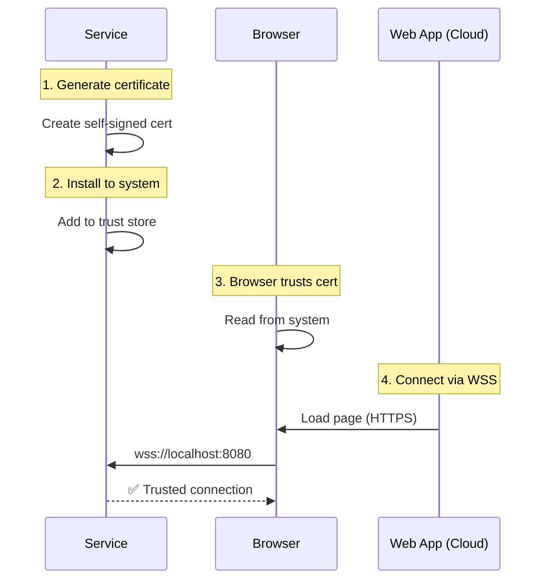

# SSL/WSS Setup (QZ Tray Style)

Setup HTTPS dan WSS (WebSocket Secure) untuk memungkinkan cloud web app connect ke local service tanpa security warnings.

## Overview

Architecture 6 menggunakan pendekatan yang sama dengan **QZ Tray** - self-signed certificate yang di-install ke system trust store. Ini memungkinkan:

- ✅ Cloud web app (HTTPS) connect ke local service via WSS
- ✅ No mixed content warnings
- ✅ No security warnings
- ✅ No browser extension needed
- ✅ No cloud backend needed

## How It Works



## Quick Start

### Step 1: Enable HTTPS

Edit `config.json`:

```json
{
  "server": {
    "port": 8080,
    "host": "0.0.0.0",
    "https": {
      "enabled": true,
      "autoGenerate": true,
      "autoInstall": false
    }
  }
}
```

**Options:**
- `enabled`: Enable HTTPS/WSS (default: `false`)
- `autoGenerate`: Auto-generate self-signed certificate (default: `true`)
- `autoInstall`: Auto-install certificate on startup (default: `false`, requires admin)
- `cert`: Path to custom certificate (optional)
- `key`: Path to custom private key (optional)

### Step 2: Start Service

```bash
fingerprint-service.exe
```

**Output:**
```
[INFO] Initializing SSL certificate manager...
[INFO] Generating self-signed certificate...
[INFO] Certificate generated successfully
[INFO] HTTPS Server started on https://0.0.0.0:8080
[INFO] WebSocket: wss://0.0.0.0:8080/ws
[INFO] Certificate fingerprint: AA:BB:CC:DD:EE:FF:...
```

Certificate akan di-generate di `data/ssl/cert.pem`

### Step 3: Install Certificate

Certificate harus di-install ke system trust store agar browser tidak menampilkan warning.

#### Windows (as Administrator)

```bash
certutil -addstore "Root" "C:\path\to\data\ssl\cert.pem"
```

**Or via GUI:**
1. Double-click `cert.pem`
2. Click "Install Certificate"
3. Select "Local Machine"
4. Select "Place all certificates in the following store"
5. Browse → "Trusted Root Certification Authorities"
6. Click "Finish"
7. Restart browser

#### macOS (with sudo)

```bash
sudo security add-trusted-cert -d -r trustRoot \
  -k /Library/Keychains/System.keychain \
  /path/to/data/ssl/cert.pem
```

**Or via GUI:**
1. Double-click `cert.pem`
2. In Keychain Access, select "System" keychain
3. Find certificate and double-click
4. Expand "Trust" section
5. Set "When using this certificate" to "Always Trust"
6. Close and enter password
7. Restart browser

#### Linux (Ubuntu/Debian)

```bash
# Copy certificate
sudo cp /path/to/data/ssl/cert.pem /usr/local/share/ca-certificates/fingerprint-service.crt

# Update certificate store
sudo update-ca-certificates

# For Chrome/Chromium (optional)
certutil -d sql:$HOME/.pki/nssdb -A -t "C,," -n "Fingerprint Service" -i /path/to/data/ssl/cert.pem
```

Restart browser after installation.

### Step 4: Verify Installation

Open browser and navigate to:

```
https://localhost:8080/health
```

✅ **Should show:** `{"status":"ok","timestamp":"..."}`  
❌ **Should NOT show:** Security warning or certificate error

## Web App Integration

### REST API with HTTPS

```javascript
// All API endpoints now use HTTPS
async function enrollFingerprint(userId) {
  const response = await fetch('https://localhost:8080/api/fingerprint/enroll', {
    method: 'POST',
    headers: {
      'Content-Type': 'application/json',
      'X-API-Key': 'your-api-key'
    },
    body: JSON.stringify({ userId })
  });
  
  return await response.json();
}

// Get devices
async function getDevices() {
  const response = await fetch('https://localhost:8080/api/devices', {
    headers: { 'X-API-Key': 'your-api-key' }
  });
  
  return await response.json();
}

// Verify fingerprint
async function verifyFingerprint(userId, templateData) {
  const response = await fetch('https://localhost:8080/api/fingerprint/verify', {
    method: 'POST',
    headers: {
      'Content-Type': 'application/json',
      'X-API-Key': 'your-api-key'
    },
    body: JSON.stringify({ userId, templateData })
  });
  
  return await response.json();
}
```

### WebSocket with WSS

```javascript
// Connect to WSS (not WS)
const ws = new WebSocket('wss://localhost:8080/ws');

ws.onopen = () => {
  console.log('Connected via WSS!');
};

ws.onmessage = (event) => {
  const data = JSON.parse(event.data);
  console.log('Event:', data);
  
  // Handle events
  if (data.event === 'fingerprint:detected') {
    console.log('Fingerprint detected, quality:', data.quality);
  }
  
  if (data.event === 'fingerprint:enrolled') {
    console.log('Fingerprint enrolled successfully');
  }
};

ws.onerror = (error) => {
  console.error('WebSocket error:', error);
};

// Send command
ws.send(JSON.stringify({
  type: 'enroll',
  userId: 'user123'
}));
```

### Complete Example

```javascript
class FingerprintService {
  constructor(apiKey) {
    this.baseUrl = 'https://localhost:8080';
    this.apiKey = apiKey;
    this.ws = null;
  }

  // REST API Methods
  async getDevices() {
    const response = await fetch(`${this.baseUrl}/api/devices`, {
      headers: { 'X-API-Key': this.apiKey }
    });
    return await response.json();
  }

  async enrollFingerprint(userId) {
    const response = await fetch(`${this.baseUrl}/api/fingerprint/enroll`, {
      method: 'POST',
      headers: {
        'Content-Type': 'application/json',
        'X-API-Key': this.apiKey
      },
      body: JSON.stringify({ userId })
    });
    return await response.json();
  }

  // WebSocket Methods
  async connectWebSocket() {
    return new Promise((resolve, reject) => {
      this.ws = new WebSocket(`wss://localhost:8080/ws`);
      
      this.ws.onopen = () => {
        console.log('WebSocket connected');
        resolve();
      };
      
      this.ws.onerror = (error) => {
        console.error('WebSocket error:', error);
        reject(error);
      };
      
      this.ws.onmessage = (event) => {
        const data = JSON.parse(event.data);
        this.handleEvent(data);
      };
    });
  }

  handleEvent(data) {
    console.log('Event received:', data);
  }
}

// Usage
const service = new FingerprintService('your-api-key');

// Use REST API
const devices = await service.getDevices();
console.log('Devices:', devices);

// Use WebSocket for real-time events
await service.connectWebSocket();

// Enroll with REST API, get real-time updates via WebSocket
const result = await service.enrollFingerprint('user123');
```

## SSL Management API

Service menyediakan API untuk manage certificate:

### GET /api/ssl/info

Get certificate information (requires auth)

```javascript
const response = await fetch('https://localhost:8080/api/ssl/info', {
  headers: { 'X-API-Key': 'your-api-key' }
});

const data = await response.json();
console.log('Certificate info:', data);
```

**Response:**
```json
{
  "success": true,
  "certificate": {
    "fingerprint": "AA:BB:CC:DD:EE:FF:...",
    "validFrom": "2024-01-01T00:00:00.000Z",
    "validTo": "2034-01-01T00:00:00.000Z",
    "publicKey": "-----BEGIN PUBLIC KEY-----\n..."
  }
}
```

### GET /api/ssl/download

Download certificate file for manual installation

```javascript
// Open download link
window.open('https://localhost:8080/api/ssl/download');
```

### GET /api/ssl/instructions

Get installation instructions for current platform

```javascript
const response = await fetch('https://localhost:8080/api/ssl/instructions');
const data = await response.json();

console.log('Platform:', data.platform);
console.log('Instructions:', data.instructions);
```

### GET /api/ssl/status

Check certificate installation status

```javascript
const response = await fetch('https://localhost:8080/api/ssl/status');
const data = await response.json();

console.log('Certificate exists:', data.status.exists);
console.log('Certificate valid:', data.status.isValid);
console.log('Certificate installed:', data.status.isInstalled);
```

**Response:**
```json
{
  "success": true,
  "status": {
    "exists": true,
    "isValid": true,
    "isInstalled": true,
    "hasAdminPrivileges": false,
    "platform": "win32"
  }
}
```

### POST /api/ssl/install

Install certificate to system trust store (requires admin)

```javascript
const response = await fetch('https://localhost:8080/api/ssl/install', {
  method: 'POST',
  headers: { 'X-API-Key': 'your-api-key' }
});

const data = await response.json();
console.log(data.message);
```

### POST /api/ssl/regenerate

Regenerate certificate (requires auth)

```javascript
const response = await fetch('https://localhost:8080/api/ssl/regenerate', {
  method: 'POST',
  headers: { 'X-API-Key': 'your-api-key' }
});

const data = await response.json();
console.log('Certificate regenerated:', data.certificate);
```

## Troubleshooting

### Certificate Not Trusted

**Problem:** Browser shows "Your connection is not private" warning

**Solution:**
1. Check if certificate is installed:
   ```bash
   curl https://localhost:8080/api/ssl/status
   ```
2. If not installed, install it (see Step 3 above)
3. Restart browser

### Mixed Content Warning

**Problem:** Web app shows "Mixed Content" error

**Solution:**
- Make sure you're using `wss://` (not `ws://`)
- Make sure you're using `https://` (not `http://`)
- Certificate must be installed in system trust store

### Connection Refused

**Problem:** Cannot connect to `wss://localhost:8080`

**Solution:**
1. Check if service is running:
   ```bash
   curl https://localhost:8080/health
   ```
2. Check if HTTPS is enabled in config
3. Check firewall settings

### Certificate Expired

**Problem:** Certificate is expired

**Solution:**
1. Regenerate certificate:
   ```bash
   curl -X POST https://localhost:8080/api/ssl/regenerate \
     -H "X-API-Key: your-api-key"
   ```
2. Reinstall certificate to system trust store

## Auto-Install (Optional)

Untuk auto-install certificate saat service start, set `autoInstall: true`:

```json
{
  "server": {
    "https": {
      "enabled": true,
      "autoGenerate": true,
      "autoInstall": true
    }
  }
}
```

**⚠️ Warning:** Requires administrator/root privileges!

```bash
# Windows: Run as Administrator
fingerprint-service.exe

# Linux/macOS: Run with sudo
sudo fingerprint-service
```

## Deployment to Cloud

Untuk deploy web app ke cloud (Vercel, Netlify, etc.):

1. **Build your web app** dengan HTTPS/WSS integration
2. **Deploy to cloud** (Vercel, Netlify, etc.)
3. **Users must:**
   - Install Fingerprint Service
   - Install SSL certificate
   - Open your web app (e.g., https://your-app.vercel.app)
   - Service will connect automatically via WSS

## Example Project

Lihat working example di `examples/wss-client/`:

```bash
cd examples/wss-client
open index.html
```

## Next Steps

- [Architecture Comparison](./architectures.md) - Compare with other architectures
- [REST API Reference](../api-reference/rest-api.md) - Full API documentation
- [WebSocket Events](../api-reference/websocket.md) - Real-time events
- [JavaScript Integration](./javascript-vanilla.md) - Complete integration guide
