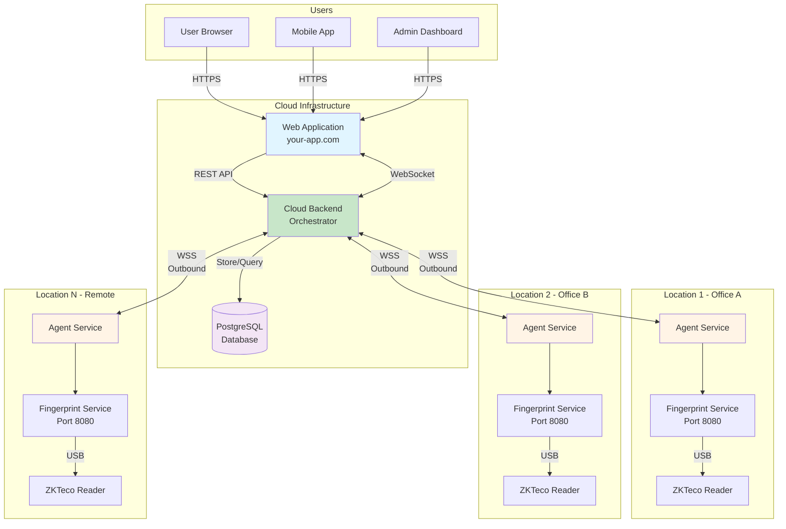
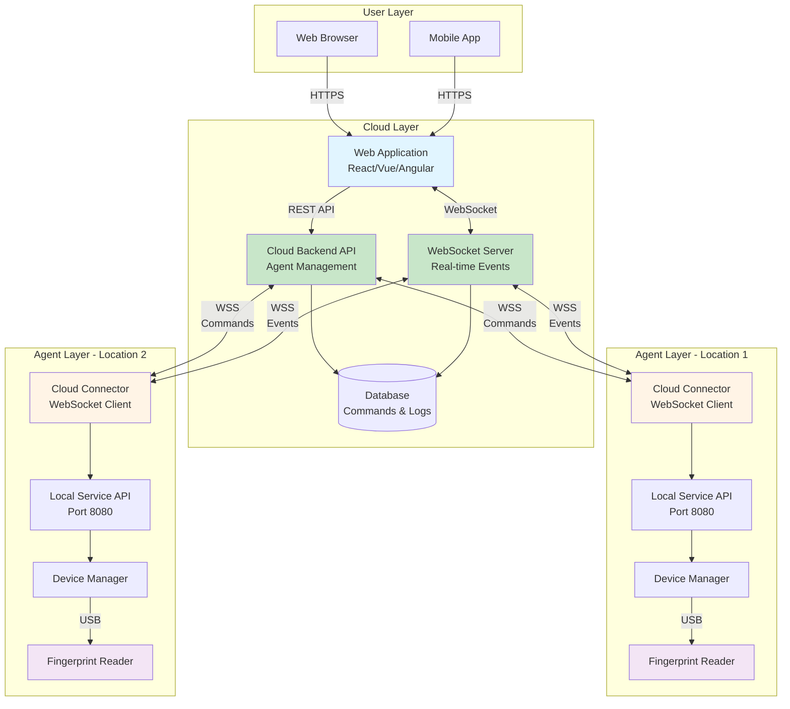
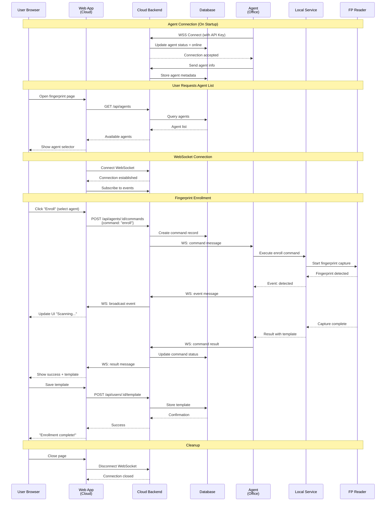

# Welcome to Fingerprint Service Documentation

Welcome to the comprehensive integration documentation for the Fingerprint Background Service. This documentation will guide you through integrating ZKTeco fingerprint reader functionality into your applications.

## What is Fingerprint Service?

The Fingerprint Background Service is a Windows service that provides a REST API and WebSocket interface for interacting with ZKTeco fingerprint readers. It enables developers to easily integrate fingerprint enrollment, verification, and identification capabilities into their applications without dealing with low-level SDK complexities.

## System Architecture

### High-Level Architecture (Cloud-Based)

**Key Components:**

- **Cloud Web App**: Hosted web application accessible from anywhere
- **Cloud Backend**: Orchestrator that manages all agents and routes commands
- **Agent Service**: Desktop service that connects to cloud backend (outbound connection only)
- **Fingerprint Service**: Local service that manages fingerprint hardware
- **Database**: Stores agent registry, commands, and audit logs

**Benefits:**
- ✅ Multi-location support
- ✅ Centralized management
- ✅ Secure (outbound connections only)
- ✅ Scalable architecture
- ✅ Real-time monitoring

> **Note:** For simpler use cases where the web app runs on the same machine as the fingerprint reader, see [Integration Architectures](./integration/architectures.md) for alternative deployment options.

### Integration Architecture

**Architecture Layers:**

1. **User Layer**: Web browsers and mobile apps accessing the cloud application
2. **Cloud Layer**: Hosted web app and backend that orchestrates all operations
3. **Agent Layer**: Desktop services at various locations with fingerprint readers

**Data Flow:**
- Users interact with cloud web app
- Web app sends commands to cloud backend
- Cloud backend routes commands to appropriate agents via WebSocket
- Agents execute commands on local fingerprint hardware
- Results flow back through cloud backend to web app
- Real-time events broadcast to all connected clients

### Component Interaction Flow (Cloud-Based)

**Key Interactions:**

1. **Agent Registration**: Agents connect to cloud backend on startup with API key authentication
2. **Agent Discovery**: Web app queries available agents from cloud backend
3. **Command Routing**: Cloud backend routes commands to appropriate agents via WebSocket
4. **Real-time Events**: Events flow from device → agent → cloud → web app for live updates
5. **Data Persistence**: Templates and audit logs stored in cloud database

## Key Features

- **REST API**: Simple HTTP endpoints for all fingerprint operations
- **WebSocket Support**: Real-time event notifications for fingerprint captures
- **Multi-Device Support**: Manage multiple fingerprint readers simultaneously
- **Cross-Platform Clients**: Integrate from any language or framework that supports HTTP
- **Template Management**: Store and manage fingerprint templates in your own database
- **Web Admin Interface**: Built-in web interface for device management and testing

## Quick Links

### Getting Started
- [Installation Guide](./getting-started/installation.md) - Install the service on Windows, macOS, or Linux
- [Authentication](./getting-started/authentication.md) - Learn how to authenticate API requests
- [Quick Start](./getting-started/quick-start.md) - Get up and running in 5 minutes

### Integration Guides
- [Integration Architectures](./integration/architectures.md) - Choose the right architecture for your deployment
- [JavaScript/TypeScript](./integration/javascript-vanilla.md) - Integrate with vanilla JS, React, Angular, or Vue
- [Backend Languages](./integration/php.md) - Integrate with PHP, Python, .NET, or Java

### API Reference
- [REST API](./api-reference/rest-api.md) - Complete REST API documentation
- [WebSocket](./api-reference/websocket.md) - Real-time event handling
- [Error Codes](./api-reference/error-codes.md) - Error code reference

### Guides
- [Enrollment Flow](./guides/enrollment-flow.md) - Step-by-step enrollment process
- [Verification Flow](./guides/verification-flow.md) - 1:1 fingerprint verification
- [Best Practices](./guides/best-practices.md) - Tips for production deployments

### Examples
- [Login System](./examples/login-system.md) - Complete fingerprint authentication example
- [Attendance System](./examples/attendance-system.md) - Time tracking with fingerprints
- [Access Control](./examples/access-control.md) - Door access control system

## Documentation Structure

This documentation is organized into several sections:

1. **Getting Started**: Installation, authentication, and quick start guides
2. **Integration Guides**: Framework-specific integration examples for JavaScript/TypeScript and backend languages
3. **API Reference**: Complete API documentation with all endpoints and parameters
4. **Guides**: Detailed workflows and best practices for common use cases
5. **Examples**: Complete working applications demonstrating real-world implementations

## Need Help?

If you encounter any issues or have questions:

- Check the [Installation Guide](./getting-started/installation.md)
- Review the [Best Practices](./guides/best-practices.md)
- Examine the [Error Codes Reference](./api-reference/error-codes.md)

## Next Steps

Ready to get started? Head over to the [Installation Guide](./getting-started/installation.md) to install the Fingerprint Service, or jump straight to the [Quick Start](./getting-started/quick-start.md) if you already have it installed.
