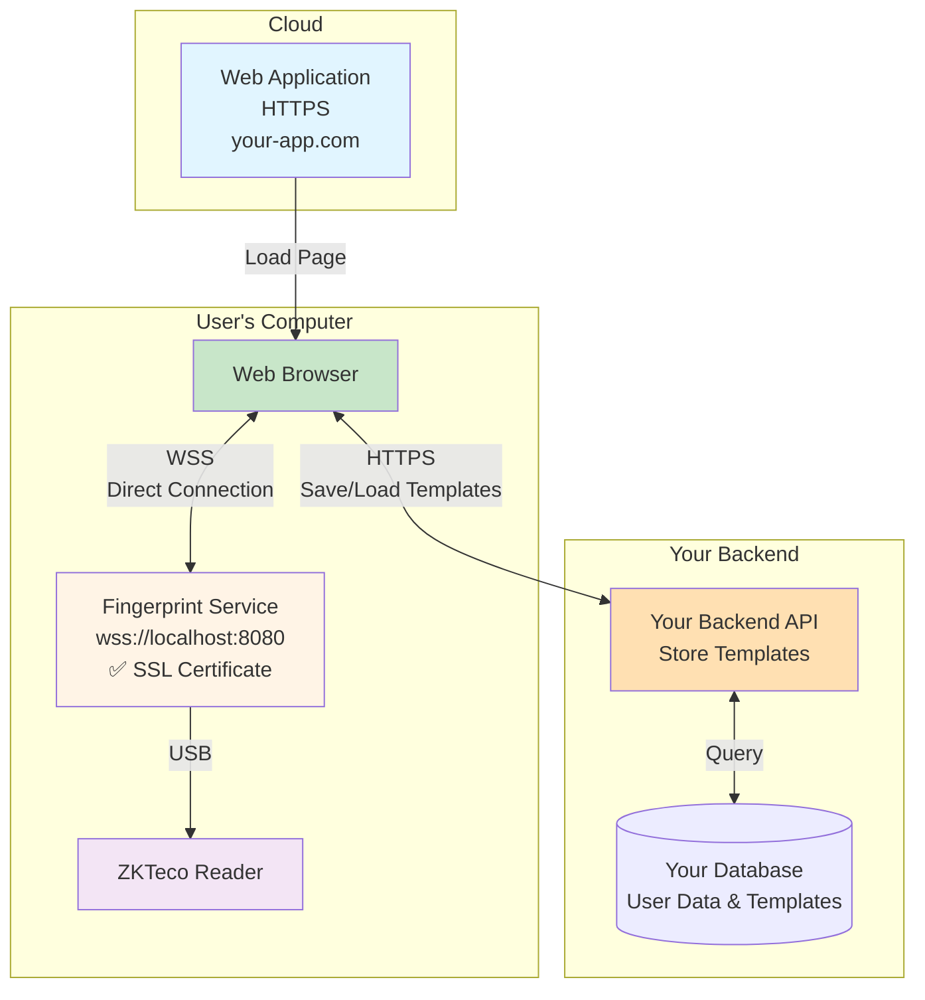
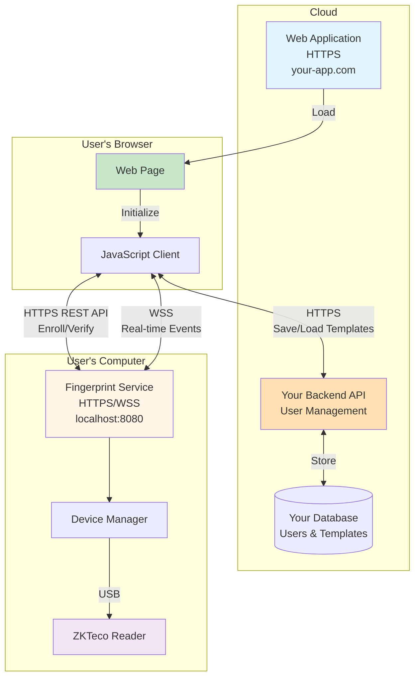
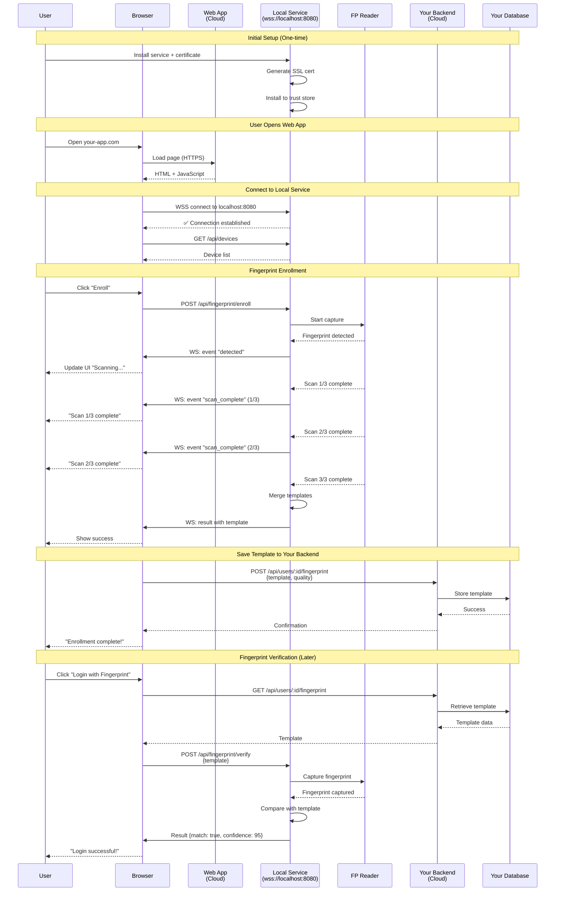

# Welcome to Fingerprint Service Documentation

Welcome to the comprehensive integration documentation for the Fingerprint Background Service. This documentation will guide you through integrating ZKTeco fingerprint reader functionality into your applications.

## What is Fingerprint Service?

The Fingerprint Background Service is a Windows service that provides a REST API and WebSocket interface for interacting with ZKTeco fingerprint readers. It enables developers to easily integrate fingerprint enrollment, verification, and identification capabilities into their applications without dealing with low-level SDK complexities.

## System Architecture

### High-Level Architecture (QZ Tray Style)

**Key Components:**

- **Cloud Web App**: Your hosted web application (React, Vue, Angular, etc.)
- **Web Browser**: User's browser with trusted SSL certificate
- **Fingerprint Service**: Local Windows service with HTTPS/WSS enabled
- **ZKTeco Reader**: USB fingerprint device
- **Your Backend**: Your existing backend API (stores user data and templates)

**How It Works:**

1. **Certificate Trust**: Service generates self-signed certificate and installs it to system trust store
2. **Direct Connection**: Browser connects directly to local service via `wss://localhost:8080`
3. **No Warnings**: Because certificate is trusted by system, no security warnings appear
4. **Template Storage**: Your backend stores fingerprint templates (not the local service)

**Benefits:**
- ✅ **No cloud backend needed** for fingerprint operations
- ✅ **No browser extension** required
- ✅ **No security warnings** (after certificate install)
- ✅ **Low latency** - Direct local connection
- ✅ **Production-ready** - Same approach as QZ Tray
- ✅ **Cost-effective** - No additional infrastructure
- ✅ **Simple deployment** - Just install service + certificate

> **Note:** This is the same architecture used by popular tools like QZ Tray (printing), Ledger Live (crypto wallets), and Trezor Bridge (hardware wallets). For other deployment options including multi-location support, see [Integration Architectures](./integration/architectures.md).

### Integration Architecture

**Architecture Layers:**

1. **Cloud Layer**: Your hosted web application and backend API
2. **Browser Layer**: User's browser running your JavaScript client
3. **Local Service Layer**: Fingerprint service running on user's computer

**Data Flow:**
1. User opens your web app (HTTPS)
2. JavaScript client connects to local service via WSS
3. User performs fingerprint operations (enroll/verify)
4. Service captures fingerprint and returns template
5. JavaScript saves template to your backend
6. Real-time events flow via WebSocket for live UI updates

### Component Interaction Flow (QZ Tray Style)

**Key Interactions:**

1. **One-Time Setup**: User installs service and SSL certificate (requires admin once)
2. **Direct Connection**: Browser connects directly to local service via WSS (no intermediary)
3. **Real-Time Events**: Events flow directly from service to browser via WebSocket
4. **Template Storage**: Your backend stores templates (service doesn't store anything)
5. **Verification**: Browser retrieves template from your backend, sends to service for comparison

## Key Features

- **HTTPS/WSS Support**: Secure connections from cloud web apps to local service (QZ Tray style)
- **No Cloud Backend Needed**: Direct browser-to-service communication
- **No Browser Extension**: Works with standard browsers after certificate install
- **REST API**: Simple HTTPS endpoints for all fingerprint operations
- **WebSocket Support**: Real-time event notifications via WSS for fingerprint captures
- **Multi-Device Support**: Manage multiple fingerprint readers simultaneously
- **Cross-Platform**: Works on Windows, macOS, and Linux
- **Template Management**: Store and manage fingerprint templates in your own database
- **Production-Ready**: Same architecture as QZ Tray, Ledger Live, and Trezor Bridge

## Quick Links

### Getting Started
- [Installation Guide](./getting-started/installation.md) - Install the service on Windows, macOS, or Linux
- [SSL/WSS Setup](./integration/ssl-setup.md) - Setup HTTPS and WSS for cloud web apps (QZ Tray style)
- [Authentication](./getting-started/authentication.md) - Learn how to authenticate API requests
- [Quick Start](./getting-started/quick-start.md) - Get up and running in 5 minutes

### Integration Guides
- [SSL/WSS Setup](./integration/ssl-setup.md) - **⭐ Recommended** - Setup for cloud web apps
- [Integration Architectures](./integration/architectures.md) - Compare different deployment options
- [JavaScript/TypeScript](./integration/javascript-vanilla.md) - Integrate with vanilla JS, React, Angular, or Vue
- [Backend Languages](./integration/php.md) - Integrate with PHP, Python, .NET, or Java

### API Reference
- [REST API](./api-reference/rest-api.md) - Complete REST API documentation
- [WebSocket](./api-reference/websocket.md) - Real-time event handling
- [Error Codes](./api-reference/error-codes.md) - Error code reference

### Guides
- [Enrollment Flow](./guides/enrollment-flow.md) - Step-by-step enrollment process
- [Verification Flow](./guides/verification-flow.md) - 1:1 fingerprint verification
- [Best Practices](./guides/best-practices.md) - Tips for production deployments

### Examples
- [Login System](./examples/login-system.md) - Complete fingerprint authentication example
- [Attendance System](./examples/attendance-system.md) - Time tracking with fingerprints
- [Access Control](./examples/access-control.md) - Door access control system

## Documentation Structure

This documentation is organized into several sections:

1. **Getting Started**: Installation, authentication, and quick start guides
2. **Integration Guides**: Framework-specific integration examples for JavaScript/TypeScript and backend languages
3. **API Reference**: Complete API documentation with all endpoints and parameters
4. **Guides**: Detailed workflows and best practices for common use cases
5. **Examples**: Complete working applications demonstrating real-world implementations

## Need Help?

If you encounter any issues or have questions:

- Check the [Installation Guide](./getting-started/installation.md)
- Review the [Best Practices](./guides/best-practices.md)
- Examine the [Error Codes Reference](./api-reference/error-codes.md)

## Next Steps

Ready to get started?

1. **[Installation Guide](./getting-started/installation.md)** - Install the Fingerprint Service
2. **[SSL/WSS Setup](./integration/ssl-setup.md)** - Setup HTTPS/WSS for cloud web apps (QZ Tray style)
3. **[Quick Start](./getting-started/quick-start.md)** - Build your first integration

**For cloud web apps (recommended):** Follow the [SSL/WSS Setup Guide](./integration/ssl-setup.md) to enable secure connections from your hosted web application to the local service.
